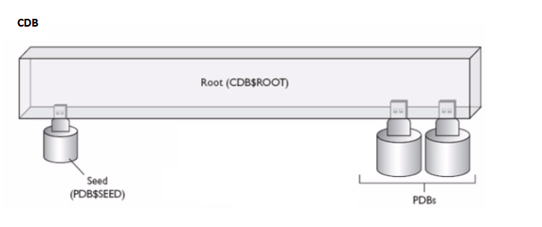
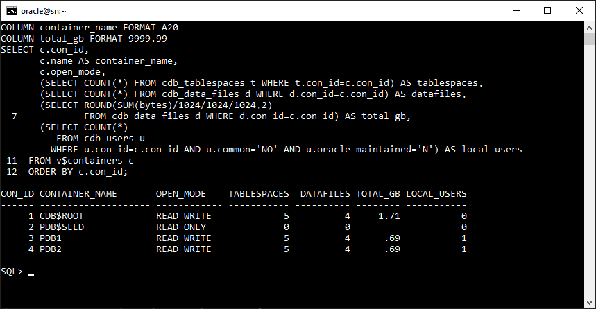
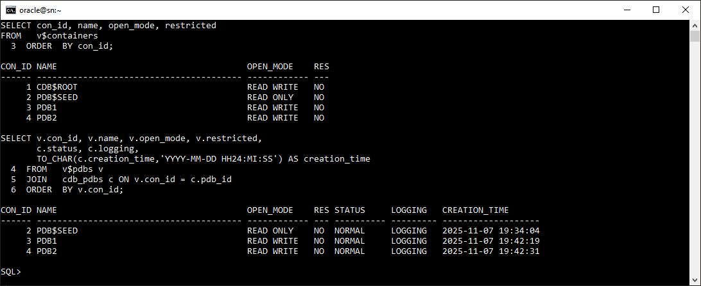
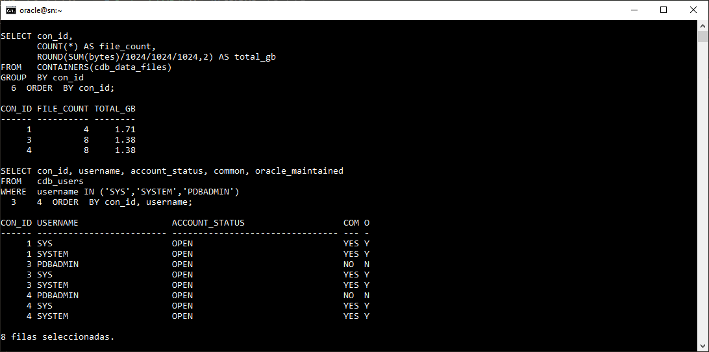

# Práctica 1.1 Creación de CDB y PDB regulares 

<br/><br/>

## Objetivos

* Identificar todos los contenedores de un CDB con `V$CONTAINERS`, `V$PDBS` y `CDB_PDBS`.
* Diferenciar vistas del diccionario `CDB_*` (root) y `DBA_*` (contenedor actual).
* Analizar y usar `CON_ID` en consultas cross-container.
* Explorar metadatos de `CDB$ROOT`, `PDB$SEED` y PDBs con `V$DATABASE` y `V$INSTANCE`.
* Generar reportes de inventario de tablespaces, datafiles y usuarios por contenedor.

## Tiempo estimado

- 30 minutos

<br/><br/>


## Tabla de ayuda

| **Vista / Comando**                 | **Descripción**                                                                                                      | **Referencia oficial**                                                                                                                                                                                        |
| ----------------------------------- | -------------------------------------------------------------------------------------------------------------------- | ------------------------------------------------------------------------------------------------------------------------------------------------------------------------------------------------------------- |
| `V$CONTAINERS`                      | Muestra información de todos los contenedores del CDB, incluyendo nombre, modo de apertura y restricciones.          | [Oracle Docs – V$CONTAINERS](https://docs.oracle.com/en/database/oracle/oracle-database/19/refrn/V-CONTAINERS.html)                                                                                           |
| `V$PDBS`                            | Muestra información sobre las PDBs asociadas a la instancia actual (nombre, estado y modo de apertura).              | [Oracle Docs – V$PDBS](https://docs.oracle.com/en/database/oracle/oracle-database/18/refrn/V-PDBS.html)                                                                                                       |
| `CDB_PDBS`                          | Contiene metadatos persistentes sobre cada PDB registrada en el CDB, incluyendo estado, logging y fecha de creación. | [Oracle Docs – CDB_PDBS](https://docs.oracle.com/en/database/oracle/oracle-database/19/refrn/DBA_PDBS.html)                                                                                                   |
| `CDB_USERS`                         | Lista los usuarios de todos los contenedores, indicando si son comunes (`COMMON=YES`) o locales (`COMMON=NO`).       | [Oracle Docs – CDB_USERS (Multitenant Overview)](https://docs.oracle.com/en/database/oracle/oracle-database/19/multi/overview-of-the-multitenant-architecture.html#GUID-7F629DD8-D4DE-4FD7-9C35-38AC016DDCDC) |
| `CONTAINERS()`                      | Permite ejecutar una misma consulta sobre una vista `CDB_*` en todos los contenedores de la base.                    | [Oracle Docs – CONTAINERS Clause](https://docs.oracle.com/en/database/oracle/oracle-database/19/sqlrf/CONTAINERS.html)                                                                                        |
| `ALTER SESSION SET CONTAINER`       | Cambia el contexto de la sesión al contenedor especificado (CDB$ROOT o una PDB).                                     | [Oracle Docs – ALTER SESSION](https://docs.oracle.com/en/database/oracle/oracle-database/19/sqlrf/ALTER-SESSION.html)                                                                                         |
| `SYS_CONTEXT('USERENV','CON_NAME')` | Devuelve el nombre del contenedor actual de la sesión.                                                               | [Oracle Docs – SYS_CONTEXT](https://docs.oracle.com/en/database/oracle/oracle-database/19/sqlrf/SYS_CONTEXT.html)                                                                                             |
| `V$DATABASE`                        | Muestra información general de la base de datos (nombre, si es CDB, modo de apertura).                               | [Oracle Docs – V$DATABASE](https://docs.oracle.com/en/database/oracle/oracle-database/19/refrn/V-DATABASE.html)                                                                                               |
| `V$INSTANCE`                        | Proporciona información de la instancia actual: nombre, host, versión y estado.                                      | [Oracle Docs – V$INSTANCE](https://docs.oracle.com/en/database/oracle/oracle-database/21/refrn/V-INSTANCE.html)                                                                                               |


<br/><br/>

## Objetivo visual 



> La imagen muestra un CDB con un contenedor raíz (CDB$ROOT), la plantilla PDB$SEED y dos PDBs de usuario que operan como bases de datos independientes dentro del mismo entorno.

<br/><br/>


## Instrucciones

**Prerrequisitos:**

* Oracle 19c CDB con ≥2 PDBs abiertas.
* Usuario con `SELECT ANY DICTIONARY` o `SELECT_CATALOG_ROLE`.
* `SQL*Plus`/`SQLcl`, `ORACLE_HOME` y `ORACLE_SID` configurados.

### Tarea 1. Verificación del entorno

1. Sistema y cliente:

   ```bash
   echo $ORACLE_HOME
   echo $ORACLE_SID
   sqlplus -version
   ```
2. Conexión y estado del CDB:

   ```sql
   SQLPLUS / AS SYSDBA
   SELECT name, cdb, open_mode FROM v$database;
   ```
sel
   *Esperado:* `CDB=YES`, `OPEN_MODE=READ WRITE`.

3. Confirmar ≥2 PDBs de usuario:

   ```sql
   SELECT name, open_mode FROM v$pdbs WHERE name NOT IN ('PDB$SEED');
   ```

<br/><br/>

### Tarea 2. Inventario de contenedores (V$CONTAINERS)

```sql
SET LINES 200 PAGES 100
COLUMN con_id FORMAT 999
COLUMN name FORMAT A20
COLUMN open_mode FORMAT A12
SELECT con_id, name, open_mode, restricted FROM v$containers ORDER BY con_id;
```

*Notas:* `CON_ID=1` es `CDB$ROOT`, `2` es `PDB$SEED`, ≥3 PDBs de usuario.

<br/><br/>

### Tarea 3. V$PDBS vs CDB_PDBS (estado vs metadatos)

1. Estado en memoria:

   ```sql
   SELECT con_id AS pdb_id, name AS pdb_name, open_mode, restricted, open_time
   FROM v$pdbs ORDER BY con_id;
   ```
2. Metadatos persistentes:

   ```sql
   COL pdb_name format a30
   SELECT pdb_id, pdb_name, status, logging,
          TO_CHAR(creation_time,'YYYY-MM-DD HH24:MI:SS') creation_time
   FROM cdb_pdbs ORDER BY pdb_id;
   ```
3. Reporte combinado:

   ```sql
   COLUMN name format a30
   SELECT v.con_id, v.name, v.open_mode, v.restricted,
          c.status, c.logging,
          TO_CHAR(c.creation_time,'YYYY-MM-DD HH24:MI:SS') creation_time
   FROM v$pdbs v JOIN cdb_pdbs c ON v.con_id=c.pdb_id
   ORDER BY v.con_id;
   ```

<br/><br/>

### Tarea 4. CDB_USERS vs DBA_USERS (ámbito root vs local)

1. Panorama global:

   ```sql
   COL username format a30
   SELECT con_id, username, account_status, common, oracle_maintained
   FROM cdb_users
   WHERE username IN ('SYS','SYSTEM','PDBADMIN')
   ORDER BY con_id, username;
   ```

2. Solo contenedor actual (root):

   ```sql
   SELECT username, account_status, oracle_maintained
   FROM dba_users
   WHERE username IN ('SYS','SYSTEM','PDBADMIN')
   ORDER BY username;
   ```

3. Cambiar a `PDB1` y repetir:

   ```sql
   ALTER SESSION SET CONTAINER=PDB1;
   SELECT SYS_CONTEXT('USERENV','CON_NAME') FROM dual;
   SELECT username,account_status,oracle_maintained
   FROM dba_users
   WHERE username IN ('SYS','SYSTEM','PDBADMIN')
   ORDER BY username;
   ALTER SESSION SET CONTAINER=CDB$ROOT;
   ```

<br/><br/>

### Tarea 5. Filtro por CON_ID (CDB_TABLESPACES)

1. Conteo por contenedor:

   ```sql
   SELECT con_id, COUNT(*) AS tablespace_count
   FROM cdb_tablespaces GROUP BY con_id ORDER BY con_id;
   ```
2. Detalle para `CON_ID=3` (ajusta según tu PDB):

   ```sql
   SELECT con_id, tablespace_name, status, contents
   FROM cdb_tablespaces
   WHERE con_id=3
   ORDER BY tablespace_name;
   ```
3. Tablespaces “propios” (excluye SYSTEM/SYSAUX/TEMP/UNDO):

   ```sql
   SELECT con_id, tablespace_name, status
   FROM cdb_tablespaces
   WHERE tablespace_name NOT IN ('SYSTEM','SYSAUX','TEMP','UNDOTBS1')
     AND con_id>2
   ORDER BY con_id, tablespace_name;
   ```

<br/><br/>

### Tarea 6. Consultas cross-container con `CONTAINERS()`

1. Datafiles `USERS` en todos los contenedores:

   ```sql
   COLUMN file_name FORMAT A60
   SELECT con_id, file_name, tablespace_name, bytes
   FROM CONTAINERS(cdb_data_files)
   WHERE tablespace_name='USERS'
   ORDER BY con_id;
   ```
2. Uso total por contenedor:

   ```sql
   SELECT con_id,
          COUNT(*) AS file_count,
          ROUND(SUM(bytes)/1024/1024/1024,2) AS total_gb
   FROM CONTAINERS(cdb_data_files)
   GROUP BY con_id
   ORDER BY con_id;
   ```

<br/><br/>

### Tarea 7. Reportes consolidados

1. Resumen por contenedor:

   ```sql
   COLUMN container_name FORMAT A20
   COLUMN total_gb FORMAT 9999.99
   SELECT c.con_id,
          c.name AS container_name,
          c.open_mode,
          (SELECT COUNT(*) FROM cdb_tablespaces t WHERE t.con_id=c.con_id) AS tablespaces,
          (SELECT COUNT(*) FROM cdb_data_files d WHERE d.con_id=c.con_id) AS datafiles,
          (SELECT ROUND(SUM(bytes)/1024/1024/1024,2)
             FROM cdb_data_files d WHERE d.con_id=c.con_id) AS total_gb,
          (SELECT COUNT(*) FROM cdb_users u
             WHERE u.con_id=c.con_id AND u.common='NO' AND u.oracle_maintained='N') AS local_users
   FROM v$containers c
   ORDER BY c.con_id;
   ```
2. Usuarios no-Oracle por contenedor:

   ```sql
   COLUMN username FORMAT A25
   COLUMN created FORMAT A20
   SELECT u.con_id, c.name AS container_name, u.username, u.account_status,
          TO_CHAR(u.created,'YYYY-MM-DD HH24:MI:SS') AS created
   FROM cdb_users u
   JOIN v$containers c ON u.con_id=c.con_id
   WHERE u.oracle_maintained='N'
     AND u.username NOT IN ('SYS','SYSTEM')
   ORDER BY u.con_id, u.username;
   ```
3. Metadatos de BD e instancia:

   ```sql
   COL HOST_NAME format a35
   SELECT d.name AS db_name, d.cdb, d.open_mode AS db_open_mode,
          i.instance_name, i.host_name, i.version, i.status AS instance_status,
          TO_CHAR(i.startup_time,'YYYY-MM-DD HH24:MI:SS') AS startup_time
   FROM v$database d, v$instance i;
   ```

<br/><br/>

### Tarea 8. Metadata compartida vs local

1. Objetos comunes en root:

   ```sql
   SELECT object_type, COUNT(*) AS common_objects
   FROM cdb_objects
   WHERE con_id=1 AND owner='SYS'
     AND object_type IN ('TABLE','VIEW','PACKAGE','PROCEDURE')
   GROUP BY object_type
   ORDER BY object_type;
   ```
2. Comparativa root vs PDB1:

   ```sql
   SELECT 'CDB$ROOT' AS container, COUNT(*) AS object_count
   FROM cdb_objects WHERE con_id=1 AND owner='SYS'
   UNION ALL
   SELECT 'PDB1', COUNT(*) FROM cdb_objects
   WHERE con_id=3 AND owner='SYS'
   ORDER BY container;
   ```
3. Vistas multitenant más usadas:

   ```sql
   SELECT view_name
   FROM dba_views
   WHERE view_name LIKE 'CDB_%' AND view_name NOT LIKE '%$%'
   ORDER BY view_name
   FETCH FIRST 20 ROWS ONLY;
   ```

<br/><br/>

## Resultado esperado

Al finalizar, podrás:

* Listar todos los contenedores con su `CON_ID`, nombre y `OPEN_MODE`.
* Explicar cuándo usar `CDB_*` vs `DBA_*` y demostrarlo con consultas.
* Filtrar por `CON_ID` y ejecutar consultas cross-container con `CONTAINERS()`.
* Cambiar de contexto entre contenedores con `ALTER SESSION SET CONTAINER`.
* Entregar un reporte consolidado por contenedor (tablespaces, datafiles, usuarios).


---

<br/><br/>

- La salida muestra un reporte consolidado del CDB y sus PDBs, donde se observa el contenedor raíz (**CDB$ROOT**), la plantilla **PDB$SEED** y dos PDBs de usuario (**PDB1** y **PDB2**) con sus respectivos modos de apertura, número de tablespaces, datafiles, tamaño total en gigabytes y cantidad de usuarios locales; este resultado confirma la estructura completa del entorno multitenant y refleja que cada PDB opera de forma independiente dentro del mismo CDB.




<br/><br/>

- La imagen muestra los resultados de dos consultas: la primera lista los contenedores del CDB con sus identificadores, nombres y modos de apertura, confirmando la existencia del contenedor raíz (CDB$ROOT), la plantilla PDB$SEED y dos PDBs de usuario (PDB1 y PDB2) abiertas en modo READ WRITE; la segunda combina las vistas V$PDBS y CDB_PDBS para mostrar el estado, tipo de logging y fecha de creación de cada PDB, evidenciando que todas las PDBs se encuentran en estado NORMAL y con registro de transacciones habilitado (LOGGING).



<br/><br/>

- La imagen muestra un resumen del número y tamaño de los datafiles por contenedor y una lista de usuarios comunes y locales, destacando que **SYS** y **SYSTEM** existen en todos los contenedores, mientras que **PDBADMIN** es propio de cada PDB.





<br/><br/>

> **Verificación final (script breve):**

```sql
-- Conteo de contenedores (≥4: root, seed y ≥2 PDBs)
SELECT COUNT(*) AS container_count FROM v$containers;

-- Acceso a vistas CDB_*
SELECT COUNT(*) AS cdb_view_count
FROM dba_views
WHERE view_name LIKE 'CDB_%';

-- Confirmar múltiples PDBs (≥2)
SELECT COUNT(*) AS pdb_count
FROM v$pdbs
WHERE name NOT IN ('PDB$SEED');

-- Cambio de contexto
COL current_container format a30
ALTER SESSION SET CONTAINER=PDB1;
SELECT SYS_CONTEXT('USERENV','CON_NAME') AS current_container FROM dual;
ALTER SESSION SET CONTAINER=CDB$ROOT;

-- Resumen final
SELECT con_id, name, open_mode FROM v$containers ORDER BY con_id;
```


