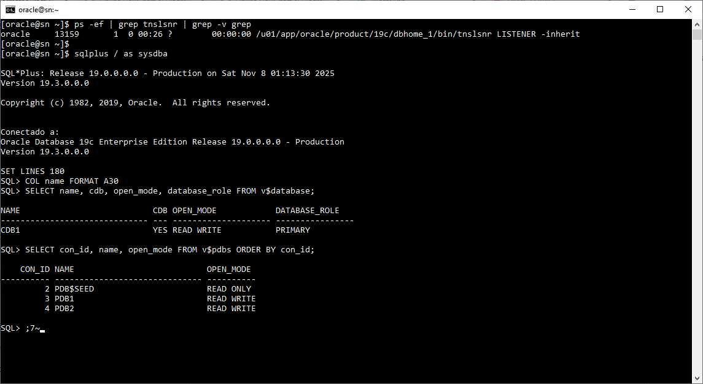
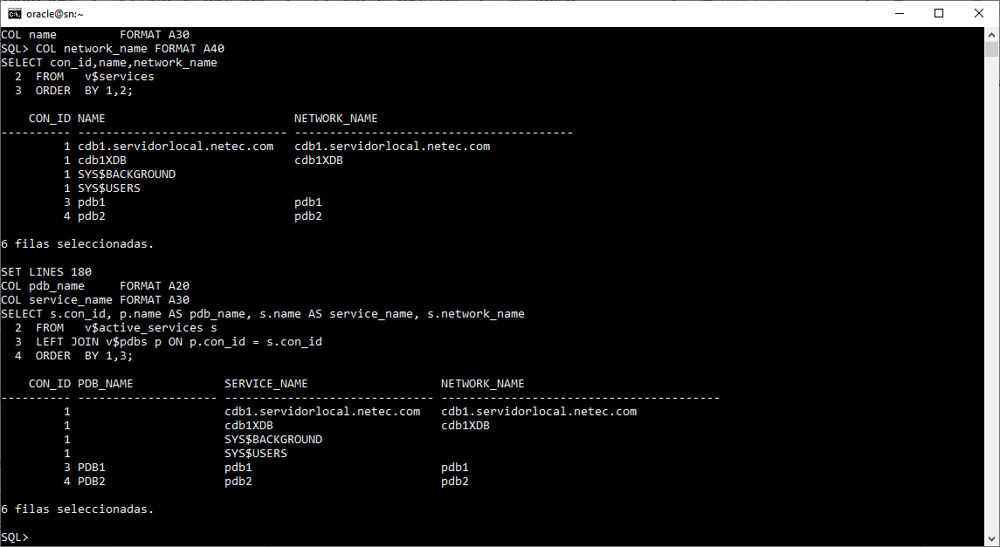
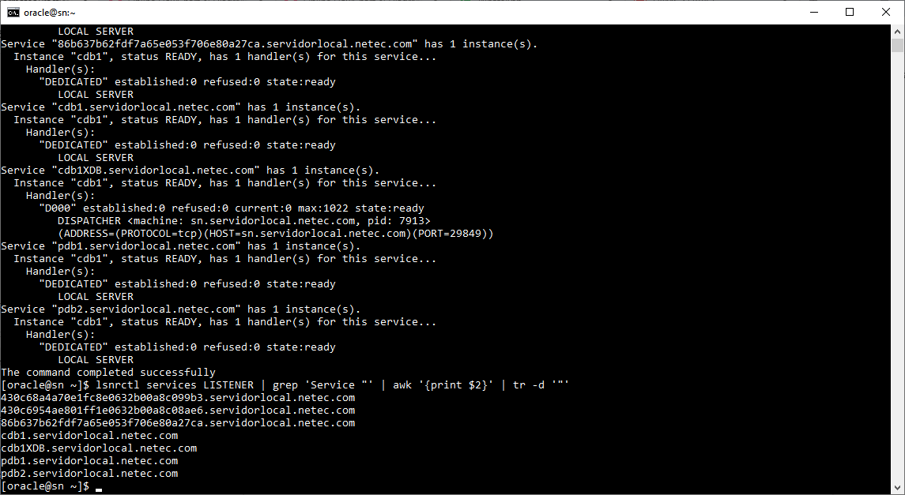
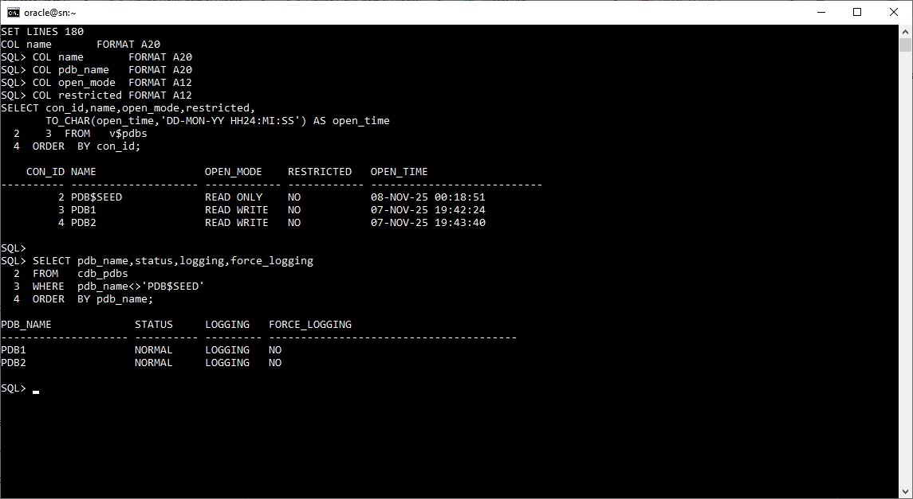
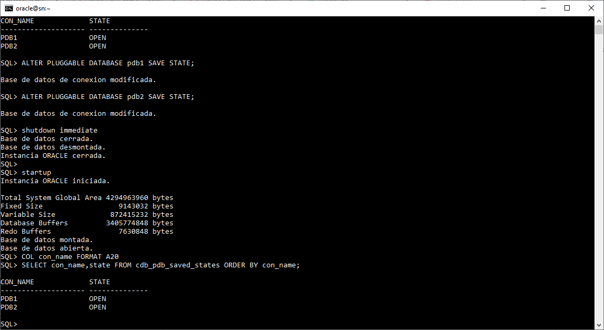
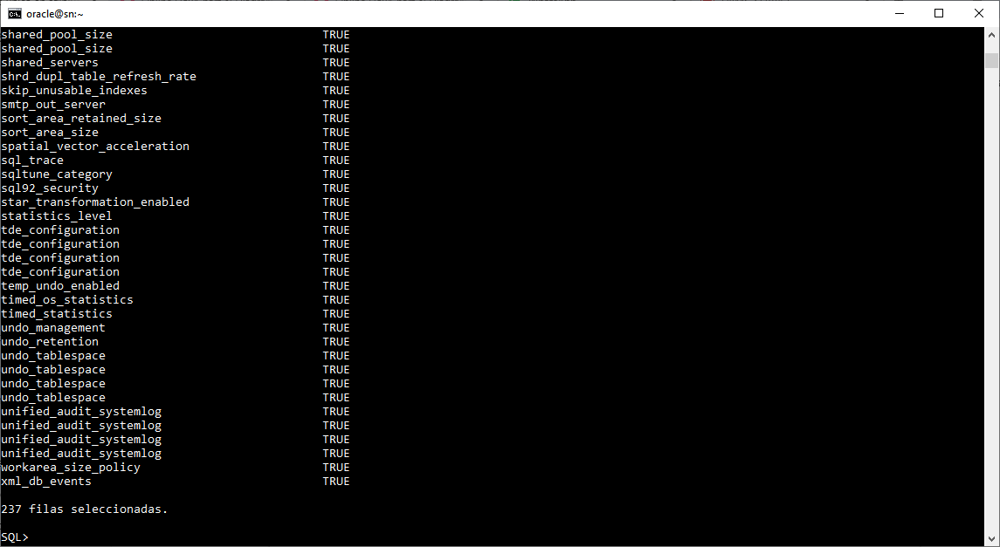
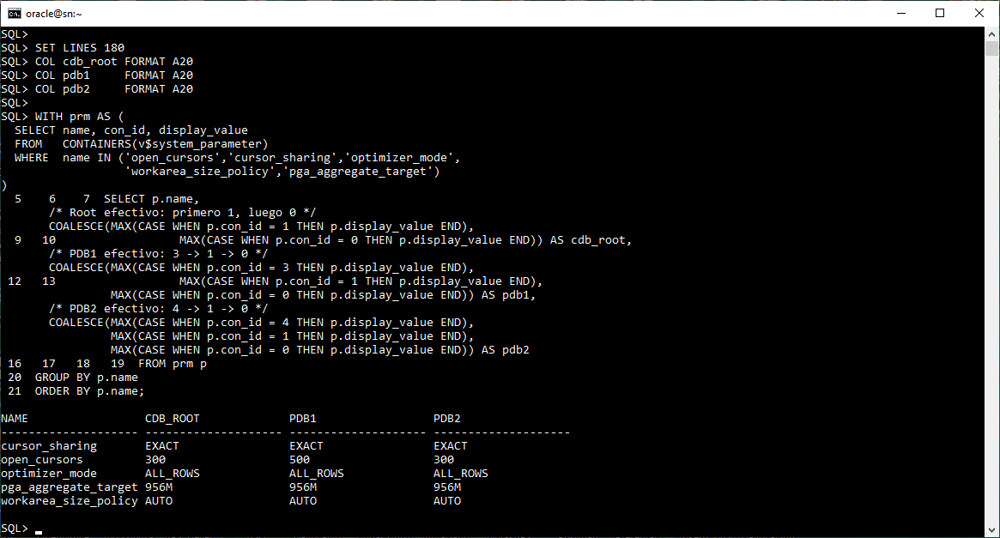
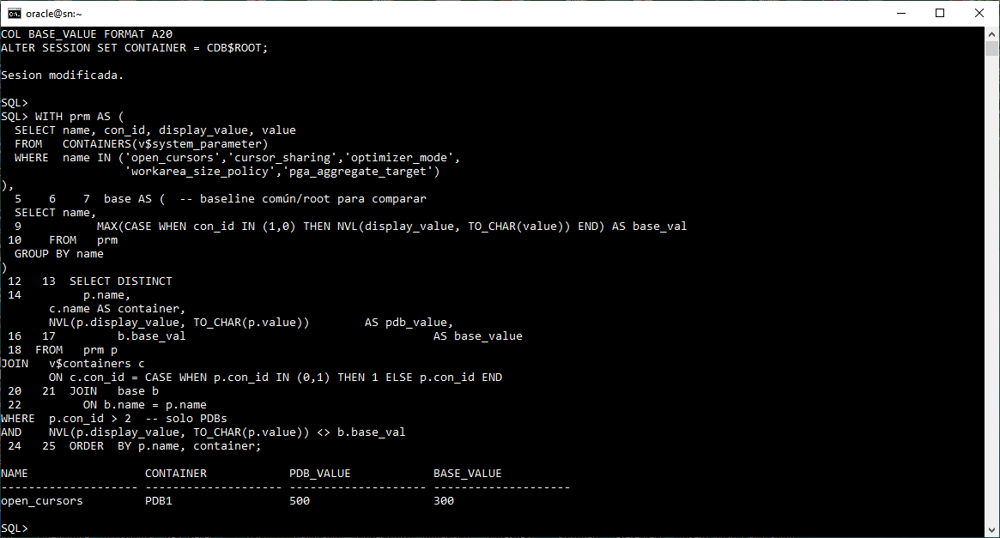
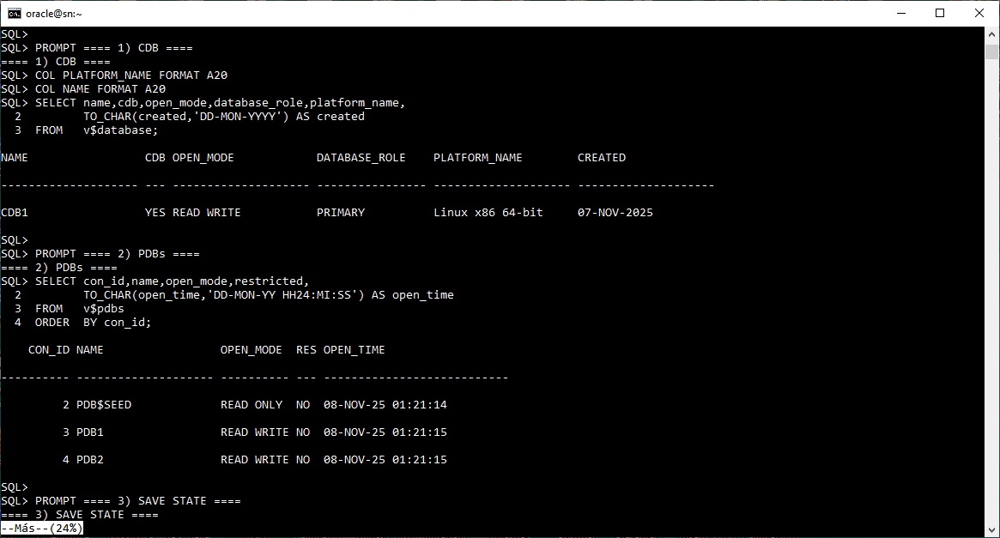

# Práctica 2.1 Servicios en CDBs y PDBs


<br/><br/>

## Objetivos

1. Identificar servicios en el listener y mapearlos a cada contenedor.
2. Consultar servicios **registrados** con `V$SERVICES` y **activos** con `V$ACTIVE_SERVICES`.
3. Verificar estados de PDBs con `V$PDBS` y `CDB_PDBS`.
4. Comprobar/configurar persistencia de apertura con `CDB_PDB_SAVED_STATES`.
5. Diferenciar parámetros comunes/locales usando `V$SYSTEM_PARAMETER (ISPDB_MODIFIABLE)`.
6. Generar un **dashboard** con la información clave.

<br/><br/>


## Tiempo estimado

- 30 minutos

<br/><br/>


## Prerrequisitos

* CDB 19c con ≥ 2 PDBs; listener activo; usuario `oracle`; acceso `SYSDBA`.
* Variables `ORACLE_HOME`, `ORACLE_SID` configuradas; SQL*Plus 19c.

<br/><br/>

## Tabla de ayuda

| Característica             |Ejemplo                                                                                                                            |
| ---------------------------- | ----------------------------------------------------------------------------------------------------------------------------------------- |
| Ver servicios en listener    | `lsnrctl services LISTENER`                                                                                                               |
| Listar servicios registrados | `SELECT con_id,name,network_name FROM v$services ORDER BY 1,2;`                                                                           |
| Listar servicios activos     | `SELECT s.con_id,p.name pdb_name,s.name service_name FROM v$active_services s LEFT JOIN v$pdbs p ON p.con_id=s.con_id ORDER BY s.con_id;` |
| Estados de PDBs              | `SELECT con_id,name,open_mode,restricted FROM v$pdbs ORDER BY con_id;`                                                                    |
| Metadatos PDB                | `SELECT pdb_name,status,logging,force_logging FROM cdb_pdbs WHERE pdb_name<>'PDB$SEED';`                                                  |
| Persistencia (SAVE STATE)    | `SELECT con_name,state FROM cdb_pdb_saved_states;`                                                                                        |
| Guardar estado de PDB        | `ALTER PLUGGABLE DATABASE pdb1 SAVE STATE;`                                                                                               |
| Parámetros PDB-modificables  | `SELECT name FROM v$system_parameter WHERE ispdb_modifiable='TRUE' ORDER BY name;`                                                        |
| Diferencias vs ROOT          | Verificar con `V$SYSTEM_PARAMETER` por `con_id` (0/1=root, >2=PDBs)                                                                       |
| Abrir PDBs                   | `ALTER PLUGGABLE DATABASE ALL OPEN;`                                                                                                      |

<br/><br/>


## Instrucciones

### Tarea 1. Verificación inicial (SO y conexión)

```bash
echo "ORACLE_HOME=$ORACLE_HOME"; 
echo "ORACLE_SID=$ORACLE_SID"
sqlplus -v
ps -ef | grep tnslsnr | grep -v grep
```

```sql
-- CDB y PDBs
SET LINES 180
COL name FORMAT A30
SELECT name, cdb, open_mode, database_role FROM v$database;
SELECT con_id, name, open_mode FROM v$pdbs ORDER BY con_id;
-- Si alguna PDB no está en READ WRITE:
-- ALTER PLUGGABLE DATABASE ALL OPEN;
```

<br/><br/>

### Tarea 2. Servicios registrados en el listener

```bash
lsnrctl services LISTENER

# Listar solo los nombres publicados
lsnrctl services LISTENER | grep 'Service "' | awk '{print $2}' | tr -d '"'
```

<br/><br/>

### Tarea 3. Servicios registrados/activos (diccionario)

```sql
-- Registrados
SET LINES 180
COL name         FORMAT A30 
COL network_name FORMAT A40
SELECT con_id,name,network_name
FROM   v$services
ORDER  BY 1,2;

-- Activos  
SET LINES 180
COL pdb_name     FORMAT A20 
COL service_name FORMAT A30
SELECT s.con_id, p.name AS pdb_name, s.name AS service_name, s.network_name
FROM   v$active_services s
LEFT JOIN v$pdbs p ON p.con_id = s.con_id
ORDER  BY 1,3;

-- Conteo de activos por contenedor
SELECT s.con_id, p.name AS pdb_name, COUNT(*) AS num_servicios
FROM   v$active_services s
LEFT JOIN v$pdbs p ON p.con_id = s.con_id
GROUP  BY s.con_id,p.name
ORDER  BY 1;
```

<br/><br/>

### Tarea 4. Estados de PDBs (apertura y restricciones)

```sql
SET LINES 180
COL name       FORMAT A20 
COL pdb_name   FORMAT A20
COL open_mode  FORMAT A12 
COL restricted FORMAT A12
SELECT con_id,name,open_mode,restricted,
       TO_CHAR(open_time,'DD-MON-YY HH24:MI:SS') AS open_time
FROM   v$pdbs
ORDER  BY con_id;

SELECT pdb_name,status,logging,force_logging
FROM   cdb_pdbs
WHERE  pdb_name<>'PDB$SEED'
ORDER  BY pdb_name;
```

<br/><br/>

### Tarea 5. Persistencia (SAVE STATE)

```sql
-- Ver configuración
SET LINES 180
COL con_name FORMAT A20
SELECT con_name,state FROM cdb_pdb_saved_states ORDER BY con_name;

-- Configurar (si falta)
ALTER PLUGGABLE DATABASE pdb1 SAVE STATE;
ALTER PLUGGABLE DATABASE pdb2 SAVE STATE;

-- Verificar
SELECT con_name,state FROM cdb_pdb_saved_states ORDER BY con_name;
```

> Opcional: reinicia el CDB y confirma que las PDBs con SAVE STATE abren en `OPEN READ WRITE`.

<br/><br/>

### Tarea 6. Parámetros comunes vs. locales (PDB-modificables)

```sql
-- Parámetros modificables en PDB
SET PAGESIZE 50000
SET LINES 180
COL name FORMAT A45
SELECT name, ispdb_modifiable
FROM   v$system_parameter
WHERE  ispdb_modifiable='TRUE'
ORDER  BY name;
```

**Comparación puntual (mapeando CON_ID=0/1 a ROOT):**

```sql
SET LINESIZE 180
COL name     FORMAT A20
COL cdb_root FORMAT A20
COL pdb1     FORMAT A20
COL pdb2     FORMAT A20

SET LINES 180
COL cdb_root FORMAT A20
COL pdb1     FORMAT A20
COL pdb2     FORMAT A20

WITH prm AS (
  SELECT name, con_id, display_value
  FROM   CONTAINERS(v$system_parameter)
  WHERE  name IN ('open_cursors','cursor_sharing','optimizer_mode',
                  'workarea_size_policy','pga_aggregate_target')
)
SELECT p.name,
       /* Root efectivo: primero 1, luego 0 */
       COALESCE(MAX(CASE WHEN p.con_id = 1 THEN p.display_value END),
                MAX(CASE WHEN p.con_id = 0 THEN p.display_value END)) AS cdb_root,
       /* PDB1 efectivo: 3 -> 1 -> 0 */
       COALESCE(MAX(CASE WHEN p.con_id = 3 THEN p.display_value END),
                MAX(CASE WHEN p.con_id = 1 THEN p.display_value END),
                MAX(CASE WHEN p.con_id = 0 THEN p.display_value END)) AS pdb1,
       /* PDB2 efectivo: 4 -> 1 -> 0 */
       COALESCE(MAX(CASE WHEN p.con_id = 4 THEN p.display_value END),
                MAX(CASE WHEN p.con_id = 1 THEN p.display_value END),
                MAX(CASE WHEN p.con_id = 0 THEN p.display_value END)) AS pdb2
FROM prm p
GROUP BY p.name
ORDER BY p.name;
```

**Demostración de cambio local en PDB1:**

```sql
ALTER SESSION SET CONTAINER=pdb1;
SHOW PARAMETER open_cursors;
ALTER SYSTEM SET open_cursors=500 SCOPE=BOTH;
SHOW PARAMETER open_cursors;

ALTER SESSION SET CONTAINER=cdb$root;
```

**Comprobación de diferencias (robusta):**

```sql
COL CONTAINER FORMAT A20
COL NAME  FORMAT A20
COL PDB_VALUE FORMAT A20
COL BASE_VALUE FORMAT A20
ALTER SESSION SET CONTAINER = CDB$ROOT;

WITH prm AS (
  SELECT name, con_id, display_value, value
  FROM   CONTAINERS(v$system_parameter)
  WHERE  name IN ('open_cursors','cursor_sharing','optimizer_mode',
                  'workarea_size_policy','pga_aggregate_target')
),
base AS (  -- baseline común/root para comparar
  SELECT name,
         MAX(CASE WHEN con_id IN (1,0) THEN NVL(display_value, TO_CHAR(value)) END) AS base_val
  FROM   prm
  GROUP BY name
)
SELECT DISTINCT
       p.name,
       c.name AS container,
       NVL(p.display_value, TO_CHAR(p.value))        AS pdb_value,
       b.base_val                                    AS base_value
FROM   prm p
JOIN   v$containers c
       ON c.con_id = CASE WHEN p.con_id IN (0,1) THEN 1 ELSE p.con_id END
JOIN   base b
       ON b.name = p.name
WHERE  p.con_id > 2  -- solo PDBs
AND    NVL(p.display_value, TO_CHAR(p.value)) <> b.base_val
ORDER  BY p.name, container;

```

<br/>

### Tarea 7. Dashboard consolidado

```sql
SET LINES 250 PAGES 1000 FEEDBACK OFF
SPOOL /tmp/Prac_2_1_dashboard.txt

PROMPT ==== 1) CDB ====
COL PLATFORM_NAME FORMAT A20
COL NAME FORMAT A20 
SELECT name,cdb,open_mode,database_role,platform_name,
       TO_CHAR(created,'DD-MON-YYYY') AS created
FROM   v$database;

PROMPT ==== 2) PDBs ====
SELECT con_id,name,open_mode,restricted,
       TO_CHAR(open_time,'DD-MON-YY HH24:MI:SS') AS open_time
FROM   v$pdbs
ORDER  BY con_id;

PROMPT ==== 3) SAVE STATE ====
COL CON_NAME FORMAT A20
SELECT con_name,state
FROM   cdb_pdb_saved_states
ORDER  BY con_name;

PROMPT ==== 4) Servicios registrados ====
COL NETWORK_NAME FORMAT A30
COL PDB_NAME FORMAT A15
COL SERVICE_NAME A20
SELECT NVL(p.name,'CDB$ROOT') AS pdb_name, s.name AS service_name, s.network_name
FROM   v$services s
LEFT JOIN v$pdbs p ON p.con_id = s.con_id
ORDER  BY s.con_id, s.name;

PROMPT ==== 5) Servicios activos (conteo) ====
COL NAME FORMAT A15
COL PDB_NAME FORMAT A15
COL SERVICIOSACTIVOS FORMAR A20
SELECT s.con_id, p.name AS pdb_name, COUNT(*) AS servicios_activos
FROM   v$active_services s
LEFT JOIN v$pdbs p ON p.con_id = s.con_id
GROUP  BY s.con_id, p.name
ORDER  BY 1;

PROMPT ==== 6) Parámetros locales diferentes a ROOT ====
COL CONTAINER FORMAT A20
COL NAME  FORMAT A20
COL PDB_VALUE FORMAT A20
COL BASE_VALUE FORMAT A20
ALTER SESSION SET CONTAINER = CDB$ROOT;

WITH prm AS (
  SELECT name, con_id, display_value, value
  FROM   CONTAINERS(v$system_parameter)
  WHERE  name IN ('open_cursors','cursor_sharing','optimizer_mode',
                  'workarea_size_policy','pga_aggregate_target')
),
base AS (  -- baseline común/root para comparar
  SELECT name,
         MAX(CASE WHEN con_id IN (1,0) THEN NVL(display_value, TO_CHAR(value)) END) AS base_val
  FROM   prm
  GROUP BY name
)
SELECT DISTINCT
       p.name,
       c.name AS container,
       NVL(p.display_value, TO_CHAR(p.value))        AS pdb_value,
       b.base_val                                    AS base_value
FROM   prm p
JOIN   v$containers c
       ON c.con_id = CASE WHEN p.con_id IN (0,1) THEN 1 ELSE p.con_id END
JOIN   base b
       ON b.name = p.name
WHERE  p.con_id > 2  -- solo PDBs
AND    NVL(p.display_value, TO_CHAR(p.value)) <> b.base_val
ORDER  BY p.name, container;


SPOOL OFF
```

<br/><br/>

## Resultado esperado

* Todas las PDBs de usuario en **READ WRITE**.
* **SAVE STATE** configurado (al menos en PDB1 y PDB2).
* Cada PDB con ≥ 1 servicio **activo**.
* Al menos un parámetro modificado **localmente** en PDB1 (p. ej., `open_cursors=500`).
* Archivo generado: `/tmp/Prac_2_1_dashboard.txt` con > 200 líneas.

<br/><br/>

La siguiente captura de pantalla muestra un entorno Oracle 19c correctamente configurado, con el listener operativo, conexión exitosa como SYSDBA y las PDBs abiertas y disponibles.



<br/><br/>

La salida demuestra que el CDB y las dos PDBs tienen sus servicios correctamente registrados y activos en el entorno, reflejando un listener funcional y una configuración multitenant operativa.



<br/><br/>

La captura siguiente confirma que el listener de Oracle está correctamente configurado y operativo, con el CDB y las PDBs publicando sus servicios de red activos y disponibles para conexión remota.



<br/><br/>

El contenedor multitenant tiene las PDBs PDB1 y PDB2 abiertas en modo de lectura/escritura y operando normalmente, mientras que la plantilla PDB$SEED permanece en modo de solo lectura, cumpliendo su función de base para crear nuevas PDBs.




<br/><br/>

La captura demuestra la implementación exitosa del mecanismo SAVE STATE, que permite que las PDBs se abran automáticamente tras cada reinicio del CDB, facilitando la administración y disponibilidad continua del entorno multitenant.




<br/><br/>

La captura confirma que en Oracle 19c hay una amplia lista (237) de parámetros configurables a nivel de PDB, lo que brinda flexibilidad para adaptar el comportamiento y consumo de recursos de cada base de datos pluggable de forma individual.




<br/><br/>

La captura siguiente confirma la comparación exitosa de parámetros entre el CDB y las PDBs, ilustrando el concepto de parámetros comunes y locales en la arquitectura multitenant de Oracle 19c, donde cada PDB puede ajustar valores específicos según sus necesidades operativas.





<br/><br/>

La captura demuestra una comparación cruzada precisa de parámetros entre CDB y PDBs, mostrando cómo detectar parámetros modificados localmente. En este caso, open_cursors es el único parámetro diferente, evidenciando la independencia de configuración de las PDBs en Oracle 19c.





<br/><br/>

La captura muestra un entorno multitenant Oracle 19c completamente funcional, donde el contenedor raíz (CDB1) y las PDBs (PDB1, PDB2) están abiertos y operativos. El script continúa hacia la sección de SAVE STATE, que permitirá confirmar o configurar la apertura automática de las PDBs tras reinicios del CDB.




<br/><br/>

## Verificación final

```sql
-- 1) PDBs en READ WRITE
SELECT COUNT(*) AS fail_cnt
FROM   v$pdbs
WHERE  name<>'PDB$SEED' AND open_mode<>'READ WRITE';

-- 2) SAVE STATE en todas las PDBs de usuario
SELECT (SELECT COUNT(*) FROM v$pdbs WHERE name<>'PDB$SEED') AS total_pdbs,
       (SELECT COUNT(*) FROM cdb_pdb_saved_states)          AS pdbs_con_save
FROM   dual;

-- 3) Servicios activos por PDB (>=1)
SELECT p.name, COUNT(s.name) AS activos
FROM   v$pdbs p
LEFT   JOIN v$active_services s ON s.con_id = p.con_id
WHERE  p.con_id > 2
GROUP  BY p.name;

-- 4) Parámetro local modificado en PDB1
ALTER SESSION SET CONTAINER = pdb1;
SELECT display_value
FROM   v$parameter
WHERE  name='open_cursors' AND con_id=3;
```

```bash
# 5) Listener activo y publicando servicios
lsnrctl status LISTENER | grep -E "READY|Listening Endpoints"
ls -lh /tmp/Prac_2_1_dashboard.txt ; 
wc -l /tmp/Prac_2_1_dashboard.txt
```

<br/><br/>

## Notas y troubleshooting

* Si `lsnrctl services` no muestra tus servicios, ejecuta en la BD: `ALTER SYSTEM REGISTER;` y valida `SHOW PARAMETER local_listener`.
* Asegura que el **HOST** en `listener.ora/tnsnames.ora` sea tu IP/FQDN real (no siempre `localhost`).
* Recuerda: al unir `V$SYSTEM_PARAMETER` con `V$CONTAINERS`, **mapea `CON_ID=0/1 → ROOT (1)`** para no “perder” filas de ROOT.

<br/><br/>


## Referencias oficiales

* [Oracle 19c **Administrator’s Guide** — Managing a Multitenant Environment](https://docs.oracle.com/en/database/oracle/oracle-database/19/multi/overview-of-managing-a-multitenant-environment.html#GUID-528FBE02-2B84-4E97-BD87-36AEF9EA524D)
* Oracle 19c **Reference** — `V$SERVICES`, `V$ACTIVE_SERVICES`, `V$PDBS`, `CDB_PDBS`, `CDB_PDB_SAVED_STATES`, `V$SYSTEM_PARAMETER`
* [Oracle 19c **PL/SQL Packages** — `DBMS_SERVICE`](https://docs.oracle.com/database/121/ARPLS/d_serv.htm)
