# Práctica 2.3 Plan de arranque y verificación de apertura persistente de PDBs


<br/><br/>


## Objetivos

1. Implementar estrategias de apertura automática de PDBs con `ALTER PLUGGABLE DATABASE SAVE STATE`.
2. Configurar modos de apertura: READ ONLY, READ WRITE y RESTRICTED.
3. Crear triggers de startup a nivel CDB para apertura condicional.
4. Validar la persistencia de apertura ante distintos tipos de shutdown/startup.
5. Diseñar un script de validación post-startup que verifique el estado de las PDBs.

<br/><br/>


## Tiempo estimado
- 60 minutos

<br/><br/>

## **Prerrequisitos**

**Conocimientos previos**

* Arquitectura multitenant (CDB/PDB)
* Estados de base de datos (NOMOUNT, MOUNT, OPEN)
* Comandos de arranque/apagado (`startup`, `shutdown`)
* Triggers de sistema (`ON STARTUP`)
* Uso básico de SQL*Plus o SQLcl

**Requisitos del entorno**

* Oracle Database 19c con CDB funcional
* Mínimo 3 PDBs creadas y disponibles
* Usuario con privilegios SYSDBA
* Variables `$ORACLE_HOME` y `$ORACLE_SID` configuradas

**Validación rápida de prerrequisitos**

```bash
echo $ORACLE_HOME
echo $ORACLE_SID
```

```sql
sqlplus / as sysdba
SELECT instance_name, status FROM v$instance;
SELECT name, open_mode FROM v$pdbs ORDER BY con_id;
```

<br/><br/>

## Tabla de ayuda

| **Descripción**                                                              | **Ejemplo rápido**                                                            |
| --------------------------------------------------------------------------------- | ----------------------------------------------------------------------------- |
| Guarda el estado actual de apertura de una PDB para restaurarlo tras un reinicio. | `ALTER PLUGGABLE DATABASE pdb1 SAVE STATE;`                               |
| Muestra los estados guardados de todas las PDBs.                                  | `SELECT * FROM cdb_pdb_saved_states;`                                         |
| Lista las PDBs y su modo de apertura actual.                                      | `SELECT name, open_mode FROM v$pdbs;`                                         |
| Crea un trigger que se ejecuta tras iniciar el CDB.                               | `CREATE OR REPLACE TRIGGER cdb_startup_trigger AFTER STARTUP ON DATABASE ...` |


<br/><br/>


## **Configuración del Entorno**

**Verificación inicial**

```sql
sqlplus / as sysdba
COL NAME FORMAT A15
SELECT instance_name, status, database_status FROM v$instance;
SELECT con_id, name, open_mode, restricted FROM v$pdbs;

SET LINESIZE 200
COL CON_NAME FORMAT A20
COL INSTANCE_NAME FORMAT A30
SELECT * FROM cdb_pdb_saved_states;
```

Si hay menos de 3 PDBs, crea las necesarias:

```sql
CREATE PLUGGABLE DATABASE pdb_prod ADMIN USER pdb_admin IDENTIFIED BY Oracle_2024 FILE_NAME_CONVERT=('/pdbseed/','/pdb_prod/');
CREATE PLUGGABLE DATABASE pdb_test ADMIN USER pdb_admin IDENTIFIED BY Oracle_2024 FILE_NAME_CONVERT=('/pdbseed/','/pdb_test/');
CREATE PLUGGABLE DATABASE pdb_dev ADMIN USER pdb_admin IDENTIFIED BY Oracle_2024 FILE_NAME_CONVERT=('/pdbseed/','/pdb_dev/');
ALTER PLUGGABLE DATABASE ALL OPEN;
```

Limpia configuraciones previas de SAVE STATE:

```sql
-- Debes estar en CDB$ROOT
SHOW CON_NAME;   

-- Quita los estados guardados de TODAS las PDBs
ALTER PLUGGABLE DATABASE ALL DISCARD STATE;

-- Verificación (debería regresar 0 filas si se limpió todo)
SELECT con_id, con_name, state, restricted
FROM   cdb_pdb_saved_states
ORDER  BY con_id, con_name;

-- (Opcional) conteo rápido:
SELECT COUNT(*) AS filas_restantes FROM cdb_pdb_saved_states;

```

<br/><br/>

## Instrucciones

### Tarea 1. Implementar SAVE STATE en diferentes modos

**1. Configurar PDB_PROD en modo READ WRITE**

```sql
ALTER PLUGGABLE DATABASE pdb_prod CLOSE IMMEDIATE;
ALTER PLUGGABLE DATABASE pdb_prod OPEN READ WRITE;
ALTER PLUGGABLE DATABASE pdb_prod SAVE STATE;
```

**Resultado esperado**

```
PDB_PROD  READ WRITE  NO
```

**2. Configurar PDB_TEST en modo READ ONLY**

```sql
ALTER PLUGGABLE DATABASE pdb_test CLOSE IMMEDIATE;
ALTER PLUGGABLE DATABASE pdb_test OPEN READ ONLY;
ALTER PLUGGABLE DATABASE pdb_test SAVE STATE;
```

**Resultado esperado**

```
PDB_TEST  READ ONLY  NO
```

**3. Configurar PDB_DEV en modo RESTRICTED** Modo administrativo con recursos sin usuarios.

```sql
ALTER PLUGGABLE DATABASE pdb_dev CLOSE IMMEDIATE;
ALTER PLUGGABLE DATABASE pdb_dev OPEN READ WRITE RESTRICTED;
ALTER PLUGGABLE DATABASE pdb_dev SAVE STATE;
```

**Resultado esperado**

```
PDB_DEV  READ WRITE  YES
```

<br/><br/>

### Tarea 2. Validar persistencia ante distintos shutdown/startup

**1. Escenario: SHUTDOWN IMMEDIATE / STARTUP**

```sql
SHUTDOWN IMMEDIATE;
STARTUP;
SELECT name, open_mode, restricted FROM v$pdbs;
```


**Resultado esperado:**

```
PDB_PROD  READ WRITE  NO
PDB_TEST  READ ONLY   NO
PDB_DEV   READ WRITE  YES
```

**2. Escenario: SHUTDOWN ABORT / STARTUP**

```sql
SHUTDOWN ABORT;
STARTUP;
SELECT name, open_mode, restricted FROM v$pdbs;
```

**Verificación adicional:**

```bash
!tail -n200 $ORACLE_BASE/diag/rdbms/*/*/trace/alert_*.log | grep -i "PDB"
```

**3. Escenario: STARTUP FORCE** (Equivale a shutdown abort seguido por startup)

```sql
help startup
STARTUP FORCE
show pdbs
col name format a20
SELECT name, open_mode, restricted FROM v$pdbs;
```

**4. Registrar resultados**

```sql

-- 0) Verifica contenedor actual y pásate al ROOT
SHOW CON_NAME;
ALTER SESSION SET CONTAINER = CDB$ROOT;
SHOW CON_NAME;

-- 1) Crea (o repara) el usuario común C##ADMIN sin referenciar USERS
DECLARE
  v_exists NUMBER;
BEGIN
  SELECT COUNT(*) INTO v_exists
  FROM   cdb_users
  WHERE  username = 'C##ADMIN' AND con_id = 1;  -- existencia en el ROOT

  IF v_exists = 0 THEN
    EXECUTE IMMEDIATE 'CREATE USER C##ADMIN IDENTIFIED BY "oracle_4U"';
  END IF;

  -- Asegura privilegios y espacio, aunque ya exista
  EXECUTE IMMEDIATE 'GRANT CREATE SESSION TO C##ADMIN CONTAINER=ALL';
  EXECUTE IMMEDIATE 'GRANT CREATE TABLE  TO C##ADMIN CONTAINER=ALL';
  EXECUTE IMMEDIATE 'GRANT UNLIMITED TABLESPACE TO C##ADMIN CONTAINER=ALL';
END;
/
```

```sql
BEGIN
  EXECUTE IMMEDIATE 'DROP TABLE C##ADMIN.pdb_startup_validation PURGE';
EXCEPTION WHEN OTHERS THEN IF SQLCODE != -942 THEN RAISE; END IF;
END;
/

CREATE TABLE C##ADMIN.pdb_startup_validation AS
SELECT
  SYSTIMESTAMP                    AS test_timestamp,
  p.con_id,
  p.name                          AS pdb_name,
  NVL(s.state,'NO_SAVE_STATE')    AS saved_state,
  p.open_mode,
  p.restricted
FROM v$pdbs p
LEFT JOIN cdb_pdb_saved_states s
  ON p.con_id = s.con_id
WHERE p.name <> 'PDB$SEED';

SELECT * FROM C##ADMIN.pdb_startup_validation
ORDER BY con_id, pdb_name;


```

<br/><br/>

### Tarea 3. Trigger de apertura condicional

**1. Crear trigger a nivel CDB**

```sql
CREATE OR REPLACE TRIGGER cdb_startup_trigger
AFTER STARTUP ON DATABASE
BEGIN
  FOR rec IN (SELECT name FROM v$pdbs WHERE name LIKE '%PROD%' AND open_mode='MOUNTED') LOOP
    EXECUTE IMMEDIATE 'ALTER PLUGGABLE DATABASE '||rec.name||' OPEN READ WRITE';
  END LOOP;
  FOR rec IN (SELECT name FROM v$pdbs WHERE name LIKE '%TEST%' AND open_mode='MOUNTED') LOOP
    EXECUTE IMMEDIATE 'ALTER PLUGGABLE DATABASE '||rec.name||' OPEN READ ONLY';
  END LOOP;
  FOR rec IN (SELECT name FROM v$pdbs WHERE name LIKE '%DEV%' AND open_mode='MOUNTED') LOOP
    EXECUTE IMMEDIATE 'ALTER PLUGGABLE DATABASE '||rec.name||' OPEN READ WRITE RESTRICTED';
  END LOOP;
END;
/
```

**2. Verificar creación**

```sql
SELECT trigger_name, status FROM dba_triggers WHERE trigger_name='CDB_STARTUP_TRIGGER';
```

**3. Probar trigger**

```sql
ALTER PLUGGABLE DATABASE ALL DISCARD STATE;   
ALTER PLUGGABLE DATABASE ALL CLOSE IMMEDIATE;

SHUTDOWN IMMEDIATE;
STARTUP;
COL name format a20
SELECT name, open_mode, restricted FROM v$pdbs;
```


**Resultado esperado**

```
PDB_PROD  READ WRITE  NO
PDB_TEST  READ ONLY   NO
PDB_DEV   READ WRITE  YES
```

<br/><br/>

**4. Restaurar SAVE STATE**

```sql
ALTER PLUGGABLE DATABASE pdb_prod SAVE STATE;
ALTER PLUGGABLE DATABASE pdb_test SAVE STATE;
ALTER PLUGGABLE DATABASE pdb_dev SAVE STATE;
```

<br/><br/>

## Resultado esperado

* Todas las PDBs conservan su modo de apertura configurado tras reinicios del CDB.
* El trigger abre PDBs según su patrón de nombre (`PROD`, `TEST`, `DEV`).
* La tabla `C##ADMIN.PDB_STARTUP_VALIDATION` registra los resultados.

<br/><br/>

Se muestra la conexión en el contenedor raíz CDB$ROOT y la ejecución de un bloque PL/SQL que crea el usuario común C##ADMIN con privilegios para crear sesiones y tablas, asegurando además espacio ilimitado. El procedimiento finaliza correctamente, confirmando que el usuario fue creado y configurado sin errores.

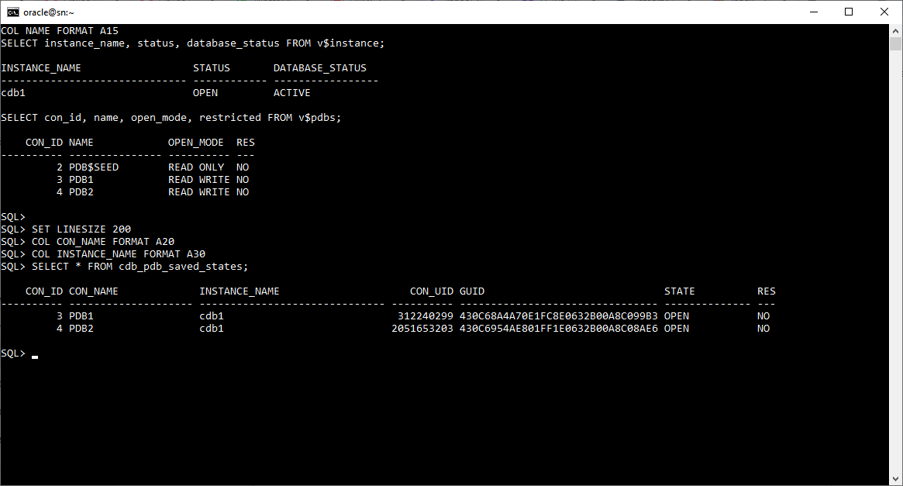

<br/><br/>

Tras ejecutar STARTUP FORCE, se valida con SHOW PDBS el estado de las bases pluggables: PDB_PROD y PDB_DEV abiertas en READ WRITE, PDB_TEST en READ ONLY, y las PDBs PDB1 y PDB2 en estado MOUNTED.

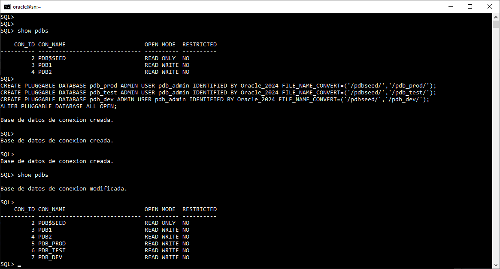

<br/><br/>

Se utiliza el comando HELP STARTUP para consultar la sintaxis y opciones del arranque de la base de datos, mostrando parámetros como FORCE, RESTRICT, MOUNT, READ WRITE y READ ONLY.

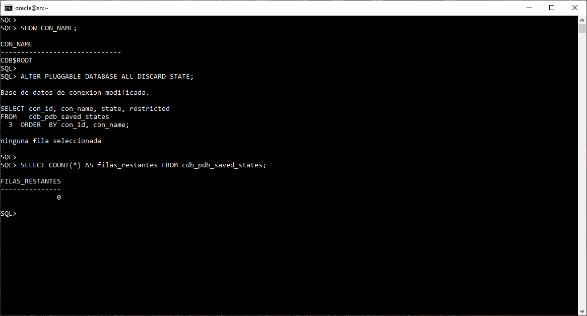

<br/><br/>

Durante el arranque del CDB se observan los mensajes de inicialización y apertura de las PDBs, confirmando que PDB_PROD, PDB_TEST y PDB_DEV se abren correctamente con su configuración de modo y character set AL32UTF8.


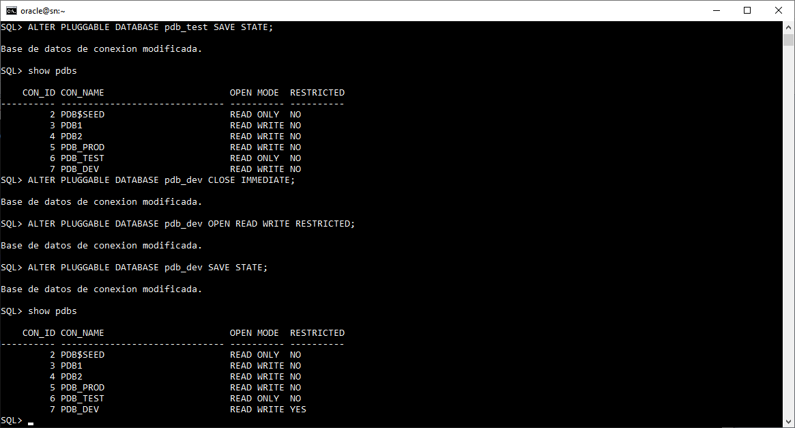

<br/><br/>

Después de un SHUTDOWN ABORT, al ejecutar STARTUP las PDBs se abren nuevamente en sus modos previos: PDB_PROD y PDB_DEV en READ WRITE, y PDB_TEST en READ ONLY, validando la persistencia de los estados guardados.

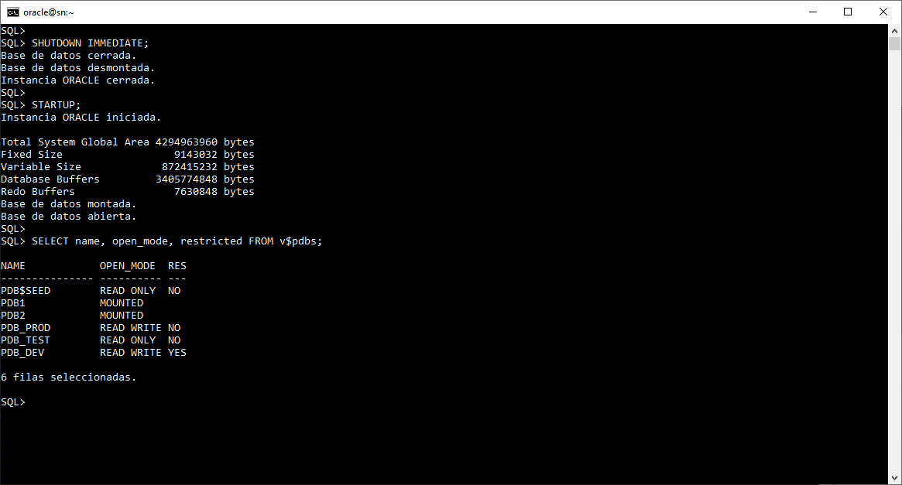

<br/><br/>

Se repite la validación tras un SHUTDOWN IMMEDIATE y posterior STARTUP, observando los mismos resultados de apertura automática en las PDBs configuradas con SAVE STATE.

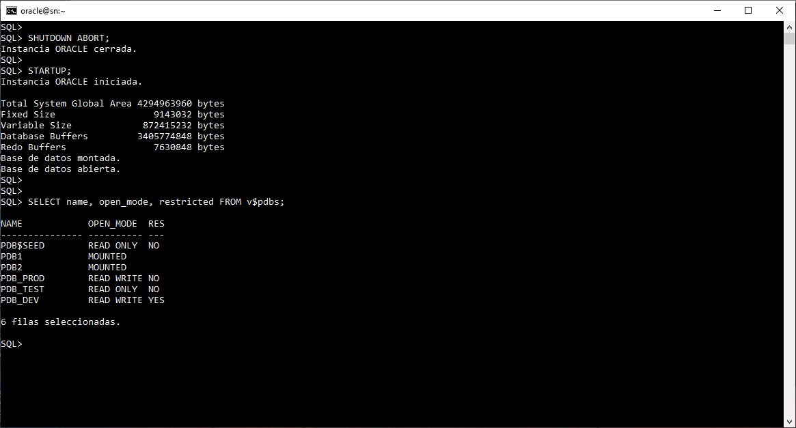

<br/><br/>

Se ejecutan comandos para configurar los estados persistentes: PDB_TEST se guarda en READ ONLY y PDB_DEV en READ WRITE RESTRICTED. El resultado muestra ambos modos aplicados correctamente.


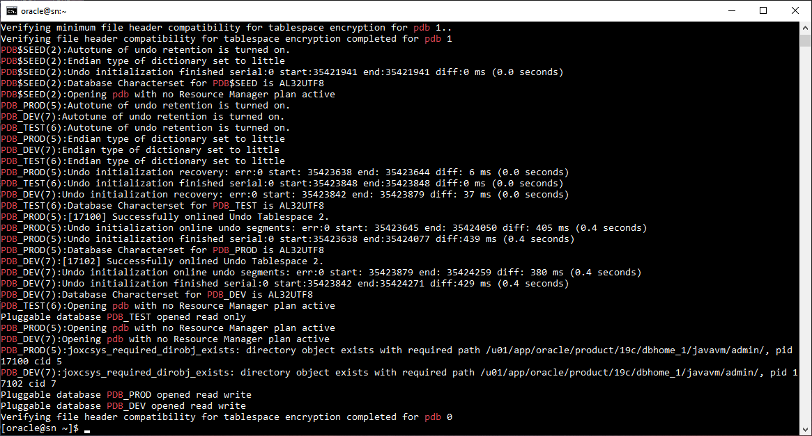

<br/><br/>

Desde CDB$ROOT se ejecuta ALTER PLUGGABLE DATABASE ALL DISCARD STATE, eliminando todos los estados guardados. La consulta a CDB_PDB_SAVED_STATES devuelve cero filas, confirmando su eliminación.

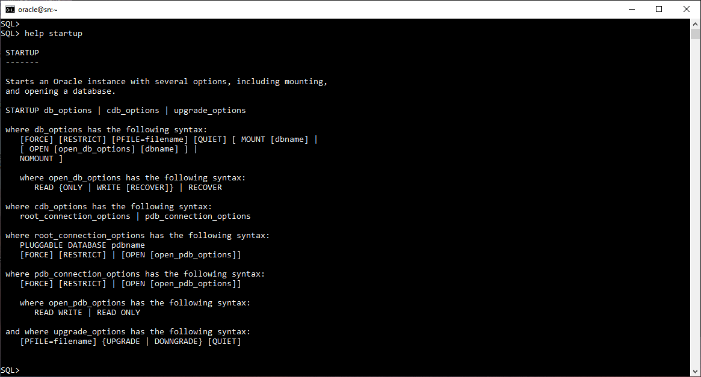

<br/><br/>

Se crean las PDBs PDB_PROD, PDB_TEST y PDB_DEV a partir de la semilla PDB$SEED utilizando FILE_NAME_CONVERT para definir sus ubicaciones. Las PDBs se abren en modo READ WRITE exitosamente.


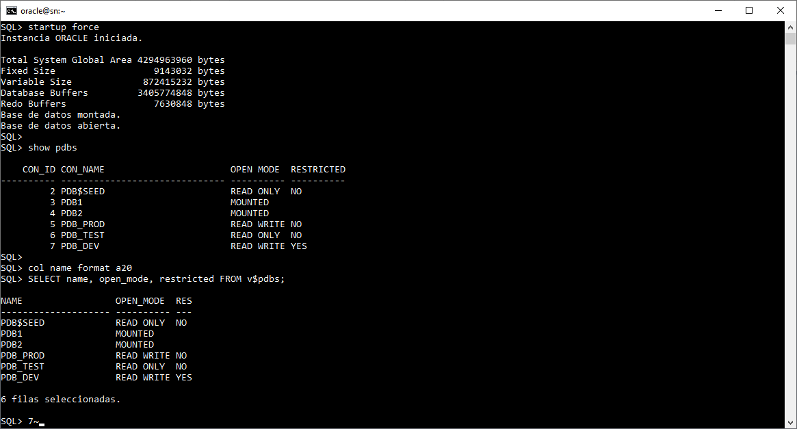

<br/><br/>

Se muestran los resultados de las vistas V$INSTANCE, V$PDBS y CDB_PDB_SAVED_STATES, donde la instancia cdb1 está activa y las PDBs PDB1 y PDB2 figuran con estado OPEN, confirmando el registro correcto de sus estados persistentes


<br/><br/>

Se ejecuta el comando ALTER PLUGGABLE DATABASE ALL DISCARD STATE para eliminar los estados persistentes de todas las PDBs, seguido de ALTER PLUGGABLE DATABASE ALL CLOSE IMMEDIATE para cerrarlas. Luego se realiza un SHUTDOWN IMMEDIATE y STARTUP, verificando con V$PDBS que las PDBs se abren en sus modos correspondientes: PDB_PROD y PDB_DEV en READ WRITE, PDB_TEST en READ ONLY, y las PDBs PDB1 y PDB2 permanecen montadas.


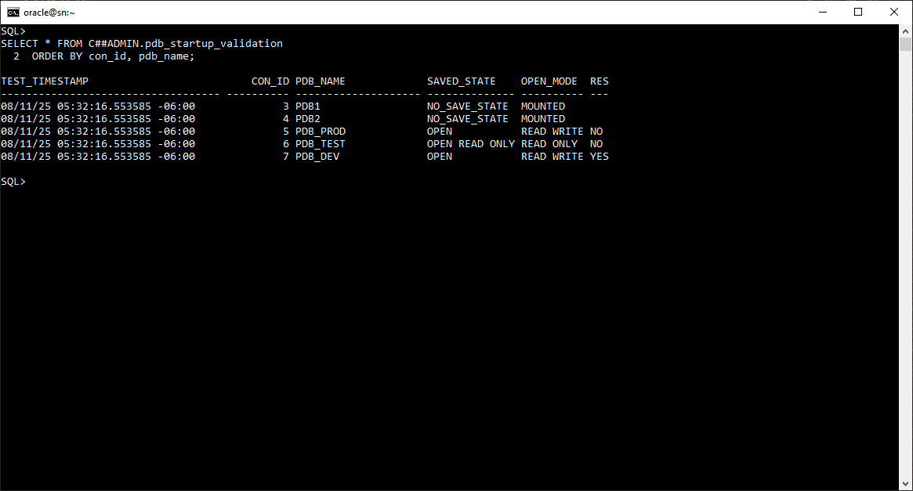

<br/><br/>

Se crea el disparador CDB_STARTUP_TRIGGER, configurado para ejecutarse automáticamente después de cada inicio de base de datos. Este trigger abre las PDBs según su nombre: PDB_PROD en READ WRITE, PDB_TEST en READ ONLY y PDB_DEV en READ WRITE RESTRICTED. La verificación en DBA_TRIGGERS confirma que el disparador fue creado correctamente y se encuentra habilitado. 


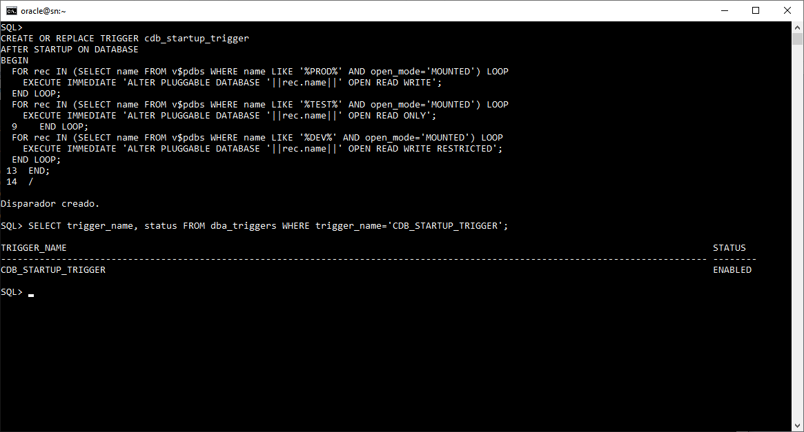

<br/><br/>

Se consulta la tabla C##ADMIN.pdb_startup_validation, creada para registrar el estado de cada PDB. El resultado muestra la marca de tiempo del registro, el CON_ID, el nombre de la PDB, su estado guardado (OPEN o NO_SAVE_STATE), el modo de apertura (READ WRITE o READ ONLY) y la columna RESTRICTED. Esto confirma que las PDBs mantienen los modos definidos tras el arranque del CDB.

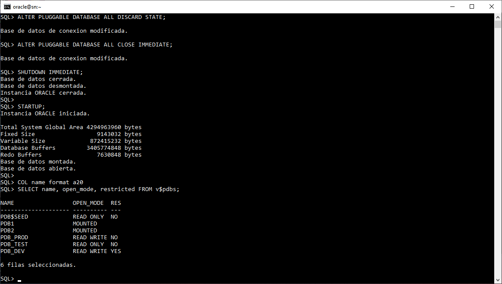

<br/><br/>

## **Mejores Prácticas para Producción**

<br/><br/>

### **1. Documentación**

| Recomendación                      | Descripción                                                                                          |
| ---------------------------------- | ---------------------------------------------------------------------------------------------------- |
| **Mantener runbooks actualizados** | Registra cada cambio en configuraciones, apertura de PDBs y políticas de SAVE STATE.                 |
| **Documentar dependencias**        | Define la relación entre PDBs, aplicaciones y servicios dependientes para facilitar la trazabilidad. |
| **Registrar RTO/RPO esperados**    | Establece los tiempos de recuperación (RTO) y pérdida máxima de datos (RPO) para cada PDB.           |

<br/><br/>

### **2. Monitoreo**

| Recomendación                          | Descripción                                                                                         |
| -------------------------------------- | --------------------------------------------------------------------------------------------------- |
| **Configurar alertas automáticas**     | Implementa notificaciones cuando una PDB no se abra correctamente o quede en modo restringido.      |
| **Medir tiempos de apertura**          | Registra y analiza el tiempo que tarda cada PDB en pasar de *MOUNTED* a *OPEN*.                     |
| **Auditar configuraciones SAVE STATE** | Supervisa periódicamente los estados persistentes y valida que coincidan con la política operativa. |

<br/><br/>

### **3. Testing**

| Recomendación                              | Descripción                                                                                        |
| ------------------------------------------ | -------------------------------------------------------------------------------------------------- |
| **Ejecutar pruebas de arranque y apagado** | Valida mensualmente los procedimientos `STARTUP` y `SHUTDOWN` para detectar inconsistencias.       |
| **Simular fallas controladas**             | Evalúa el comportamiento del CDB ante distintos tipos de apagado (`IMMEDIATE`, `ABORT`, `FORCE`).  |
| **Realizar drills de recuperación**        | Practica escenarios de recuperación ante desastres para garantizar tiempos de respuesta realistas. |

<br/><br/>

### **4. Automatización**

| Recomendación                              | Descripción                                                                                 |
| ------------------------------------------ | ------------------------------------------------------------------------------------------- |
| **Integrar validaciones en CI/CD**         | Incluye scripts de validación post-startup dentro de pipelines de despliegue automatizados. |
| **Automatizar notificaciones**             | Envía alertas a los equipos responsables cuando una PDB no cumple con el estado esperado.   |
| **Implementar mecanismos de self-healing** | Configura procedimientos automáticos que reabran o corrijan PDBs con fallas de apertura.    |


