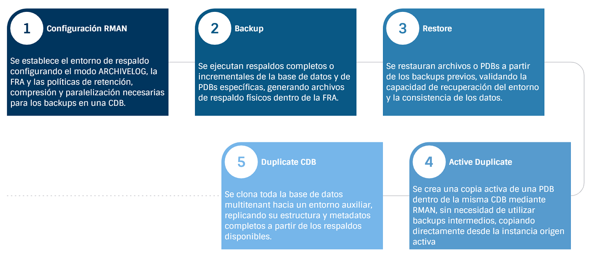

# Práctica 3.3 Active Duplicate de una PDB hacia la misma CDB


<br/><br/>

## Objetivos

* Configurar la infraestructura de conectividad Oracle Net (listener, tnsnames) necesaria para operaciones RMAN ACTIVE DUPLICATE.
* Ejecutar una clonación activa de PDB usando RMAN DUPLICATE sin requerir backups previos.
* Monitorear el progreso de la operación de clonación mediante vistas dinámicas de rendimiento (`V$SESSION_LONGOPS`, `V$RMAN_STATUS`).
* Validar la independencia completa entre la PDB origen y la PDB clonada mediante pruebas de modificación de datos.
* Documentar el consumo de recursos (red, I/O, memoria) durante el proceso y comparar con métodos alternativos de clonación.


<br/><br/>

## Tiempo estimado

- 60 minutos

<br/><br/>

## Tabla de ayuda


| **Comando / Vista / Parámetro**                   | **¿Para qué sirve?**                                                                      |
| ------------------------------------------------- | ----------------------------------------------------------------------------------------- |
| `lsnrctl status`                                  | Verifica que el listener de Oracle esté en ejecución y escuche el puerto configurado.     |
| `tnsping <servicio>`                              | Comprueba la conectividad de red y la resolución del alias definido en `tnsnames.ora`.    |
| `sqlplus / as sysdba`                             | Conecta a la base de datos como usuario administrativo SYSDBA.                            |
| `ARCHIVE LOG LIST`                                | Muestra si la base de datos está en modo ARCHIVELOG o NOARCHIVELOG.                       |
| `SHOW PARAMETER file_name_convert`                | Verifica si existe conversión automática de rutas entre archivos de diferentes PDBs.      |
| `CDB_DATA_FILES`                                  | Lista los datafiles de todas las PDBs abiertas en la CDB.                                 |
| `V$CONTAINERS`                                    | Muestra los nombres (`NAME`) y el identificador (`CON_ID`) de todos los contenedores.     |
| `V$DATAFILE`                                      | Lista los datafiles sin requerir que las PDBs estén abiertas (visible en modo MOUNTED).   |
| `V$SESSION_LONGOPS`                               | Muestra el progreso de operaciones de larga duración, como duplicaciones RMAN.            |
| `V$RMAN_STATUS`                                   | Contiene el historial de operaciones RMAN (BACKUP, RESTORE, DUPLICATE, etc.).             |
| `V$PDB_IOSTAT_DETAIL`                             | Reporta estadísticas de I/O (lecturas y escrituras físicas) por PDB.                      |
| `RMAN DUPLICATE PLUGGABLE DATABASE ...`           | Ejecuta una clonación activa de una PDB sin requerir respaldos previos.                   |
| `ALTER PLUGGABLE DATABASE ... OPEN`               | Abre una PDB en modo `READ WRITE` o `READ ONLY`.                                          |
| `ALTER PLUGGABLE DATABASE ... RENAME GLOBAL_NAME` | Permite renombrar una PDB existente dentro de la misma CDB.                               |
| `DROP PLUGGABLE DATABASE ... INCLUDING DATAFILES` | Elimina una PDB y sus datafiles físicos asociados.                                        |
| `CONTAINERS(view)`                                | Consulta consolidada que permite acceder a una vista en todas las PDBs (cross-container). |
| `V$SYSSTAT`                                       | Muestra estadísticas globales del sistema, incluyendo uso de memoria.                     |
| `df -h`                                           | Verifica espacio disponible en el sistema de archivos a nivel de servidor.                |
| `mkdir -p <ruta>` / `chmod` / `chown`             | Crea y asigna permisos a directorios para almacenamiento de datafiles de la PDB clonada.  |


<br/><br/>

## Objetivo visual



<br/><br/>

## **Prerequisitos**

**Labs previos requeridos:**

* Configuración de RMAN y backups de CDB completado.
* Estrategias de backup de PDBs completado.

<br/><br/>

## **Verificación Inicial del Ambiente**

Ejecuta los siguientes comandos para validar el entorno antes de iniciar:

```bash
# Verificar que el listener está en ejecución
lsnrctl status

# Verificar variables de ambiente
echo $ORACLE_HOME
echo $ORACLE_SID

# Verificar espacio en disco disponible
df -h $ORACLE_BASE/oradata
```

```sql
-- Conectar como SYSDBA
sqlplus / as sysdba

-- Verificar estado de la CDB
SELECT name, open_mode, cdb FROM v$database;

-- Verificar PDBs existentes
SELECT pdb_name, status, open_mode FROM cdb_pdbs ORDER BY pdb_name;

-- Verificar tamaño de la PDB origen (ejemplo: PDB1)
SELECT c.name AS pdb_name,
       ROUND(SUM(df.bytes)/1024/1024/1024, 2) AS data_gb
FROM   v$datafile df
JOIN   v$containers c
  ON   df.con_id = c.con_id
WHERE  c.name = 'PDB1'
GROUP  BY c.name
ORDER  BY c.name;
sshow
```

<br/><br/>

## Instrucciones

### Tarea 1. Preparar la PDB Origen con Datos de Prueba

```sql
ALTER SESSION SET CONTAINER = PDB1;

CREATE USER testuser IDENTIFIED BY Oracle123
DEFAULT TABLESPACE users
QUOTA UNLIMITED ON users;

GRANT CREATE SESSION, CREATE TABLE TO testuser;

CONNECT testuser/Oracle123@localhost:1521/PDB1

CREATE TABLE sales_data (
    id NUMBER PRIMARY KEY,
    customer_name VARCHAR2(100),
    product_name VARCHAR2(100),
    sale_amount NUMBER(10,2),
    sale_date DATE,
    notes VARCHAR2(4000)
);

BEGIN
    FOR i IN 1..1000000 LOOP
        INSERT INTO sales_data VALUES (
            i,
            'Customer_' || i,
            'Product_' || MOD(i, 100),
            ROUND(DBMS_RANDOM.VALUE(10, 10000), 2),
            SYSDATE - DBMS_RANDOM.VALUE(1, 365),
            RPAD('Sample data for testing ', 4000, 'X')
        );
        IF MOD(i, 10000) = 0 THEN
            COMMIT;
        END IF;
    END LOOP;
    COMMIT;
END;
/

SELECT COUNT(*) FROM sales_data;

SELECT
    tablespace_name,
    ROUND(SUM(bytes)/1024/1024, 2) AS size_mb
FROM user_segments
GROUP BY tablespace_name;

CONNECT / AS SYSDBA
```

> **Nota:** Debe haber alrededor de 1,000,000 registros y un tamaño de varios cientos de MB.

<br/><br/>

### Tarea 2. Configurar Servicios de Red para la PDB Origen

```bash
lsnrctl services
vi $ORACLE_HOME/network/admin/tnsnames.ora
```

Agregar al final del archivo:

```
PDB1 =
  (DESCRIPTION =
    (ADDRESS = (PROTOCOL = TCP)(HOST = localhost)(PORT = 1521))
    (CONNECT_DATA =
      (SERVER = DEDICATED)
      (SERVICE_NAME = PDB1)
    )
  )

PDB1_DUPLICATE =
  (DESCRIPTION =
    (ADDRESS = (PROTOCOL = TCP)(HOST = localhost)(PORT = 1521))
    (CONNECT_DATA =
      (SERVER = DEDICATED)
      (SERVICE_NAME = PDB1)
    )
  )

ORCL =
  (DESCRIPTION =
    (ADDRESS = (PROTOCOL = TCP)(HOST = localhost)(PORT = 1521))
    (CONNECT_DATA =
      (SERVER = DEDICATED)
      (SERVICE_NAME = ORCL)
    )
  )
```

```bash
tnsping PDB1
tnsping ORCL
sqlplus sys/Oracle123@PDB1 as sysdba
```

> **Nota:** Verifica que los pings y conexiones respondan correctamente.

<br/><br/>

### Tarea 3. Crear Directorio de Destino para la PDB Clonada

```bash
mkdir -p $ORACLE_BASE/oradata/ORCL/PDB1_CLONE
ls -ld $ORACLE_BASE/oradata/ORCL/PDB1_CLONE
chmod 755 $ORACLE_BASE/oradata/ORCL/PDB1_CLONE
chown oracle:oinstall $ORACLE_BASE/oradata/ORCL/PDB1_CLONE
```

> **Nota:** El directorio debe existir con permisos adecuados y propietario `oracle:oinstall`.

<br/><br/>

### Tarea 4. Preparar el Archivo de Password para Conexiones Remotas

```bash
ls -l $ORACLE_HOME/dbs/orapw$ORACLE_SID
orapwd file=$ORACLE_HOME/dbs/orapw$ORACLE_SID password=Oracle123 entries=10 force=y
chmod 640 $ORACLE_HOME/dbs/orapw$ORACLE_SID
```

> **Nota:** Debe existir y ser legible por el usuario oracle.

<br/><br/>

### Tarea 5. Configurar Parámetros de la PDB Origen

```sql
CONNECT / AS SYSDBA

ARCHIVE LOG LIST;

-- Si no está en modo archivelog:
SHUTDOWN IMMEDIATE;
STARTUP MOUNT;
ALTER DATABASE ARCHIVELOG;
ALTER DATABASE OPEN;

SELECT name, open_mode FROM v$pdbs WHERE name = 'PDB1';
ALTER PLUGGABLE DATABASE PDB1 OPEN READ WRITE;
SHOW PARAMETER file_name_convert;
```

> **Nota:** Confirma que la base está en modo ARCHIVELOG y la PDB en READ WRITE.

<br/><br/>

### Tarea 6. Ejecutar RMAN Active Duplicate de la PDB

```bash
rman TARGET sys/Oracle123@ORCL AUXILIARY sys/Oracle123@ORCL
```

```sql
SHOW ALL;

RUN {
    SET PARALLELISM 2;
    DUPLICATE PLUGGABLE DATABASE PDB1 AS PDB1_CLONE
        AUXILIARY DESTINATION '$ORACLE_BASE/oradata/ORCL/PDB1_CLONE';
}
```

> **Nota:** El proceso puede tardar entre 10–20 minutos según el hardware.

<br/><br/>

### Tarea 7. Monitorear el Progreso de la Clonación (Sesión Paralela)

```sql
sqlplus / as sysdba

SELECT
    sid, serial#, opname, target, sofar, totalwork,
    ROUND((sofar/totalwork)*100, 2) AS pct_complete,
    time_remaining, elapsed_seconds
FROM v$session_longops
WHERE opname LIKE '%Duplicate%' OR opname LIKE '%RMAN%'
ORDER BY start_time DESC;

SELECT
    sid, serial#, username, program, status, event, seconds_in_wait
FROM v$session
WHERE program LIKE '%rman%' OR client_info LIKE '%rman%';

SELECT
    operation, status, mbytes_processed, start_time, end_time
FROM v$rman_status
WHERE operation LIKE '%DUPLICATE%'
ORDER BY start_time DESC;

SELECT
    pdb_name,
    ROUND(SUM(phyrds)/1000, 2) AS physical_reads_k,
    ROUND(SUM(phywrts)/1000, 2) AS physical_writes_k
FROM v$pdb_iostat_detail
GROUP BY pdb_name
ORDER BY pdb_name;
```

> **Nota:** Debe observarse progreso incremental y actividad de I/O.

<br/><br/>

### Tarea 8. Verificar la Creación de la PDB Clonada

```sql
CONNECT / AS SYSDBA

SELECT pdb_id, pdb_name, status, open_mode, restricted, recovery_status
FROM cdb_pdbs ORDER BY pdb_name;

SELECT file_name, tablespace_name, ROUND(bytes/1024/1024, 2) AS size_mb, status
FROM cdb_data_files
WHERE con_id = (SELECT con_id FROM v$containers WHERE name = 'PDB1_CLONE')
ORDER BY file_name;

SELECT name, open_mode, restricted, open_time
FROM v$pdbs
WHERE name = 'PDB1_CLONE';
```

> **Nota:** Debe existir `PDB1_CLONE` y encontrarse en estado normal.

<br/><br/>

### Tarea 9. Abrir la PDB Clonada

```sql
ALTER PLUGGABLE DATABASE PDB1_CLONE OPEN READ WRITE;

SELECT name, open_mode, restricted FROM v$pdbs WHERE name = 'PDB1_CLONE';

SELECT name, pdb, network_name
FROM cdb_services
WHERE pdb = 'PDB1_CLONE'
ORDER BY name;
```

> **Nota:** Confirma que el modo sea READ WRITE.

<br/><br/>

### Tarea 10. Validar Independencia de Datos entre PDB Origen y Clonada

```sql
ALTER SESSION SET CONTAINER = PDB1_CLONE;

SELECT COUNT(*) FROM testuser.sales_data;

UPDATE testuser.sales_data
SET customer_name = 'CLONED_' || customer_name
WHERE ROWNUM <= 1000;
COMMIT;

SELECT customer_name FROM testuser.sales_data WHERE ROWNUM <= 5;

ALTER SESSION SET CONTAINER = PDB1;
SELECT customer_name FROM testuser.sales_data WHERE ROWNUM <= 5;
```


> **Nota:** Los datos modificados solo deben reflejarse en la PDB clonada.

<br/><br/>

### Tarea 11. Renombrar la PDB Clonada (Opcional)

```sql
CONNECT / AS SYSDBA
ALTER PLUGGABLE DATABASE PDB1_CLONE CLOSE IMMEDIATE;
ALTER PLUGGABLE DATABASE PDB1_CLONE RENAME GLOBAL_NAME TO PDB1_COPY;
ALTER PLUGGABLE DATABASE PDB1_COPY OPEN READ WRITE;

SELECT pdb_name, status, open_mode FROM cdb_pdbs WHERE pdb_name = 'PDB1_COPY';
SELECT name, open_mode FROM v$pdbs WHERE name = 'PDB1_COPY';
```

> **Nota:** Debe aparecer con el nuevo nombre `PDB1_COPY`.

<br/><br/>

### Tarea 12. Documentar Consumo de Recursos Durante la Clonación

```sql
CONNECT / AS SYSDBA

SELECT
    pdb_name,
    ROUND(SUM(phyrds), 2) AS total_physical_reads,
    ROUND(SUM(phywrts), 2) AS total_physical_writes,
    ROUND(SUM(phyblkrd), 2) AS total_blocks_read,
    ROUND(SUM(phyblkwrt), 2) AS total_blocks_written
FROM v$pdb_iostat_detail
WHERE pdb_name IN ('PDB1', 'PDB1_COPY')
GROUP BY pdb_name
ORDER BY pdb_name;

SELECT
    operation, status, start_time, end_time,
    ROUND((end_time - start_time) * 24 * 60, 2) AS duration_minutes,
    ROUND(mbytes_processed, 2) AS mb_processed,
    ROUND(mbytes_processed / NULLIF((end_time - start_time) * 24 * 60, 0), 2) AS mb_per_minute
FROM v$rman_status
WHERE operation = 'DUPLICATE'
    AND start_time > SYSDATE - 1
ORDER BY start_time DESC
FETCH FIRST 5 ROWS ONLY;

SELECT
    pdb_name,
    ROUND(SUM(bytes)/1024/1024/1024, 2) AS size_gb,
    COUNT(*) AS num_datafiles
FROM cdb_data_files
WHERE pdb_name IN ('PDB1', 'PDB1_COPY')
GROUP BY pdb_name
ORDER BY pdb_name;

SELECT name, value, ROUND(value/1024/1024, 2) AS value_mb
FROM v$sysstat
WHERE name LIKE '%memory%' AND value > 0
ORDER BY value DESC
FETCH FIRST 10 ROWS ONLY;
```

> **Nota:** Compara el consumo de recursos entre la PDB original y la clonada.

<br/><br/>

## **Limpieza del Ambiente (Opcional)**

```sql
CONNECT / AS SYSDBA
ALTER PLUGGABLE DATABASE PDB1_COPY CLOSE IMMEDIATE;
DROP PLUGGABLE DATABASE PDB1_COPY INCLUDING DATAFILES;

SELECT pdb_name, status FROM cdb_pdbs WHERE pdb_name = 'PDB1_COPY';
```

```bash
ls -l $ORACLE_BASE/oradata/ORCL/PDB1_CLONE/
rm -rf $ORACLE_BASE/oradata/ORCL/PDB1_CLONE/
```

> **Nota:** Si se desea conservar la PDB, solo cerrarla:

```sql
ALTER PLUGGABLE DATABASE PDB1_COPY CLOSE IMMEDIATE;
SELECT name, open_mode FROM v$pdbs WHERE name = 'PDB1_COPY';
```

<br/><br/>

## Resultado esperado

Durante la ejecución de RMAN, deberás ver los canales ORA_DISK_1 y ORA_DISK_2 copiando los datafiles de PDB1 hacia PDB1_CLONE. 
Cada archivo mostrará el mensaje “datafile copy complete”, y al final aparecerá “Finished Duplicate Db”, confirmando la clonación exitosa en /u01/app/oracle/oradata/CDB1/PDB1_CLONE/.

<br/><br/>


## **Salida esperada — RMAN Active Duplicate (CDB1 / PDB1 → PDB1_CLONE)**

```bash
$ rman TARGET sys/Oracle123@CDB1 AUXILIARY sys/Oracle123@CDB1

Recovery Manager: Release 19.0.0.0.0 - Production on Sat Nov 9 18:20:11 2025
Copyright (c) 1982, 2025, Oracle and/or its affiliates.  All rights reserved.

connected to target database: CDB1 (DBID=1125899907)
connected to auxiliary database: CDB1 (not mounted)

RMAN> SHOW ALL;

RMAN configuration parameters are:
CONFIGURE RETENTION POLICY TO REDUNDANCY 1;
CONFIGURE CONTROLFILE AUTOBACKUP ON;
CONFIGURE DEVICE TYPE DISK PARALLELISM 2 BACKUP TYPE TO BACKUPSET;
CONFIGURE CHANNEL DEVICE TYPE DISK FORMAT   '/u01/app/oracle/fast_recovery_area/CDB1/backupset/%U';
CONFIGURE COMPRESSION ALGORITHM 'BASIC';
CONFIGURE ENCRYPTION FOR DATABASE OFF;
CONFIGURE ARCHIVELOG DELETION POLICY TO NONE;
CONFIGURE BACKUP OPTIMIZATION OFF;
CONFIGURE DEFAULT DEVICE TYPE TO DISK;

RMAN> RUN {
2> SET PARALLELISM 2;
3> DUPLICATE PLUGGABLE DATABASE PDB1 AS PDB1_CLONE
4>   AUXILIARY DESTINATION '/u01/app/oracle/oradata/CDB1/PDB1_CLONE';
5> }

Starting Duplicate Db at 09-NOV-25 18:21:05
using channel ORA_DISK_1
using channel ORA_DISK_2

contents of Memory Script:
{
   sql clone "alter system set db_name='CDB1' comment='duplicate'";
   sql clone "alter pluggable database PDB1 open read only";
   set newname for datafile 1 to new;
   set newname for tempfile 1 to new;
   duplicate pluggable database PDB1 to PDB1_CLONE from active database
     dorecover
     spfile
     parameter_value_convert 'PDB1','PDB1_CLONE'
     nofilenamecheck;
}
executing Memory Script

allocated channel: ORA_DISK_1
channel ORA_DISK_1: SID=72 device type=DISK
allocated channel: ORA_DISK_2
channel ORA_DISK_2: SID=87 device type=DISK

channel ORA_DISK_1: starting datafile copy
input datafile file number=00031 name=/u01/app/oracle/oradata/CDB1/PDB1/system01.dbf
output file name=/u01/app/oracle/oradata/CDB1/PDB1_CLONE/system01.dbf
channel ORA_DISK_1: datafile copy complete, elapsed time: 00:02:38

channel ORA_DISK_2: starting datafile copy
input datafile file number=00032 name=/u01/app/oracle/oradata/CDB1/PDB1/sysaux01.dbf
output file name=/u01/app/oracle/oradata/CDB1/PDB1_CLONE/sysaux01.dbf
channel ORA_DISK_2: datafile copy complete, elapsed time: 00:02:41

channel ORA_DISK_1: starting datafile copy
input datafile file number=00033 name=/u01/app/oracle/oradata/CDB1/PDB1/users01.dbf
output file name=/u01/app/oracle/oradata/CDB1/PDB1_CLONE/users01.dbf
channel ORA_DISK_1: datafile copy complete, elapsed time: 00:00:46

channel ORA_DISK_2: starting datafile copy
input datafile file number=00034 name=/u01/app/oracle/oradata/CDB1/PDB1/undotbs01.dbf
output file name=/u01/app/oracle/oradata/CDB1/PDB1_CLONE/undotbs01.dbf
channel ORA_DISK_2: datafile copy complete, elapsed time: 00:00:44

Finished Duplicate Db at 09-NOV-25 18:32:14
```

<br/><br/>

### **Verificación en RMAN**

```bash
RMAN> LIST PLUGGABLE DATABASE SUMMARY;

List of Pluggable Databases
===========================

Key   PDB Name     CON_ID         Status
---   -----------  -------------  ------------
  1   PDB$SEED     2              AVAILABLE
  2   PDB1         3              AVAILABLE
  3   PDB1_CLONE   9              AVAILABLE


RMAN> LIST DATAFILE COPY OF PLUGGABLE DATABASE PDB1_CLONE;

List of Datafile Copies
=======================

File Key   File Name
---------  ---------------------------------------------
1          /u01/app/oracle/oradata/CDB1/PDB1_CLONE/system01.dbf
2          /u01/app/oracle/oradata/CDB1/PDB1_CLONE/sysaux01.dbf
3          /u01/app/oracle/oradata/CDB1/PDB1_CLONE/users01.dbf
4          /u01/app/oracle/oradata/CDB1/PDB1_CLONE/undotbs01.dbf


RMAN> REPORT SCHEMA FOR PLUGGABLE DATABASE PDB1_CLONE;

Report of database schema for PDB1_CLONE

List of Permanent Datafiles
===========================

File # Name                                          Size (MB)
------ --------------------------------------------- ----------
31     /u01/app/oracle/oradata/CDB1/PDB1_CLONE/system01.dbf   740
32     /u01/app/oracle/oradata/CDB1/PDB1_CLONE/sysaux01.dbf   640
33     /u01/app/oracle/oradata/CDB1/PDB1_CLONE/users01.dbf     60
34     /u01/app/oracle/oradata/CDB1/PDB1_CLONE/undotbs01.dbf  200
```


> **Nota:**
> La salida mostrada en esta práctica, incluyendo los valores de **identificadores (`CON_ID`, `PDB_ID`)**, los nombres de los **canales RMAN**, los tiempos de ejecución y los **tamaños de los datafiles**, puede variar ligeramente según el entorno del participante.
> Estas diferencias dependen del **hardware**, la **configuración de la CDB/PDB**, la **capacidad de almacenamiento**, y los **recursos asignados** en la máquina utilizada durante el curso.
> Por lo tanto, los resultados observados deben considerarse **referenciales**, no exactos, siempre que las operaciones se completen sin errores y se valide la creación correcta de la PDB clonada.
