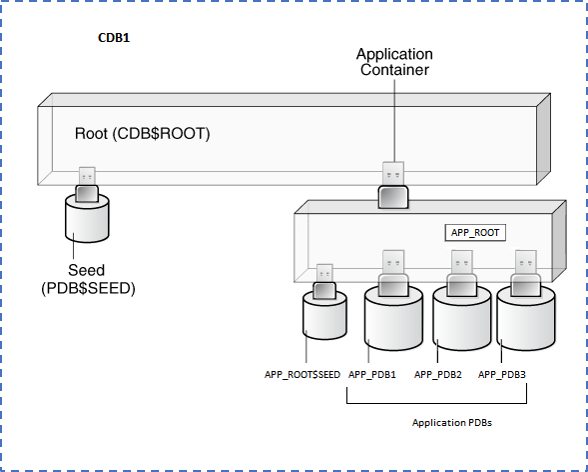
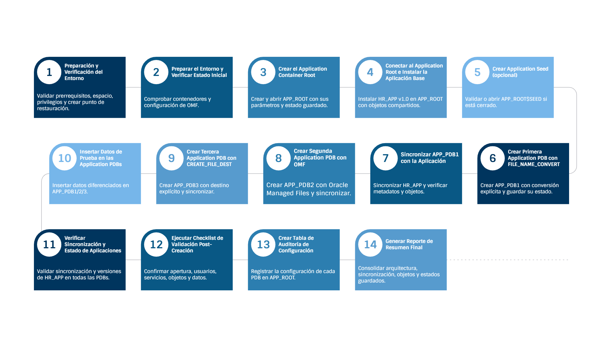

# Práctica 4.1 Creación de Application PDBs y Sincronización

<br/><br/>

## Objetivos

* Crear un Application Container Root con parámetros específicos de aplicación y configuración de archivos.
* Instalar una aplicación base (versión 1.0) en el Application Root utilizando `BEGIN/END INSTALL`.
* Crear múltiples Application PDBs desde el Application Seed usando diferentes métodos (`FILE_NAME_CONVERT`, OMF, `CREATE_FILE_DEST`).
* Verificar la sincronización automática de objetos de aplicación desde el Application Root a las Application PDBs.
* Validar el registro de versiones y estado de sincronización mediante vistas de diccionario de datos.

<br/><br/>

## Tiempo estimado

- 120 mins

<br/><br/>

## Tablas de Ayuda  

#### Tabla de ayuda 1. Conceptos Clave de Application Containers

| Concepto                     | Descripción                                                                                                                 |
| ---------------------------- | --------------------------------------------------------------------------------------------------------------------------- |
| **AS APPLICATION CONTAINER** | Declara una PDB como **Application Container Root**, que servirá como base para las Application PDBs derivadas.             |
| **ADMIN USER app_admin**     | Crea el usuario administrador local del Application Container con privilegios de gestión.                                   |
| **FILE_NAME_CONVERT**        | Convierte las rutas o nombres de archivos desde la plantilla (`pdbseed`) hacia la nueva PDB destino.                        |
| **STORAGE (MAXSIZE 10G)**    | Define el límite máximo de almacenamiento que podrá usar la base de datos contenedora.                                      |
| **DEFAULT TABLESPACE users** | Especifica el tablespace predeterminado donde se almacenarán los objetos de usuario.                                        |
| **SHARING = METADATA**       | Permite compartir la **definición de los objetos** entre Application PDBs, manteniendo **datos independientes** por tenant. |
| **BEGIN / END INSTALL**      | Delimita la instalación de una aplicación dentro del Application Root, registrando su versión y cambios.                    |


<br/><br/>

#### Tabla de ayuda 2. Comandos Operativos y de Sincronización

| Comando / Vista                                                | Descripción                                                                                            |
| -------------------------------------------------------------- | ------------------------------------------------------------------------------------------------------ |
| **CREATE PLUGGABLE DATABASE**                                  | Crea una PDB o Application PDB dentro del CDB o Application Container activo.                          |
| **ALTER PLUGGABLE DATABASE OPEN**                              | Abre una PDB o Application PDB en modo `READ WRITE` para permitir operaciones DML y DDL.               |
| **ALTER PLUGGABLE DATABASE SAVE STATE**                        | Guarda el estado actual de la PDB para que se abra automáticamente al iniciar el CDB.                  |
| **ALTER PLUGGABLE DATABASE APPLICATION ... SYNC**              | Sincroniza la aplicación instalada en el Application Root hacia las Application PDBs derivadas.        |
| **ALTER PLUGGABLE DATABASE APPLICATION ... BEGIN/END INSTALL** | Marca el inicio y final de instalación de una aplicación dentro del Application Root.                  |
| **DBA_APPLICATIONS / DBA_APP_PDB_STATUS**                      | Vistas de diccionario que muestran las aplicaciones registradas y su estado de sincronización por PDB. |
| **CDB_OBJECTS / CDB_USERS / V$CONTAINERS**                     | Vistas multitenant que permiten validar objetos, usuarios, contenedores y su tipo (ROOT, PDB o SEED).  |


<br/><br/>

## Objetivo visual 

- Arquitectura de CDB1 con Application Container y Application PDBs



<br/><br/>

- Flujo de tareas del laboratorio 4.1 — Application Containers




<br/><br/>

## Instrucciones

### Tarea 1. Preparación y Verificación del Entorno

Se valida que la base de datos cumple con los prerrequisitos para trabajar con Application Containers. Incluye comprobar versión (Oracle ≥19.3), modo multitenant (`CDB=YES`), espacio disponible, privilegios SYSDBA, y parámetro `COMPATIBLE`. También se verifica que no existan Application Containers previos que interfieran. Finalmente, se crea un **restore point garantizado** (`CREATE RESTORE POINT ... GUARANTEE FLASHBACK DATABASE`) que permitirá revertir el entorno si algo falla durante el laboratorio.

<br/><br/>

#### **Paso 1.** Validación de prerrequisitos

```bash
# Conectarse como usuario oracle
su - oracle

# Conectar como SYSDBA
sqlplus / as sysdba
```

```sql

-- Script de validación de prerequisitos
SET SERVEROUTPUT ON
SET LINESIZE 200
SET PAGESIZE 1000
PROMPT ============================================
PROMPT  VALIDACIÓN DE PREREQUISITOS - 
PROMPT ============================================

-- Verificar versión de Oracle
PROMPT
PROMPT [1] Verificando versión de Oracle Database...
SELECT banner FROM v$version WHERE banner LIKE 'Oracle%';

-- Verificar modo multitenant
PROMPT
PROMPT [2] Verificando modo multitenant (debe ser YES)...
SELECT name, cdb, con_id FROM v$database;

-- Verificar espacio disponible
PROMPT
PROMPT [3] Verificando espacio disponible en disco...
SELECT
    tablespace_name,
    ROUND(SUM(bytes)/1024/1024/1024, 2) AS total_gb,
    ROUND(SUM(CASE WHEN autoextensible = 'YES' THEN maxbytes ELSE bytes END)/1024/1024/1024, 2) AS max_gb
FROM dba_data_files
WHERE tablespace_name IN ('SYSTEM', 'SYSAUX', 'USERS')
GROUP BY tablespace_name;

-- Verificar privilegios del usuario actual
PROMPT
PROMPT [4] Verificando privilegios del usuario...
SELECT privilege FROM session_privs WHERE privilege IN ('SYSDBA', 'CREATE PLUGGABLE DATABASE', 'ALTER DATABASE');

-- Verificar parámetro COMPATIBLE
PROMPT
PROMPT [5] Verificando parámetro COMPATIBLE...
SELECT name, value FROM v$parameter WHERE name = 'compatible';

-- Verificar Application Containers existentes
PROMPT
PROMPT [6] Verificando Application Containers existentes...
SELECT con_id, name, open_mode, application_root, application_pdb, application_seed
FROM v$containers
WHERE application_root = 'YES' OR application_pdb = 'YES' OR application_seed = 'YES'
ORDER BY con_id;

PROMPT
PROMPT ============================================
PROMPT  VALIDACIÓN COMPLETADA
PROMPT ============================================
```

<br/><br/>

**Nota (criterios de validación):**

* Versión Oracle Database 19c (19.3.0 o superior)
* `CDB = YES`
* Espacio disponible > 20 GB
* Privilegios SYSDBA presentes
* `COMPATIBLE >= 19.0.0`

<br/><br/>


> **Nota de Prerrequisito**
>
> Esta práctica requiere un entorno con **CDB1 operativo** y al menos una **PDB funcional** creada desde la semilla.  
>  
> Si tu entorno aún no cuenta con una PDB activa, completa primero las siguientes prácticas:
> Práctica 1.1 Creación de CDB y PDB regulares — configuración inicial del CDB y PDB.  
> Práctica 2.1 Servicios en CDBs y PDBs — verificación de servicios y modos de apertura.  
> Práctica 3.3 Active Duplicate de una PDB hacia la misma CDB — clonación opcional de una PDB existente.  
>
> Una vez verificado tu entorno, continúa con la creación del punto de restauración garantizado.

<br/><br/>

#### **Paso 2.** Crear punto de restauración garantizado

```sql
-- Conectar al CDB como SYSDBA
CONNECT / AS SYSDBA

-- Crear punto de restauración garantizado
CREATE RESTORE POINT before_lab  GUARANTEE FLASHBACK DATABASE;

-- Verificar creación
SELECT name, scn, time, guarantee_flashback_database
FROM v$restore_point
WHERE name = 'BEFORE_LAB';
```

<br/><br/>

### Tarea 2. Preparar el Entorno y Verificar Estado Inicial

Se comprueba que el **CDB y sus PDBs** estén operativos, revisando su estado mediante `v$containers`. Luego se valida o configura la ruta de **Oracle Managed Files (OMF)** con `SHOW PARAMETER db_create_file_dest`. Esto asegura que los futuros datafiles se creen automáticamente sin rutas manuales, simplificando la gestión de las PDBs que se crearán más adelante.      

<br/><br/>

#### **Paso 1.** Conectar al CDB y listar contenedores

```sql
-- Conectar al CDB$ROOT
CONNECT / AS SYSDBA

-- Verificar contenedor actual
SHOW CON_NAME
SHOW CON_ID

-- Listar PDBs existentes
COL name FORMAT A30
COL open_mode FORMAT A15
COL restricted FORMAT A10
COL application_root FORMAT A5
COL application_pdb FORMAT A5

SELECT con_id, name, open_mode, restricted, application_root, application_pdb
FROM v$containers
ORDER BY con_id;
```

#### **Paso 2.** Verificar configuración de Oracle Managed Files (OMF)

```sql
-- Verificar parámetros de OMF
COL name FORMAT A40
COL value FORMAT A60

SELECT name, value
FROM v$parameter
WHERE name IN ('db_create_file_dest', 'db_recovery_file_dest', 'db_create_online_log_dest_1');
```

#### **Paso 3.** Configurar OMF si no está establecido

```sql
-- Configurar OMF para simplificar gestión de archivos
ALTER SYSTEM SET db_create_file_dest='/u01/app/oracle/oradata' SCOPE=BOTH;

-- Verificar configuración
SHOW PARAMETER db_create_file_dest;
```

<br/><br/>

### Tarea 3. Crear el Application Container Root

Se crea el contenedor principal de la aplicación, **APP_ROOT**, usando la instrucción `CREATE PLUGGABLE DATABASE ... AS APPLICATION CONTAINER`. Se define un usuario administrador (`app_admin`), el límite de almacenamiento (`STORAGE (MAXSIZE 10G)`) y el tablespace por defecto (`DEFAULT TABLESPACE users`). Luego se abre el contenedor en modo `READ WRITE` y se guarda su estado con `ALTER PLUGGABLE DATABASE SAVE STATE` para que se abra automáticamente junto con el CDB.  

<br/><br/>

#### **Paso 1.** Crear `APP_ROOT`

```sql
-- Crear Application Container Root
CREATE PLUGGABLE DATABASE app_root AS APPLICATION CONTAINER
  ADMIN USER app_admin IDENTIFIED BY Oracle123_App
  ROLES = (DBA)
  FILE_NAME_CONVERT = ('pdbseed', 'app_root')
  STORAGE (MAXSIZE 10G)
  DEFAULT TABLESPACE users
    DATAFILE SIZE 100M AUTOEXTEND ON NEXT 10M MAXSIZE 1G;
SHOW PDBS;
```

#### **Paso 2.** Abrir `APP_ROOT` en READ WRITE

```sql
-- Abrir APP_ROOT
ALTER PLUGGABLE DATABASE app_root OPEN;

-- Verificar estado
SELECT con_id, name, open_mode, restricted, application_root, application_seed
FROM v$containers
WHERE name = 'APP_ROOT';
```

#### **Paso 3.** Guardar estado de `APP_ROOT`

```sql
-- Guardar estado de APP_ROOT
ALTER PLUGGABLE DATABASE app_root SAVE STATE;

-- Verificar configuración guardada
COL instance_name FORMAT A15
SELECT * FROM dba_pdb_saved_states WHERE con_name = 'APP_ROOT';

ALTER SESSION SET CONTAINER = app_root;

SHOW con_name;
SHOW user;
```

<br/><br/>

### Tarea 4. Conectar al Application Root e Instalar la Aplicación Base

Se cambia el contexto a **APP_ROOT** (`ALTER SESSION SET CONTAINER=app_root`) y se instala una aplicación base llamada **HR_APP v1.0** mediante el ciclo `BEGIN INSTALL` / `END INSTALL`. Durante la instalación, se crea el usuario común `HR_APP_USER`, las tablas de empleados, departamentos y configuración, la vista `EMP_DEPT_VIEW`, y el procedimiento `ADD_EMPLOYEE`. Todos los objetos se crean con `SHARING = METADATA` para que su definición se sincronice automáticamente hacia las Application PDBs, pero no sus datos.

<br/><br/>


#### **Paso 1.** Cambiar contexto a `APP_ROOT`

```sql
-- Conectar al Application Root
ALTER SESSION SET CONTAINER = app_root;

-- Verificar contenedor actual
SHOW CON_NAME;
SHOW USER;
```

#### **Paso 2.** Iniciar instalación de la aplicación v1.0

```sql
-- Iniciar instalación de aplicación versión 1.0
ALTER PLUGGABLE DATABASE APPLICATION hr_app BEGIN INSTALL '1.0';

-- Verificar que estamos en modo instalación
SELECT app_name, app_version, app_status
FROM dba_applications
WHERE app_name = 'HR_APP';
```

#### **Paso 3.** Crear usuario de aplicación común

```sql
-- Crear usuario común para la aplicación (debe empezar con C## o c##)
CREATE USER hr_app_user IDENTIFIED BY Oracle123_HR
  DEFAULT TABLESPACE users
  QUOTA UNLIMITED ON users
  CONTAINER = ALL;

-- Otorgar privilegios necesarios
GRANT CREATE SESSION, DBA TO hr_app_user CONTAINER = ALL;
```

#### **Paso 4.** Crear objetos de aplicación (tablas)

```sql
-- Mostrar usuario debe ser SYS
SHOW USER;

-- Crear tabla de empleados (objeto de aplicación)
CREATE TABLE hr_app_user.employees_app SHARING = METADATA (
    employee_id    NUMBER(6) PRIMARY KEY,
    first_name     VARCHAR2(20),
    last_name      VARCHAR2(25) NOT NULL,
    email          VARCHAR2(25) NOT NULL UNIQUE,
    phone_number   VARCHAR2(20),
    hire_date      DATE NOT NULL,
    job_id         VARCHAR2(10) NOT NULL,
    salary         NUMBER(8,2),
    commission_pct NUMBER(2,2),
    manager_id     NUMBER(6),
    department_id  NUMBER(4),
    created_date   DATE DEFAULT SYSDATE
);

-- Crear tabla de departamentos
CREATE TABLE hr_app_user.departments_app SHARING = METADATA (
    department_id   NUMBER(4) PRIMARY KEY,
    department_name VARCHAR2(30) NOT NULL,
    manager_id      NUMBER(6),
    location_id     NUMBER(4)
);

-- Crear tabla de configuración de aplicación
CREATE TABLE hr_app_user.app_config SHARING = METADATA  (
    config_key   VARCHAR2(50) PRIMARY KEY,
    config_value VARCHAR2(200),
    description  VARCHAR2(500),
    modified_date DATE DEFAULT SYSDATE
);

-- Insertar datos de configuración inicial
INSERT INTO hr_app_user.app_config (config_key, config_value, description)
VALUES ('APP_VERSION', '1.0', 'Current application version');

INSERT INTO hr_app_user.app_config (config_key, config_value, description)
VALUES ('MAX_SALARY', '50000', 'Maximum salary allowed for new employees');

INSERT INTO hr_app_user.app_config (config_key, config_value, description)
VALUES ('COMPANY_NAME', 'Acme Corporation', 'Company name for reports');

COMMIT;
```

#### **Paso 5.** Crear vista de aplicación

```sql
-- Crear vista que combina empleados y departamentos
CREATE VIEW hr_app_user.emp_dept_view SHARING = METADATA AS
SELECT
    e.employee_id,
    e.first_name,
    e.last_name,
    e.email,
    e.salary,
    d.department_name,
    d.location_id
FROM hr_app_user.employees_app e
LEFT JOIN hr_app_user.departments_app d ON e.department_id = d.department_id;
```

#### **Paso 6.** Crear procedimiento almacenado

```sql
-- Crear procedimiento para añadir empleado
CREATE OR REPLACE PROCEDURE hr_app_user.add_employee SHARING = METADATA (
    p_first_name   IN VARCHAR2,
    p_last_name    IN VARCHAR2,
    p_email        IN VARCHAR2,
    p_hire_date    IN DATE DEFAULT SYSDATE,
    p_job_id       IN VARCHAR2,
    p_salary       IN NUMBER,
    p_department_id IN NUMBER DEFAULT NULL
) 
AS
    v_employee_id NUMBER;
    v_max_salary  NUMBER;
BEGIN
    -- Obtener configuración de salario máximo
    SELECT TO_NUMBER(config_value) INTO v_max_salary
    FROM hr_app_user.app_config WHERE config_key = 'MAX_SALARY';

    -- Validar salario
    IF p_salary > v_max_salary THEN
        RAISE_APPLICATION_ERROR(-20001, 'Salary exceeds maximum allowed: ' || v_max_salary);
    END IF;

    -- Generar nuevo ID de empleado
    SELECT NVL(MAX(employee_id), 0) + 1 INTO v_employee_id FROM     hr_app_user.employees_app;

    -- Insertar empleado
    INSERT INTO hr_app_user.employees_app (
        employee_id, first_name, last_name, email, hire_date,
        job_id, salary, department_id
    ) VALUES (
        v_employee_id, p_first_name, p_last_name, p_email, p_hire_date,
        p_job_id, p_salary, p_department_id
    );

    COMMIT;

    DBMS_OUTPUT.PUT_LINE('Employee created with ID: ' || v_employee_id);
EXCEPTION
    WHEN OTHERS THEN
        ROLLBACK;
        RAISE;
END add_employee;
/
```

#### **Paso 7.** Finalizar instalación de la aplicación

```sql

-- Finalizar instalación de aplicación versión 1.0
ALTER PLUGGABLE DATABASE APPLICATION hr_app END INSTALL '1.0';
```

#### **Paso 8.** Verificar aplicación registrada

```sql
-- Verificar aplicación registrada
COL app_name FORMAT A15
COL app_version FORMAT A12
COL app_status FORMAT A15

SELECT app_name, app_version, app_status, app_implicit
FROM dba_applications
WHERE app_name = 'HR_APP';
```

#### **Paso 9.** Verificar objetos de aplicación en el Root

```sql
-- Verificar objetos compartidos en el Application Root
COL owner FORMAT A20
COL object_name FORMAT A30
COL object_type FORMAT A15
COL sharing FORMAT A15

SELECT owner, object_name, object_type, sharing
FROM dba_objects
WHERE owner = 'HR_APP_USER'
  AND object_name LIKE '%APP%'
ORDER BY object_type, object_name;
```

<br/><br/>

### Tarea 5. Crear Application Seed (Opcional pero Recomendado)

Se valida la existencia del Application Seed (`APP_ROOT$SEED`) que Oracle genera automáticamente al crear el Application Root. Esta PDB especial funciona como **plantilla base** para crear Application PDBs derivadas. En caso de estar cerrada, se abre con `ALTER PLUGGABLE DATABASE app_root$seed OPEN`. 

<br/><br/>

#### **Paso 1.** Verificar si existe el Application Seed

```sql

-- Verificar si existe Application Seed
SELECT con_id, name, open_mode, application_seed
FROM v$containers
WHERE application_seed = 'YES'
  AND con_id IN (SELECT con_id FROM v$containers START WITH name = 'APP_ROOT' CONNECT BY PRIOR con_id = con_id);
```

**Nota:** Oracle crea automáticamente un Application Seed llamado **APP_ROOT$SEED** cuando creas el Application Root. No necesitas crearlo manualmente a menos que quieras personalizarlo.


#### **Paso 2.** Abrir el Application Seed (si está cerrado)

```sql
-- Abrir Application Seed si está cerrado
ALTER PLUGGABLE DATABASE app_root$seed OPEN;

-- Verificar estado
SELECT name, open_mode, application_seed
FROM v$containers
WHERE name = 'APP_ROOT$SEED';
```

<br/><br/>

### Tarea 6. Crear Primera Application PDB con FILE_NAME_CONVERT

Se crea **APP_PDB1**, la primera PDB derivada del Application Root, usando el método **FILE_NAME_CONVERT**, que mapea manualmente rutas de archivos entre `APP_ROOT` y la nueva PDB. Se define un usuario administrador (`pdb1_admin`), se abre la PDB en `READ WRITE` y se guarda su estado. Este método ejemplifica el control manual sobre las ubicaciones físicas de los datafiles.                                                                    

<br/><br/>

#### **Paso 1.** Crear APP_PDB1 con FILE_NAME_CONVERT

```sql
-- Asegurarse de estar en APP_ROOT
ALTER SESSION SET CONTAINER = app_root;

-- Crear primera Application PDB
CREATE PLUGGABLE DATABASE app_pdb1
  ADMIN USER pdb1_admin IDENTIFIED BY Oracle123_PDB1
  ROLES = (DBA)
  FILE_NAME_CONVERT = ('/u01/app/oracle/oradata/ORCL/pdbseed/', 
  '/u01/app/oracle/oradata/ORCL/app_pdb1/');
```

#### **Paso 2.** Abrir APP_PDB1

```sql
-- Abrir APP_PDB1
ALTER PLUGGABLE DATABASE app_pdb1 OPEN;

-- Verificar estado
SELECT con_id, name, open_mode, restricted, application_pdb
FROM v$containers
WHERE name = 'APP_PDB1';
```

#### **Paso 3.** Guardar estado para apertura automática

```sql
-- Guardar estado de APP_PDB1
ALTER PLUGGABLE DATABASE app_pdb1 SAVE STATE;
```

<br/><br/>

### Tarea 7. Sincronizar APP_PDB1 con la Aplicación

 Una vez creada la primera Application PDB, se sincroniza con la aplicación instalada en APP_ROOT mediante `ALTER PLUGGABLE DATABASE APPLICATION hr_app SYNC`. Este comando replica las definiciones de objetos de `HR_APP_USER` hacia APP_PDB1. Luego se validan las vistas `DBA_APPLICATIONS` y `DBA_OBJECTS` para confirmar la propagación de metadatos. Las tablas deben estar vacías, confirmando que solo se copiaron las definiciones. 

<br/><br/>

#### **Paso 1.** Sincronizar APP_PDB1

```sql
-- Cambiar al contexto de APP_PDB1
ALTER SESSION SET CONTAINER = app_pdb1;

-- Sincronizar con la aplicación
ALTER PLUGGABLE DATABASE APPLICATION hr_app SYNC;
```

#### **Paso 2.** Verificar estado de la aplicación en APP_PDB1

```sql
-- Verificar estado de sincronización
COL app_name FORMAT A15
COL app_version FORMAT A12
COL app_status FORMAT A15

SELECT app_name, app_version, app_status
FROM dba_applications
WHERE app_name = 'HR_APP';
```

#### **Paso 3.** Validar objetos sincronizados

```sql
-- Verificar objetos sincronizados
COL owner FORMAT A20
COL object_name FORMAT A30
COL object_type FORMAT A15
COL sharing FORMAT A15

SELECT owner, object_name, object_type, sharing, origin_con_id
FROM dba_objects
WHERE owner = 'HR_APP_USER'
  AND object_name LIKE '%APP%'
ORDER BY object_type, object_name;
```

#### **Paso 4.** Confirmar que las tablas están vacías (solo metadatos)

```sql
-- Conectar como usuario de aplicación en APP_PDB1
CONNECT hr_app_user/Oracle123_HR@localhost/app_pdb1

-- Verificar contenido de tablas
SELECT COUNT(*) as employee_count FROM employees_app;
SELECT COUNT(*) as department_count FROM departments_app;
SELECT COUNT(*) as config_count FROM app_config;
```

<br/><br/>

### Tarea 8. Crear Segunda Application PDB con OMF

Se crea **APP_PDB2** utilizando **Oracle Managed Files (OMF)**, sin necesidad de especificar rutas de archivos. Este método delega a Oracle la gestión de ubicaciones físicas. Se abre, se guarda su estado y se sincroniza con la aplicación `HR_APP`. Finalmente, se consulta `DBA_DATA_FILES` para confirmar que los datafiles se encuentran en los directorios OMF definidos por `db_create_file_dest`.  

<br/><br/>

#### **Paso 1.** Crear APP_PDB2 con OMF

```sql
-- Reconectar como SYSDBA y cambiar a APP_ROOT
CONNECT / AS SYSDBA
ALTER SESSION SET CONTAINER = app_root;

-- Crear segunda Application PDB con OMF (sin FILE_NAME_CONVERT)
CREATE PLUGGABLE DATABASE app_pdb2
  ADMIN USER pdb2_admin IDENTIFIED BY Oracle123_PDB2
  ROLES = (DBA);
```

#### **Paso 2.** Abrir, guardar estado y sincronizar APP_PDB2

```sql
-- Abrir APP_PDB2
ALTER PLUGGABLE DATABASE app_pdb2 OPEN;

-- Guardar estado
ALTER PLUGGABLE DATABASE app_pdb2 SAVE STATE;

-- Cambiar a APP_PDB2 y sincronizar
ALTER SESSION SET CONTAINER = app_pdb2;

-- Sincronizar con la aplicación
ALTER PLUGGABLE DATABASE APPLICATION hr_app SYNC;

-- Verificar sincronización
SELECT app_name, app_version, app_status
FROM dba_applications
WHERE app_name = 'HR_APP';
```

#### **Paso 3.** Verificar ubicación de archivos de datos (OMF)

```sql
-- Verificar archivos de datos de APP_PDB2
COL file_name FORMAT A80
COL tablespace_name FORMAT A20

SELECT file_id, tablespace_name, file_name, bytes/1024/1024 as size_mb
FROM dba_data_files
ORDER BY file_id;
```

<br/><br/>

### Tarea 9. Crear Tercera Application PDB con CREATE_FILE_DEST

Se crea **APP_PDB3** usando el parámetro `CREATE_FILE_DEST` para asignar explícitamente el directorio donde se almacenarán sus archivos (`/u01/app/oracle/oradata/CDB1/app_pdb3`). Luego se abre, se guarda su estado y se sincroniza con la aplicación. Este método muestra cómo se pueden controlar las rutas de almacenamiento sin usar FILE_NAME_CONVERT.

<br/><br/>

#### **Paso 1.** Crear APP_PDB3 con `CREATE_FILE_DEST`

```sql
-- Cambiar a APP_ROOT
ALTER SESSION SET CONTAINER = app_root;

-- Crear tercera Application PDB con CREATE_FILE_DEST específico
CREATE PLUGGABLE DATABASE app_pdb3
  ADMIN USER pdb3_admin IDENTIFIED BY Oracle123_PDB3
  ROLES = (DBA)
  CREATE_FILE_DEST = '/u01/app/oracle/oradata/CDB1/app_pdb3';
```

#### **Paso 2.** Abrir, guardar estado y sincronizar APP_PDB3

```sql
-- Abrir APP_PDB3
ALTER PLUGGABLE DATABASE app_pdb3 OPEN;

-- Guardar estado
ALTER PLUGGABLE DATABASE app_pdb3 SAVE STATE;

-- Cambiar a APP_PDB3 y sincronizar
ALTER SESSION SET CONTAINER = app_pdb3;

-- Sincronizar con la aplicación
ALTER PLUGGABLE DATABASE APPLICATION hr_app SYNC;

-- Verificar sincronización
SELECT app_name, app_version, app_status
FROM dba_applications
WHERE app_name = 'HR_APP';
```

<br/><br/>

### Tarea 10. Insertar Datos de Prueba en las Application PDBs

Se insertan datos en cada PDB para comprobar que las definiciones son compartidas, pero los datos independientes. En APP_PDB1 se insertan empleados y departamentos del área administrativa, en APP_PDB2 datos del área financiera y recursos humanos, y en APP_PDB3 datos de investigación y desarrollo. Se usa el procedimiento `ADD_EMPLOYEE` para validar la lógica de negocio distribuida. 

<br/><br/>


#### **Paso 1.** Insertar datos en APP_PDB1

```sql
-- Conectar como usuario de aplicación en APP_PDB1
CONNECT hr_app_user/Oracle123_HR@localhost/app_pdb1

-- Insertar departamentos
INSERT INTO departments_app VALUES (10, 'Administración', NULL, 1700);
INSERT INTO departments_app VALUES (20, 'Marketing', NULL, 1800);
INSERT INTO departments_app VALUES (30, 'Ventas', NULL, 1700);
INSERT INTO departments_app VALUES (40, 'TI', NULL, 2400);
COMMIT;

-- Usar procedimiento para insertar empleados
SET SERVEROUTPUT ON
EXEC add_employee('Juan', 'Pérez', 'jperez@acme.com', SYSDATE, 'IT_PROG', 45000, 40);
EXEC add_employee('María', 'González', 'mgonzalez@acme.com', SYSDATE, 'SA_REP', 38000, 30);
EXEC add_employee('Carlos', 'Rodríguez', 'crodriguez@acme.com', SYSDATE, 'AD_ASST', 28000, 10);

-- Verificar datos insertados
SELECT employee_id, first_name, last_name, department_id, salary
FROM employees_app
ORDER BY employee_id;

-- Verificar vista
SELECT first_name, last_name, department_name, salary
FROM emp_dept_view
ORDER BY employee_id;
```

#### **Paso 2.** Insertar datos en APP_PDB2

```sql
-- Conectar a APP_PDB2
CONNECT hr_app_user/Oracle123_HR@localhost/app_pdb2

-- Insertar departamentos diferentes
INSERT INTO departments_app VALUES (50, 'Recursos Humanos', NULL, 2400);
INSERT INTO departments_app VALUES (60, 'Finanzas', NULL, 1700);
INSERT INTO departments_app VALUES (70, 'Operaciones', NULL, 2700);
COMMIT;

-- Insertar empleados
EXEC add_employee('Ana', 'Martínez', 'amartinez@acme.com', SYSDATE, 'HR_REP', 32000, 50);
EXEC add_employee('Luis', 'López', 'llopez@acme.com', SYSDATE, 'FI_ACCOUNT', 42000, 60);

-- Verificar datos
SELECT employee_id, first_name, last_name, department_id, salary
FROM employees_app;
```

#### **Paso 3.** Insertar datos en APP_PDB3

```sql
-- Conectar a APP_PDB3
CONNECT hr_app_user/Oracle123_HR@localhost/app_pdb3

-- Insertar departamentos
INSERT INTO departments_app VALUES (80, 'Investigación', NULL, 1500);
INSERT INTO departments_app VALUES (90, 'Desarrollo', NULL, 1400);
COMMIT;

-- Insertar empleados
EXEC add_employee('Elena', 'Sánchez', 'esanchez@acme.com', SYSDATE, 'IT_PROG', 48000, 90);
EXEC add_employee('Pedro', 'Ramírez', 'pramirez@acme.com', SYSDATE, 'IT_PROG', 46000, 90);
EXEC add_employee('Laura', 'Torres', 'ltorres@acme.com', SYSDATE, 'ST_CLERK', 25000, 80);

-- Verificar datos
SELECT employee_id, first_name, last_name, department_id, salary
FROM employees_app;
```

<br/><br/>

### Tarea 11. Verificar Sincronización y Estado de Aplicaciones

Se ejecutan consultas sobre `CDB_APPLICATIONS`, `DBA_APP_PDB_STATUS` y `V$CONTAINERS` para consolidar el estado de todas las PDBs. Esto permite comprobar la versión de aplicación instalada, si las PDBs están sincronizadas y si existe coherencia entre el Application Root y las Application PDBs derivadas. 

<br/><br/>

#### **Paso 1.** Vista consolidada del estado en todas las Application PDBs

```sql
-- Conectar como SYSDBA al CDB$ROOT
CONNECT / AS SYSDBA

-- Crear script de verificación consolidada
SET LINESIZE 200
SET PAGESIZE 100
COL pdb_name FORMAT A15
COL app_name FORMAT A15
COL app_version FORMAT A12
COL app_status FORMAT A15
COL sync_status FORMAT A15

-- Verificar estado de aplicación en todas las PDBs
SELECT
    c.name as pdb_name,
    c.con_id,
    c.open_mode,
    c.application_root,
    c.application_pdb,
    a.app_name,
    a.app_version,
    a.app_status
FROM v$containers c
LEFT JOIN cdb_applications a ON c.con_id = a.con_id
WHERE c.application_root = 'YES'
   OR c.application_pdb = 'YES'
   OR c.application_seed = 'YES'
ORDER BY c.con_id;
```

#### **Paso 2.** Verificar versiones de aplicación registradas

```sql
-- Consultar historial de versiones de aplicación
COL app_name FORMAT A15
COL app_version FORMAT A12
COL app_version_comment FORMAT A40

SELECT app_name, app_version, app_version_comment
FROM dba_app_versions
WHERE app_name = 'HR_APP'
ORDER BY app_version;
```

#### **Paso 3.** Estado de sincronización detallado por PDB

```sql
-- Verificar estado de sincronización en cada Application PDB
COL pdb_name FORMAT A15
COL app_name FORMAT A15
COL app_statement FORMAT A20
COL app_status FORMAT A15

SELECT
    p.pdb_name,
    s.app_name,
    s.app_statement,
    s.app_status
FROM dba_app_pdb_status s
JOIN dba_pdbs p ON s.con_uid = p.con_uid
WHERE s.app_name = 'HR_APP'
ORDER BY p.pdb_name;
```

<br/><br/>


### Tarea 12. Ejecutar Checklist de Validación Post-Creación

 Se validan aspectos globales del entorno tras la creación de todas las PDBs: modo de apertura (`READ WRITE`), existencia de usuarios comunes (`HR_APP_USER`), tablespaces, servicios registrados (`v$services`), objetos en cada PDB (`CDB_OBJECTS`), y conteo de datos reales en las tablas de aplicación mediante un bloque PL/SQL iterativo. Esta tarea garantiza la integridad general del entorno multitenant.

<br/><br/>

#### **Paso 1.** Verificar modo de apertura de todas las PDBs

```sql
-- Verificar que todas las PDBs están abiertas en READ WRITE
SELECT name, open_mode, restricted
FROM v$pdbs
WHERE name LIKE 'APP%'
ORDER BY name;
```

#### **Paso 2.** Verificar usuarios comunes

```sql
-- Verificar que el usuario común existe en todas las PDBs
COL username FORMAT A20
COL common FORMAT A10
COL con_id FORMAT 999999

SELECT con_id, username, common, account_status
FROM cdb_users
WHERE username = 'HR_APP_USER'
ORDER BY con_id;
```

#### **Paso 3.** Verificar tablespaces en cada Application PDB

```sql
-- Verificar tablespaces por PDB
SET LINESIZE 200
COL pdb_name FORMAT A15
COL tablespace_name FORMAT A20
COL status FORMAT A10

SELECT
    p.name as pdb_name,
    t.tablespace_name,
    t.status,
    t.contents,
    ROUND(SUM(d.bytes)/1024/1024, 2) as size_mb
FROM v$containers p
JOIN cdb_tablespaces t ON p.con_id = t.con_id
JOIN cdb_data_files d ON t.tablespace_name = d.tablespace_name AND t.con_id = d.con_id
WHERE p.name LIKE 'APP_PDB%'
GROUP BY p.name, t.tablespace_name, t.status, t.contents
ORDER BY p.name, t.tablespace_name;
```

#### **Paso 4.** Verificar servicios de red (TNS)

```sql
-- Verificar servicios registrados
COL name FORMAT A25
COL pdb FORMAT A15

SELECT name, pdb, con_id
FROM v$services
WHERE pdb LIKE 'APP%'
ORDER BY pdb;
```

#### **Paso 5.** Verificar conteo de objetos por PDB

```sql
-- Contar objetos de aplicación en cada PDB
SELECT
    con_id,
    owner,
    object_type,
    COUNT(*) as object_count
FROM cdb_objects
WHERE owner = 'HR_APP_USER'
  AND con_id IN (SELECT con_id FROM v$containers WHERE name LIKE 'APP%')
GROUP BY con_id, owner, object_type
ORDER BY con_id, object_type;
```

#### **Paso 6.** Verificar conteo de datos en cada Application PDB

```sql
-- Crear script para verificar conteo de datos en cada PDB
SET SERVEROUTPUT ON
DECLARE
    v_count NUMBER;
    v_pdb_name VARCHAR2(30);
BEGIN
    FOR pdb IN (SELECT name, con_id FROM v$containers WHERE application_pdb = 'YES' ORDER BY name) LOOP
        v_pdb_name := pdb.name;

        -- Contar empleados
        EXECUTE IMMEDIATE 'ALTER SESSION SET CONTAINER = ' || v_pdb_name;
        EXECUTE IMMEDIATE 'SELECT COUNT(*) FROM hr_app_user.employees_app' INTO v_count;
        DBMS_OUTPUT.PUT_LINE(v_pdb_name || ' - Employees: ' || v_count);

        -- Contar departamentos
        EXECUTE IMMEDIATE 'SELECT COUNT(*) FROM c##hr_app_user.departments_app' INTO v_count;
        DBMS_OUTPUT.PUT_LINE(v_pdb_name || ' - Departments: ' || v_count);

        DBMS_OUTPUT.PUT_LINE('---');
    END LOOP;

    -- Volver a CDB$ROOT
    EXECUTE IMMEDIATE 'ALTER SESSION SET CONTAINER = CDB$ROOT';
END;
/
```

<br/><br/>

### Tarea 13. Crear Tabla de Auditoría de Configuración

Se registra en el Application Root una tabla de auditoría (`APP_CONFIGURATION_AUDIT`) con metadatos descriptivos de las PDBs creadas, métodos de creación utilizados y notas explicativas. Es útil para trazabilidad y documentación operativa.

<br/><br/>

#### **Paso 1.** Crear tabla de auditoría en APP_ROOT e insertar registros

```sql
-- Conectar al Application Root
CONNECT / AS SYSDBA
ALTER SESSION SET CONTAINER = app_root;

-- Crear tabla de auditoría de configuración
CREATE TABLE app_configuration_audit SHARING = METADATA (
    audit_id        NUMBER GENERATED ALWAYS AS IDENTITY PRIMARY KEY,
    audit_timestamp TIMESTAMP DEFAULT SYSTIMESTAMP,
    pdb_name        VARCHAR2(30),
    configuration_item VARCHAR2(100),
    configuration_value VARCHAR2(500),
    notes           VARCHAR2(1000)
);

-- Insertar registros de configuración
INSERT INTO app_configuration_audit (pdb_name, configuration_item, configuration_value, notes)
VALUES ('APP_ROOT', 'Application Container Created', 'HR_APP v1.0', 'Initial Application Container setup');

INSERT INTO app_configuration_audit (pdb_name, configuration_item, configuration_value, notes)
VALUES ('APP_PDB1', 'Application PDB Created', 'FILE_NAME_CONVERT method', 'Created with explicit file name conversion');

INSERT INTO app_configuration_audit (pdb_name, configuration_item, configuration_value, notes)
VALUES ('APP_PDB2', 'Application PDB Created', 'OMF method', 'Created using Oracle Managed Files');

INSERT INTO app_configuration_audit (pdb_name, configuration_item, configuration_value, notes)
VALUES ('APP_PDB3', 'Application PDB Created', 'CREATE_FILE_DEST method', 'Created with specific file destination');

COMMIT;

-- Verificar registros de auditoría
COL pdb_name FORMAT A15
COL configuration_item FORMAT A30
COL configuration_value FORMAT A30
COL audit_timestamp FORMAT A30

SELECT
    TO_CHAR(audit_timestamp, 'YYYY-MM-DD HH24:MI:SS') as audit_timestamp,
    pdb_name,
    configuration_item,
    configuration_value
FROM app_configuration_audit
ORDER BY audit_id;
```

<br/><br/>

### Tarea 14. Generar Reporte de Resumen Final

Se genera un **reporte consolidado** que resume la arquitectura de Application Container, las PDBs creadas, el estado de sincronización, las aplicaciones instaladas, los objetos por PDB y los estados guardados. El reporte se genera con `SPOOL` hacia `/tmp/app_container_report_01_03_01.txt`. Marca el cierre formal del laboratorio y permite conservar evidencia del entorno final. 

<br/><br/>


#### **Paso 1.** Script del reporte consolidado (ejecútalo en CDB$ROOT)

```sql
-- Conectar como SYSDBA al CDB$ROOT
CONNECT / AS SYSDBA

-- Configurar formato de salida
SET LINESIZE 200
SET PAGESIZE 1000
SET FEEDBACK OFF
SET VERIFY OFF

PROMPT ========================================================================
PROMPT  REPORTE DE RESUMEN - APPLICATION CONTAINER LAB
PROMPT ========================================================================
PROMPT

PROMPT [1] ARQUITECTURA DE APPLICATION CONTAINER
PROMPT ========================================================================
COL name FORMAT A20
COL open_mode FORMAT A12
COL app_root FORMAT A10
COL app_pdb FORMAT A10
COL app_seed FORMAT A10

SELECT
    con_id,
    name,
    open_mode,
    CASE WHEN application_root = 'YES' THEN 'ROOT' ELSE '-' END as app_root,
    CASE WHEN application_pdb = 'YES' THEN 'PDB' ELSE '-' END as app_pdb,
    CASE WHEN application_seed = 'YES' THEN 'SEED' ELSE '-' END as app_seed
FROM v$containers
WHERE name LIKE 'APP%'
ORDER BY con_id;

PROMPT
PROMPT [2] APLICACIONES INSTALADAS
PROMPT ========================================================================
COL con_id FORMAT 999999
COL app_name FORMAT A15
COL app_version FORMAT A12
COL app_status FORMAT A15

SELECT
    con_id,
    app_name,
    app_version,
    app_status,
    app_implicit
FROM cdb_applications
WHERE app_name = 'HR_APP'
ORDER BY con_id;

PROMPT
PROMPT [3] ESTADO DE SINCRONIZACIÓN
PROMPT ========================================================================
COL pdb_name FORMAT A15
COL app_statement FORMAT A15

SELECT
    p.pdb_name,
    s.app_name,
    s.app_statement,
    s.app_status
FROM dba_app_pdb_status s
JOIN dba_pdbs p ON s.con_uid = p.con_uid
WHERE s.app_name = 'HR_APP'
ORDER BY p.pdb_name;

PROMPT
PROMPT [4] OBJETOS DE APLICACIÓN POR PDB
PROMPT ========================================================================
COL pdb_name FORMAT A15
COL object_type FORMAT A15

SELECT
    c.name as pdb_name,
    o.object_type,
    COUNT(*) as object_count
FROM cdb_objects o
JOIN v$containers c ON o.con_id = c.con_id
WHERE o.owner = 'C##HR_APP_USER'
  AND c.name LIKE 'APP%'
GROUP BY c.name, o.object_type
ORDER BY c.name, o.object_type;

PROMPT
PROMPT [5] ARCHIVOS DE DATOS POR PDB
PROMPT ========================================================================
COL pdb_name FORMAT A15
COL file_name FORMAT A60
COL size_mb FORMAT 999,999.99

SELECT
    p.name as pdb_name,
    d.file_name,
    d.bytes/1024/1024 as size_mb
FROM cdb_data_files d
JOIN v$containers p ON d.con_id = p.con_id
WHERE p.name LIKE 'APP%'
ORDER BY p.name, d.file_id;

PROMPT
PROMPT [6] ESTADOS GUARDADOS
PROMPT ========================================================================
COL con_name FORMAT A20
COL instance_name FORMAT A15
COL state FORMAT A10

SELECT con_name, instance_name, state
FROM dba_pdb_saved_states
WHERE con_name LIKE 'APP%'
ORDER BY con_name;

PROMPT
PROMPT ========================================================================
PROMPT  FIN DEL REPORTE
PROMPT ========================================================================

SET FEEDBACK ON
SET VERIFY ON
```

#### **Paso 2.** Guardar el reporte en un archivo

```sql
-- Generar reporte en archivo (ajusta ruta si lo deseas)
SPOOL /tmp/app_container_report_01_03_01.txt

-- Ejecutar el script de reporte anterior si lo guardaste como archivo
-- O bien, simplemente deja activo el SPOOL antes de ejecutar el bloque del reporte
-- @/tmp/reporte_resumen.sql

SPOOL OFF
```


<br/><br/>

## Resultado esperado

Para considerar este laboratorio completado exitosamente, valida los siguientes puntos y sus **consultas asociadas**:

1. **Application Container Root creado y abierto**

```sql
SELECT COUNT(*) FROM v$containers
WHERE name = 'APP_ROOT' AND application_root = 'YES' AND open_mode = 'READ WRITE';
-- Resultado esperado: 1
```

2. **Aplicación HR_APP v1.0 instalada en APP_ROOT**

```sql
ALTER SESSION SET CONTAINER = app_root;
SELECT COUNT(*) FROM dba_applications
WHERE app_name = 'HR_APP' AND app_version = '1.0' AND app_status = 'NORMAL';
-- Resultado esperado: 1
```

3. **Tres Application PDBs creadas y sincronizadas**

```sql
SELECT COUNT(*) FROM v$containers
WHERE name IN ('APP_PDB1', 'APP_PDB2', 'APP_PDB3')
  AND application_pdb = 'YES'
  AND open_mode = 'READ WRITE';
-- Resultado esperado: 3
```

4. **Objetos de aplicación sincronizados en todas las PDBs**

```sql
SELECT con_id, COUNT(*) as object_count
FROM cdb_objects
WHERE owner = 'HR_APP_USER'
  AND con_id IN (SELECT con_id FROM v$containers WHERE name LIKE 'APP_PDB%')
GROUP BY con_id
HAVING COUNT(*) >= 5;
-- Resultado esperado: 3 filas (una por cada PDB) con al menos 5 objetos cada una
```

5. **Datos de prueba insertados en cada PDB**

```sql
-- Ejecutar desde cada PDB
ALTER SESSION SET CONTAINER = app_pdb1;
SELECT COUNT(*) FROM hr_app_user.employees_app;
-- Resultado esperado: > 0

ALTER SESSION SET CONTAINER = app_pdb2;
SELECT COUNT(*) FROM hr_app_user.employees_app;
-- Resultado esperado: > 0

ALTER SESSION SET CONTAINER = app_pdb3;
SELECT COUNT(*) FROM hr_app_user.employees_app;
-- Resultado esperado: > 0
```

6. **Estados guardados para APP_ROOT y las APP_PDBs**

```sql
SELECT COUNT(*) FROM dba_pdb_saved_states
WHERE con_name IN ('APP_ROOT', 'APP_PDB1', 'APP_PDB2', 'APP_PDB3');
-- Resultado esperado: 4
```

> **Nota final para el participante:** Los nombres exactos de archivos, tamaños, IDs de contenedor y tiempos de ejecución **pueden variar** según el entorno (hardware, configuración OMF, rutas y FRA). Lo importante es que cada validación lógica se cumpla tal como está descrita.
