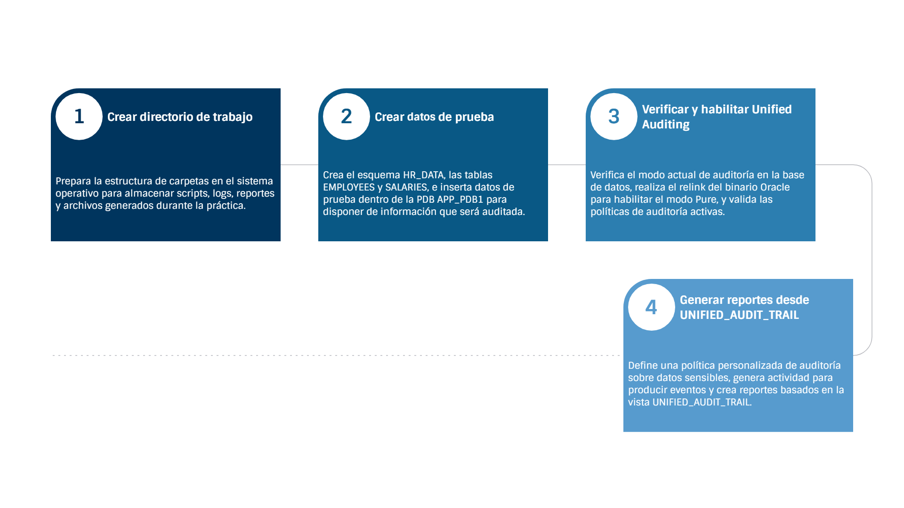

# Práctica 4.2 Configurar Unified Auditing

<br/><br/>

## Objetivos

* Verificar y habilitar **Unified Auditing** en modo *pure* en Oracle Database 19c.
* Generar reportes personalizados de eventos de auditoría utilizando la vista `UNIFIED_AUDIT_TRAIL` y otras vistas del diccionario.

<br/><br/>

## Tiempo estimado

- 60 minutos


<br/><br/>

## Tabla de ayuda


| Comando / Vista                          | Descripción                                                                         |
| ---------------------------------------- | ----------------------------------------------------------------------------------- |
| `V$OPTION`                               | Verifica si Unified Auditing está habilitado.                                       |
| `SHOW PARAMETER audit_trail`             | Muestra el modo de auditoría configurado.                                           |
| `V$VERSION`                              | Identifica si el binario está compilado con Unified Auditing.                       |
| `AUDIT_UNIFIED_ENABLED_POLICIES`         | Lista las políticas activas de auditoría unificada.                                 |
| `UNIFIED_AUDIT_TRAIL`                    | Muestra los registros de auditoría generados en la PDB actual.                      |
| `CDB_UNIFIED_AUDIT_TRAIL`                | Muestra los registros de auditoría de todas las PDBs, incluyendo el campo `CON_ID`. |
| `make -f ins_rdbms.mk uniaud_on ioracle` | Relinkea el binario de Oracle habilitando Unified Auditing en modo puro.            |


<br/><br/>

## Objetivo visual



<br/><br/>

## Instrucciones

### Tarea 1. Crear directorio de trabajo

1. Conéctate al sistema operativo con el usuario `oracle`.
2. Crea el directorio principal y subcarpetas del laboratorio:

```bash
mkdir -p /home/oracle/lab_02
cd /home/oracle/lab_02

mkdir -p scripts logs reports exports
```

<br/><br/>

 

### Tarea 2. Crear datos de prueba

#### **Paso 1.** Crear el script SQL

Crea el archivo `vi /home/oracle/lab_02/scripts/setup_test_data.sql` con el siguiente contenido:

```sql
connect / as sysdba

ALTER SESSION SET CONTAINER = APP_PDB1;

CREATE USER hr_data IDENTIFIED BY Oracle123
DEFAULT TABLESPACE users
TEMPORARY TABLESPACE temp
QUOTA UNLIMITED ON users;

GRANT CONNECT, RESOURCE TO hr_data;

GRANT CREATE VIEW TO hr_data;

CONNECT hr_data/Oracle123@localhost:1521/APP_PDB1;

CREATE TABLE employees (
    employee_id NUMBER PRIMARY KEY,
    first_name  VARCHAR2(50),
    last_name   VARCHAR2(50),
    email       VARCHAR2(100),
    hire_date   DATE,
    department  VARCHAR2(50)
);

CREATE TABLE salaries (
    employee_id NUMBER,
    salary NUMBER,
    bonus NUMBER,
    effective_date DATE,
    CONSTRAINT fk_emp FOREIGN KEY (employee_id)
        REFERENCES employees(employee_id)
);

BEGIN
  FOR i IN 1..500 LOOP
    INSERT INTO employees VALUES (
      i, 'FirstName'||i, 'LastName'||i,
      'employee'||i||'@company.com',
      SYSDATE - DBMS_RANDOM.VALUE(1,3650),
      CASE MOD(i,5)
        WHEN 0 THEN 'IT'
        WHEN 1 THEN 'HR'
        WHEN 2 THEN 'Finance'
        WHEN 3 THEN 'Sales'
        ELSE 'Operations'
      END
    );

    INSERT INTO salaries VALUES (
      i,
      ROUND(DBMS_RANDOM.VALUE(40000,200000),2),
      ROUND(DBMS_RANDOM.VALUE(0,50000),2),
      SYSDATE - DBMS_RANDOM.VALUE(1,365)
    );
  END LOOP;
  COMMIT;
END;
/
```

<br/><br/>

#### **Paso 2.** Ejecutar el script

```bash
cd /home/oracle/lab_02/scripts
sqlplus / as sysdba @setup_test_data.sql > ../logs/setup_test_data.log
```

<br/><br/>

#### **Paso 3.** Validar los datos

```sql
sqlplus hr_data/Oracle123@localhost:1521/APP_PDB1;
SELECT COUNT(*) AS employee_count FROM employees;
SELECT COUNT(*) AS salary_count FROM salaries;
SELECT COUNT(*) AS high_earners FROM salaries WHERE salary > 100000;
```

<br/>

#### **Paso 4.** Crear tablas similares en APP_PDB2

Crea el archivo `vi /home/oracle/lab_02/scripts/setup_test_data2.sql` con el siguiente contenido:

```sql
CONNECT / as sysdba
ALTER SESSION SET CONTAINER = APP_PDB2;

CREATE USER hr_data IDENTIFIED BY Oracle123
DEFAULT TABLESPACE users
TEMPORARY TABLESPACE temp
QUOTA UNLIMITED ON users;

GRANT CONNECT, RESOURCE TO hr_data;

CONNECT hr_data/Oracle123@localhost:1521/APP_PDB2;

CREATE TABLE employees (
    employee_id NUMBER PRIMARY KEY,
    first_name  VARCHAR2(50),
    last_name   VARCHAR2(50),
    email       VARCHAR2(100),
    hire_date   DATE,
    department  VARCHAR2(50)
);

CREATE TABLE salaries (
    employee_id NUMBER,
    salary NUMBER,
    bonus NUMBER,
    effective_date DATE,
    CONSTRAINT fk_emp FOREIGN KEY (employee_id)
        REFERENCES employees(employee_id)
);

BEGIN
  FOR i IN 1..500 LOOP
    INSERT INTO employees VALUES (
      i, 'FirstName'||i, 'LastName'||i,
      'employee'||i||'@company.com',
      SYSDATE - DBMS_RANDOM.VALUE(1,3650),
      CASE MOD(i,5)
        WHEN 0 THEN 'IT'
        WHEN 1 THEN 'HR'
        WHEN 2 THEN 'Finance'
        WHEN 3 THEN 'Sales'
        ELSE 'Operations'
      END
    );

    INSERT INTO salaries VALUES (
      i,
      ROUND(DBMS_RANDOM.VALUE(40000,200000),2),
      ROUND(DBMS_RANDOM.VALUE(0,50000),2),
      SYSDATE - DBMS_RANDOM.VALUE(1,365)
    );
  END LOOP;
  COMMIT;
END;
/
```

<br/><br/>


### Tarea 3. Verificar y habilitar Unified Auditing

#### **Paso 1.** Verificar el modo actual

```sql
sqlplus / as sysdba

SET LINESIZE 200
SET PAGESIZE 100
COLUMN parameter FORMAT A30
COLUMN value FORMAT A20

PROMPT ========================================
PROMPT Verificando modo de Unified Auditing
PROMPT ========================================

SELECT parameter, value FROM v$option
WHERE parameter = 'Unified Auditing';

SHOW PARAMETER audit_trail;

SELECT CASE
         WHEN INSTR(banner,'Unified Auditing')>0 THEN 'PURE MODE'
         ELSE 'MIXED MODE o TRADITIONAL'
       END AS audit_mode
FROM v$version
WHERE banner LIKE 'Oracle%';
```

<br/><br/>

#### **Paso 2.** Habilitar Pure Mode (si es necesario)

> **Nota:** Este proceso requiere reiniciar la base de datos. Planifica una ventana de mantenimiento.

```bash
# 1. Detener la base

SHUTDOWN IMMEDIATE;
EXIT;

# 2. Relink con Unified Auditing
cd $ORACLE_HOME/rdbms/lib

cp oracle oracle.bak.$(date +%Y%m%d)
make -f ins_rdbms.mk uniaud_on ioracle
echo "Resultado del relink: $?"

# 3. Iniciar nuevamente la base
sqlplus / as sysdba
STARTUP;
EXIT;
```

<br/><br/>

#### **Paso 3.** Verificación post-relink

```sql
sqlplus / as sysdba

SELECT parameter, value
FROM v$option
WHERE parameter = 'Unified Auditing';
-- Debe mostrar: Unified Auditing = TRUE

COLUMN policy_name FORMAT A30
COLUMN enabled_opt FORMAT A15

SELECT policy_name, enabled_opt, user_name
FROM audit_unified_enabled_policies
WHERE policy_name LIKE 'ORA%'
ORDER BY policy_name;
```

<br/><br/>


### Tarea 4. Generar reportes desde UNIFIED_AUDIT_TRAIL

#### **Paso 1.** Crear política de auditoría

```sql
CONNECT / AS SYSDBA
ALTER SESSION SET CONTAINER = APP_PDB1;

-- Conectado al Application Root
CREATE AUDIT POLICY AUD_HR_OWNER_CHANGES
 ACTIONS INSERT, UPDATE, DELETE ON HR_DATA.SALARIES
 WHEN 'SYS_CONTEXT(''USERENV'',''SESSION_USER'') = ''HR_DATA'''
 EVALUATE PER STATEMENT;

-- Habilitar la politica
AUDIT POLICY AUD_HR_OWNER_CHANGES;

-- Verificar que la politica fue creada
SELECT policy_name, 
       audit_condition, 
       audit_trail, 
       common
FROM audit_unified_policies
WHERE policy_name = 'AUD_HR_OWNER_CHANGES';

-- Verificar que la politica fue habilitada
SELECT policy_name, 
       enabled_opt,  -- Debería decir 'BY'
       user_name,    -- Si dice 'ALL USERS', aplica a todos
       success,      -- ¿Audita cuando la operación sale bien? (YES/NO)
       failure       -- ¿Audita cuando la operación falla? (YES/NO)
FROM audit_unified_enabled_policies
WHERE policy_name = 'AUD_HR_OWNER_CHANGES';
```

<br/><br/>

#### **Paso 2.** Generar actividad de auditoría

```sql
CONNECT hr_data/Oracle123@localhost:1521/APP_PDB1

SELECT COUNT(*) FROM salaries WHERE salary > 150000;
UPDATE salaries SET bonus = NVL(bonus,0) + 1000 WHERE salary > 180000;
COMMIT;
EXIT
```

<br/><br/>

#### **Paso 3.** Generar reportes

```sql
SQLPLUS / AS SYSDBA
ALTER SESSION SET CONTAINER = APP_PDB1;

SET LINES 200 PAGES 200 TRIMSPOOL ON
SPOOL /home/oracle/lab_02/reports/audit_resumen_por_accion.txt

SELECT 
    event_timestamp, 
    dbusername, 
    action_name, 
    object_schema, 
    object_name, 
    sql_text
FROM UNIFIED_AUDIT_TRAIL 
WHERE unified_audit_policies = 'AUD_HR_OWNER_CHANGES'
ORDER BY event_timestamp DESC;

SPOOL OFF;
EXIT
```

<br/><br/>

#### **Paso 4.** Limpieza (Opcional)

```sql
NOAUDIT POLICY AUD_HR_OWNER_CHANGES;
DROP AUDIT POLICY AUD_HR_OWNER_CHANGES;
```

<br/>

> **Nota de validación por contenedor:**
> Todas las auditorías de esta práctica se ejecutan dentro de **APP_PDB1**, donde se crea el usuario `HR_DATA` y la política `AUD_HR_OWNER_CHANGES`.
> En **APP_PDB2** solo existen las tablas de prueba sin auditoría habilitada.
> Si consultas desde el CDB raíz, puedes identificar el origen de los registros por el campo `CON_ID` en `CDB_UNIFIED_AUDIT_TRAIL`.

<br/><br/>


## Resultado esperado

| Descripción               | Resultado                                                        |
| ------------------------- | ---------------------------------------------------------------- |
| Unified Auditing activado | `TRUE` en `V$OPTION`                                             |
| Modo de auditoría         | `PURE MODE`                                                      |
| Políticas activas         | Políticas `ORA_*` y `AUD_HR_OWNER_CHANGES`                          |
| Datos de prueba           | 500 registros en `EMPLOYEES` y `SALARIES`                        |
| Reportes generados        | Archivos en `/home/oracle/lab_02/reports/` con resumen y detalle |
| Contenedor de auditoría   | APP_PDB1 (`CON_ID` correspondiente en `CDB_UNIFIED_AUDIT_TRAIL`) |

<br/><br/>

> **Nota:** Los conteos, tamaños y tiempos pueden variar según el entorno del curso, pero los resultados deben mostrar Unified Auditing activo y eventos registrados en `UNIFIED_AUDIT_TRAIL`.


