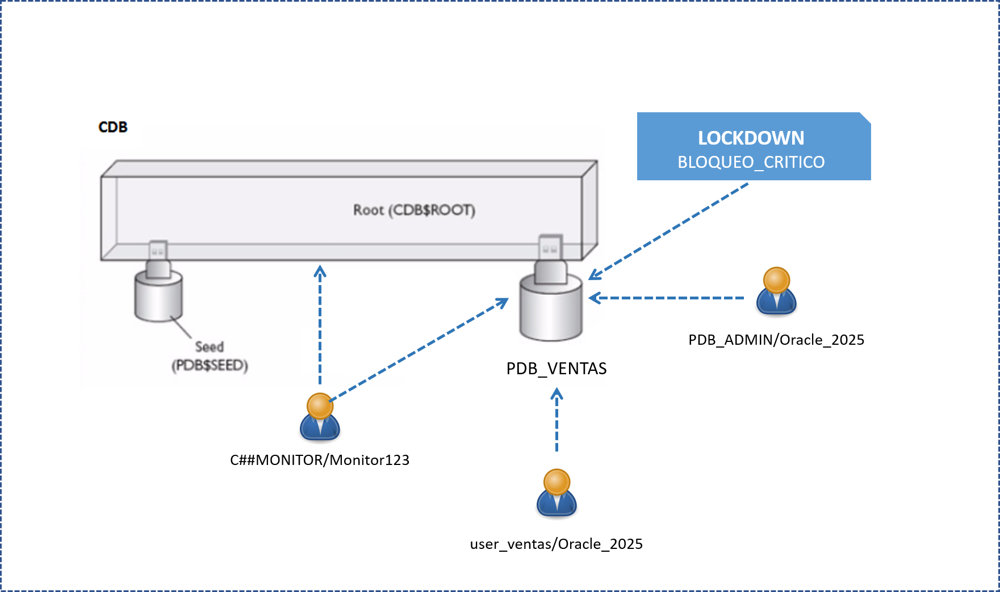
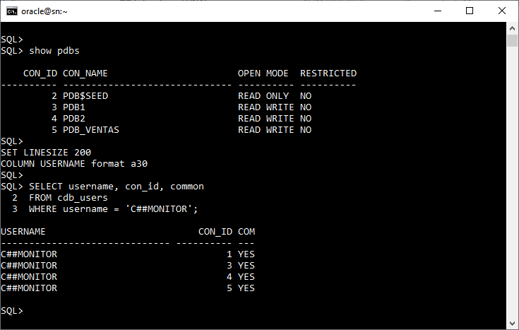
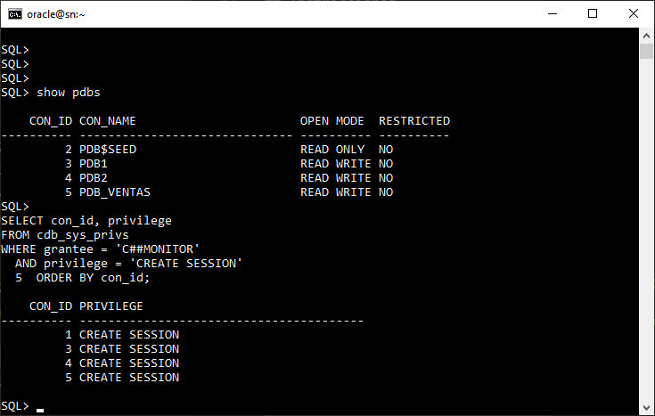
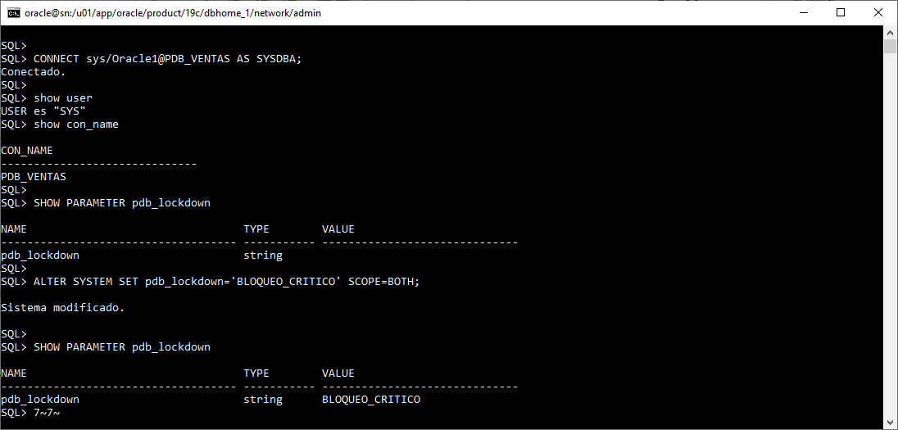

# Práctica 5.1 Gestión de Usuarios Comunes, Lockdown Profiles y Auditoría en PDBs

<br/><br/>

## Objetivos

* Crear y administrar usuarios comunes y usuarios locales.
* Verificar el alcance de un usuario común dentro de las PDBs.
* Crear y asignar un PDB Lockdown Profile.
* Validar el bloqueo de comandos críticos dentro de una PDB.

<br/><br/>

## Tiempo estimado

- 75 minutos

<br/><br/>

## Tabla de ayuda

| Comando                                        | Descripción                                       |
| ---------------------------------------------- | ------------------------------------------------------ |
| `CREATE USER ... CONTAINER=ALL`                | Crea un usuario común.                                 |
| `CREATE USER ...`                              | Crea un usuario local solo en la PDB actual.           |
| `CREATE LOCKDOWN PROFILE`                      | Crea un perfil de bloqueo para PDBs.                   |
| `ALTER LOCKDOWN PROFILE ... DISABLE STATEMENT` | Deshabilita comandos específicos dentro de las PDBs.   |
| `ALTER SYSTEM SET pdb_lockdown=`               | Asigna un lockdown profile a una PDB.                  |


<br/><br/>

## Objetivo visual



La imagen muestra el CDB con su raíz (**CDB$ROOT**), donde reside el usuario común **C##MONITOR**, y la PDB **PDB_VENTAS** administrada por **PDB_ADMIN**. 

<br/><br/>

## Instrucciones

### Tarea 1. Crear Usuario Común para Monitoreo (C##MONITOR)

Crear un usuario común con privilegios globales que pueda autenticarse y consultar vistas de diccionario en cualquier contenedor del CDB. Este usario es ideal para tareas de monitoreo y auditoría global.

#### **Paso 1.** Conectarse al CDB Root

```bash
. oraenv   # orcl
sqlplus / AS SYSDBA

SHOW USER
```

#### **Paso 2.** Crear el usuario común

```sql
-- Debe mostrar un número > 0
SHOW CON_ID;  

-- Debe mostrar CDB$ROOT
SHOW CON_NAME;

CREATE USER C##MONITOR IDENTIFIED BY Monitor123 CONTAINER = ALL;

-- Verifica la creación
SHOW PDBS;

SET LINESIZE 200
COLUMN USERNAME format a30

SELECT username, con_id, common
FROM cdb_users
WHERE username = 'C##MONITOR';
```

#### **Paso 3.** Otorgar privilegios globales

```sql
GRANT CREATE SESSION, SELECT ANY DICTIONARY TO C##MONITOR CONTAINER = ALL;

-- Verifica si el privilegio esta en todos las PDBs
SELECT con_id, privilege
FROM cdb_sys_privs
WHERE grantee = 'C##MONITOR'
  AND privilege = 'CREATE SESSION'
ORDER BY con_id;

```

<br/><br/>

### Tarea 2. Prueba de Acceso y Creación de Usuario Local en la PDB

Crear la PDB de nombre PDB_VENTAS, definir un usuario local dentro de ella y validar que el usuario común puede acceder a sus objetos.


#### **Paso 1.** Crear la PDB PDB_VENTAS

```sql
SHOW PDBS

CREATE PLUGGABLE DATABASE pdb_ventas 
ADMIN USER pdb_admin IDENTIFIED BY Oracle_2025
FILE_NAME_CONVERT=('/pdbseed/','/pdb_ventas/');

-- Debería aparecer PDB_VENTAS en la lista
SHOW PDBS

-- Deja la base de datos en modo READ & WRITE
ALTER PLUGGABLE DATABASE PDB_VENTAS OPEN READ WRITE;

SHOW PDBS

ALTER SESSION SET CONTAINER = PDB_VENTAS;

-- Debe mostrar PDB_VENTAS
SHOW CON_NAME; 

-- Verifica el/los nombres del servicio de tu PDB
SHOW PARAMETER service_names;
```

#### **Paso 2.** (Opcional) Ajustar la entrada de `PDB_VENTAS` en `tnsnames.ora`

Realiza este paso **solo si al conectarte** así:

```sql
CONNECT sys/oracle_4U@PDB_VENTAS AS SYSDBA;
```

Obtienes el error `ORA-12154`: TNS: could not resolve the connect identifier specified.

Edita el archivo `tnsnames.ora` y asegúrate de que el valor de `SERVICE_NAME` coincida **exactamente** con alguno de los valores que viste en el Paso 1 con:

```sql
SHOW PARAMETER service_names;
```

(o con el que aparece en `lsnrctl status`, en la sección *Services Summary*).

```txt
PDB_VENTAS =
  (DESCRIPTION =
    (ADDRESS = (PROTOCOL = TCP)(HOST = localhost.localdomain)(PORT = 1521))
    (CONNECT_DATA =
      (SERVER = DEDICATED)
      (SERVICE_NAME = PDB_VENTAS)    
    )
  )
```

> Nota: si el valor que viste en `service_names` es, por ejemplo, `pdb_ventas.localdomain`, entonces deberás poner:
> `SERVICE_NAME = pdb_ventas.localdomain` en lugar de `PDB_VENTAS`.


#### **Paso 3.** Conectarse a la PDB y crear usuario local

```sql
CONNECT sys/oracle_4U@PDB_VENTAS AS SYSDBA;

-- Alternativa:
ALTER SESSION SET CONTAINER = PDB_VENTAS;

-- Debe mostrar PDB_VENTAS
SHOW CON_NAME;  

CREATE USER USER_VENTAS IDENTIFIED BY Oracle_2025;
GRANT CREATE SESSION, CREATE TABLE TO USER_VENTAS;
-- GRANT ALTER SYSTEM TO USER_VENTAS;    

```

> **Nota**: En un entorno real no se recomienda otorgar `ALTER SYSTEM` a usuarios locales. Aquí se hace solo con fines didácticos, para demostrar el efecto del Lockdown Profile

#### **Paso 4.** Crear tabla local de prueba    

```sql
CONNECT USER_VENTAS/Oracle_2025@PDB_VENTAS;

SHOW CON_NAME

SHOW USER

CREATE TABLE TEST_LOCAL (id NUMBER);
```

#### **Paso 5.** Probar el acceso del usuario común

```sql
CONNECT C##MONITOR/Monitor123@PDB_VENTAS;

-- Debe mostrar PDB_VENTAS
SHOW CON_NAME  

-- Debe mostrar C##MONITOR
SHOW USER

COL TABLE_NAME FORMAT A30

SELECT TABLE_NAME 
FROM DBA_TABLES 
WHERE OWNER = 'USER_VENTAS';


SELECT TABLE_NAME, CON_ID
FROM CDB_TABLES
WHERE TABLE_NAME = 'TEST_LOCAL';

```

> **Nota**: Las dos últimas consultas deben ejecutarse con éxito y mostrar la tabla creada, confirmando que el usuario común puede operar y consultar vistas de diccionario en la PDB

<br/><br/>

### Tarea 3. Crear y Asignar PDB Lockdown Profile

Crear un perfil de bloqueo en el CDB$ROOT para restringir comandos administrativos y aplicarlo a la PDB_VENTAS.

> **Prerrequisitos**

Antes de iniciar esta tarea, asegúrate de cumplir lo siguiente:

* Contar con acceso al contenedor raíz **CDB$ROOT** utilizando el usuario **SYS**.
* Verificar que la PDB **PDB_VENTAS** se encuentre **abierta en modo READ WRITE**.


#### **Paso 1.** Conectarse al CDB Root

```sql
CONNECT sys/oracle_4U@orcl AS SYSDBA;

-- CDB$ROOT
SHOW CON_NAME; 
```

#### **Paso 2.** Crear el Lockdown Profile

```sql
CREATE LOCKDOWN PROFILE BLOQUEO_CRITICO;
```

#### **Paso 3.** Deshabilitar ALTER SYSTEM

```sql
-- Solo define la regla del perfil
-- bloquear ALTER SYSTEM cuando este perfil se aplique a una PDB.
ALTER LOCKDOWN PROFILE BLOQUEO_CRITICO 
DISABLE STATEMENT = ('ALTER SYSTEM');
```


#### **Paso 4.** Asignar el perfil a la PDB

```sql

CONNECT sys/oracle_4U@PDB_VENTAS AS SYSDBA;
SHOW CON_NAME
SHOW USER

-- Activa el perfil BLOQUEO_CRITICO en la PDB actual
ALTER SYSTEM SET pdb_lockdown='BLOQUEO_CRITICO' SCOPE=BOTH;

SHOW PARAMETER pdb_lockdown
```

#### **Paso 5.** Reiniciar la PDB para activar el perfil

```sql
ALTER PLUGGABLE DATABASE PDB_VENTAS CLOSE;
ALTER PLUGGABLE DATABASE PDB_VENTAS OPEN;
```

<br/><br/>

### Tarea 4. Probar el Lockdown Profile desde la PDB

Conectarse como usuario local a la PDB y verificar que los comandos restringidos por el perfil no se pueden ejecutar.

#### **Paso 1.** Conectarse como usuario local

```sql
CONNECT USER_VENTAS/Oracle_2025@PDB_VENTAS;

-- Debe mostrar PDB_VENTAS
SHOW CON_NAME

SHOW USER
```

#### **Paso 2.** Verificar el bloqueo del comando

Intente ejecutar la instrucción **ALTER SYSTEM** dentro de la PDB como usuario local **USER_VENTAS** para confirmar que el perfil de bloqueo está funcionando correctamente.

```sql
ALTER SYSTEM SET DB_CREATE_FILE_DEST = '/u01/app/oracle' SCOPE=BOTH;
```


>> **Nota:**

Debe fallar con un error de seguridad, por ejemplo ORA-01031, ORA-47400 o similar, indicando que la operación no está permitida en la PDB.

<br/><br/>


## Resultado esperado

* Crear un usuario común (C##MONITOR) con privilegios globales.
* Crear una PDB funcional y un usuario local (USER_VENTAS).
* Verificar acceso y alcance del usuario común.
* Crear y asignar un Lockdown Profile que bloquea ALTER SYSTEM.
* Validar que el bloqueo funciona correctamente.

<br/><br/>

La siguiente captura de pantalla muestra cómo el usuario común **C##MONITOR** aparece registrado en todos los contenedores del CDB: en el root (**CON_ID = 1**), en la seed (**CON_ID = 2**) y en cada PDB creada (**CON_ID = 3, 4 y 5**). La columna **COMMON = YES** confirma que se trata de un usuario común con presencia automática en todo el ambiente multitenant.



<br/><br/>

La siguiente captura de pantalla muestra que el privilegio común CREATE SESSION otorgado al usuario C##MONITOR se ha propagado correctamente a todos los contenedores del CDB. La consulta a CDB_SYS_PRIVS confirma que este privilegio aparece en el root (CON_ID = 1) y en cada PDB (CON_ID = 3, 4 y 5), verificando que los privilegios comunes se aplican globalmente en toda la arquitectura multitenant.



<br/><br/>

La siguiente captura de pantalla muestra la asignación del lockdown profile BLOQUEO_CRITICO dentro de la PDB PDB_VENTAS. Tras conectarse como SYSDBA en la PDB, el parámetro pdb_lockdown aparece inicialmente vacío, y después del comando ALTER SYSTEM SET pdb_lockdown='BLOQUEO_CRITICO' SCOPE=BOTH, la consulta vuelve a mostrar el parámetro con el valor asignado, confirmando que el perfil quedó activado correctamente en esa PDB.

