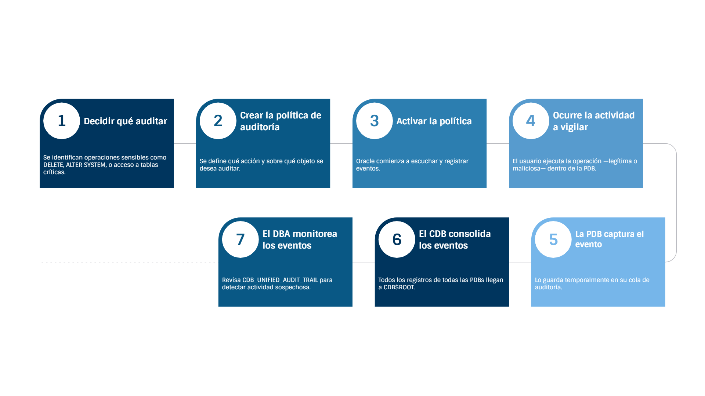
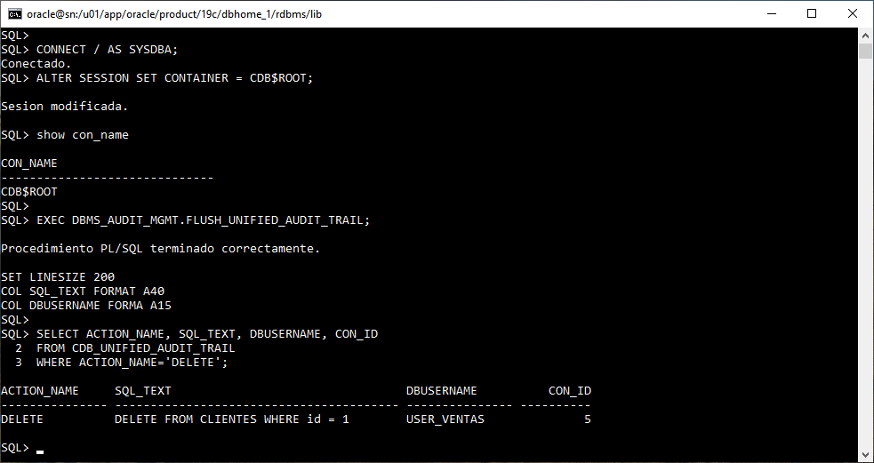

# Práctica 5.2 Configuración de Auditoría Unificada en una PDB

<br/><br/>

## Objetivo

Configurar la **auditoría unificada (Unified Auditing)** a nivel de **PDB** para rastrear los comandos **DELETE** ejecutados sobre una tabla específica, y posteriormente consultar el registro consolidado desde **CDB$ROOT**.

<br/><br/>

## Prerrequisitos

* La **PDB PDB_VENTAS** debe estar en modo **OPEN READ WRITE**.
* La tabla **CLIENTES** debe existir dentro de la PDB (por ejemplo, en el esquema **USER_VENTAS**).
* La auditoría unificada **debe estar habilitada** en la instancia.

<br/><br/>

## **Tabla de ayuda**

| Comando / Vista                             | ¿Para qué sirve?                                                   |
| ------------------------------------------- | ------------------------------------------------------------------ |
| `CREATE AUDIT POLICY`                       | Crea una política de auditoría unificada.                          |
| `AUDIT POLICY`                              | Habilita una política para comenzar a auditar.                     |
| `DBMS_AUDIT_MGMT.FLUSH_UNIFIED_AUDIT_TRAIL` | Fuerza la escritura inmediata de la cola de auditoría.             |
| `CDB_UNIFIED_AUDIT_TRAIL`                   | Vista centralizada con todos los registros de auditoría unificada. |

<br/><br/>


## Objetivo visual



<br/><br/>

## Instrucciones

### Tarea 1. Preparar la tabla CLIENTES en la PDB

#### **Paso 1.** Conectar como usuario de aplicación

```sql
CONNECT USER_VENTAS/Oracle_2025@PDB_VENTAS;
```

#### **Paso 2.** Crear la tabla (si no existe)

```sql
CREATE TABLE CLIENTES (
    id     NUMBER PRIMARY KEY,
    nombre VARCHAR2(100)
);
```

#### **Paso 3.** Insertar un registro de prueba

```sql
INSERT INTO CLIENTES VALUES (1, 'Cliente A');
COMMIT;
```

<br/><br/>

### Tarea 2. Crear y habilitar la política de auditoría en la PDB

#### **Paso 1.** Conectar como SYS dentro de la PDB

```sql
CONNECT sys/oracle_4U@PDB_VENTAS AS SYSDBA;
```

O desde CDB$ROOT:

```sql
ALTER SESSION SET CONTAINER = PDB_VENTAS;
```

#### **Paso 2.** Crear la política de auditoría

```sql
CREATE AUDIT POLICY ELIMINACION_CLIENTES_POL
  ACTIONS DELETE ON USER_VENTAS.CLIENTES;
```

#### **Paso 3.** Habilitar la política

```sql
AUDIT POLICY ELIMINACION_CLIENTES_POL;
```

<br/><br/>


### Tarea 3. Ejecutar la acción que será auditada

#### **Paso 1.** Conectar de nuevo como usuario USER_VENTAS

```sql
CONNECT USER_VENTAS/Oracle_2025@PDB_VENTAS;
```

#### **Paso 2.** Ejecutar el DELETE

```sql
DELETE FROM CLIENTES WHERE id = 1;
COMMIT;
```

<br/><br/>


### Tarea 4. Consolidar y consultar la auditoría desde CDB$ROOT

#### **Paso 1.** Conectar al contenedor raíz

```sql
CONNECT / AS SYSDBA;
```

O:

```sql
ALTER SESSION SET CONTAINER = CDB$ROOT;
```

#### **Paso 2.** Forzar la escritura de la auditoría

```sql
EXEC DBMS_AUDIT_MGMT.FLUSH_UNIFIED_AUDIT_TRAIL;
```

#### **Paso 3.** Consultar la auditoría consolidada

```sql
SELECT ACTION_NAME, SQL_TEXT, DBUSERNAME
FROM   CDB_UNIFIED_AUDIT_TRAIL
WHERE  ACTION_NAME = 'DELETE';
```

<br/><br/>


## Resultado esperado

Al finalizar la práctica, deberás confirmar lo siguiente:

1. **La política de auditoría se creó correctamente en la PDB** y quedó habilitada para monitorear operaciones DELETE sobre la tabla `CLIENTES`.
2. **La operación DELETE ejecutada por el usuario `USER_VENTAS` fue capturada** por la auditoría unificada dentro de la PDB.
3. **El registro de auditoría aparece consolidado en CDB$ROOT**, evidenciando que el evento fue enviado al repositorio central de auditoría y puede consultarse desde `CDB_UNIFIED_AUDIT_TRAIL`.




