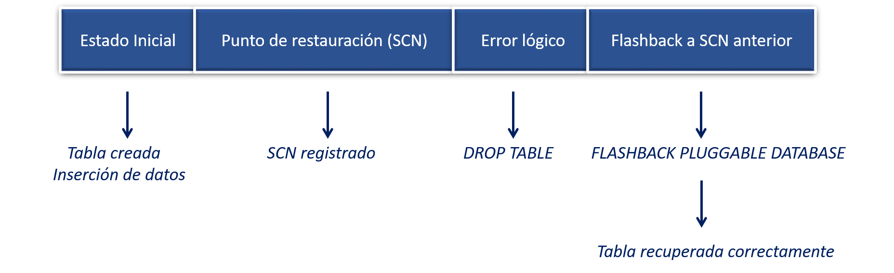

# Práctica 6.1. Recuperación de una PDB usando Flashback Database

<br/><br/>

## Objetivo

Al finalizar esta práctica, serás capaz de habilitar Flashback Database, registrar un SCN como punto de restauración, simular pérdida de datos en una PDB y recuperar su estado anterior utilizando *Flashback PDB*.

<br/><br/>

## Tiempo estimado

- 80 minutos

<br/><br/>

## **Tabla de ayuda**

| Concepto / Comando              | Descripción                                                       |
| ------------------------------- | ----------------------------------------------------------------- |
| `DB_FLASHBACK_RETENTION_TARGET` | Define en minutos cuánto historial conservará Flashback Database. |
| `ALTER DATABASE FLASHBACK ON`   | Activa Flashback Database (solo en modo MOUNT).                   |
| `CURRENT_SCN`                   | SCN actual que sirve como punto de restauración.                  |
| `FLASHBACK PLUGGABLE DATABASE`  | Revierte una PDB a un SCN previo registrado.                      |
| `OPEN RESETLOGS`                | Abre la PDB tras el flashback y reinicia los logs locales.        |
| `SHOW CON_NAME`                 | Indica en qué contenedor estás trabajando.                        |
| `V$DATABASE`                    | Vista que muestra estado de flashback y el SCN actual.            |


<br/><br/>

## Objetivo visual



<br/><br/>

## Prerrequisitos

* Acceso a **CDB$ROOT** como SYS o SYSDBA.
* La **Fast Recovery Area (FRA)** debe estar configurada (`DB_RECOVERY_FILE_DEST` y `DB_RECOVERY_FILE_DEST_SIZE`).
* La PDB **PDB_HR** debe existir (o crearse previamente).
* Usuario con privilegio para crear tablas (ej. HR_USER)

```sql
CREATE PLUGGABLE DATABASE pdb_hr
  ADMIN USER pdb_admin IDENTIFIED BY Oracle_2025
  FILE_NAME_CONVERT = ('/pdbseed/', '/pdb_hr/');
```

<br/><br/>


## Instrucciones

### Tarea 1. Habilitar Flashback Database en la CDB

En esta tarea habilitarás la funcionalidad Flashback Database en la CDB, estableciendo un periodo de retención de 1 hora (60 minutos). Para lograrlo, montarás la base de datos en el modo apropiado, activarás Flashback Database y luego abrirás la CDB junto con la PDB objetivo. Finalmente, confirmarás que Flashback quedó habilitado y funcionando correctamente.


#### **Paso 1.** Conectarse al contenedor raíz

```sql
CONNECT / AS SYSDBA;

-- o con:

ALTER SESSION SET CONTAINER = CDB$ROOT;

SHOW CON_NAME; 
-- Debe mostrar CDB$ROOT
```

<br/>

#### **Paso 2.** Configurar la retención de flashback

```sql
ALTER SYSTEM SET DB_FLASHBACK_RETENTION_TARGET=60 SCOPE=BOTH;
```

> La última instrucción establece el tiempo de retención de Flashback Database en 60 minutos, lo cual define cuánto historial de cambios conservará Oracle para permitir operaciones de recuperación

<br/>

#### **Paso 3.** Apagar y montar la CDB

```sql
SHUTDOWN IMMEDIATE;
STARTUP MOUNT;
```

<br/>

#### **Paso 4.** Habilitar Flashback Database

```sql
ALTER DATABASE FLASHBACK ON;
```

> Habilita **Flashback Database** en la CDB cuando está en modo MOUNT, permitiendo revertir la base a un estado anterior.


<br/>

#### **Paso 5.** Abrir la CDB y la PDB objetivo

```sql
ALTER DATABASE OPEN;

ALTER PLUGGABLE DATABASE PDB_HR OPEN;

ALTER PLUGGABLE DATABASE PDB_HR SAVE STATE;

SHOW PDBS;
```


#### **Paso 6.** Registrar la PDB_HR en *tnsnames.ora*

Edita el archivo **tnsnames.ora** y agrega (o verifica) la entrada correspondiente a **PDB_HR**, asegurándote de usar el *SERVICE_NAME* correcto. Luego guarda los cambios y valida la conexión con SQL*Plus.


<br/>

#### **Paso 7.** Verificar que Flashback está habilitado

```sql
SELECT FLASHBACK_ON FROM V$DATABASE;
-- Resultado esperado: YES
```

<br/><br/>

### Tarea 2. Registrar el SCN y crear el objeto de prueba

En esta tarea capturarás el **SCN actual** de la PDB, el cual servirá como punto de restauración antes de realizar cualquier modificación destructiva. Luego crearás una tabla de prueba dentro de la PDB e insertarás datos iniciales, reproduciendo un estado previo que podrá recuperarse usando Flashback. Esta preparación es imprescindible para validar posteriormente la restauración.

<br/>

#### **Paso 1.** Conectarse a la PDB

```sql
CONNECT sys/oracle_4U@PDB_HR AS SYSDBA;

ALTER SESSION SET CONTAINER = PDB_HR;

SHOW CON_NAME;
-- Debe mostrar PDB_HR
```

<br/>

#### **Paso 2.** Obtener el SCN actual

```sql
SELECT CURRENT_SCN FROM V$DATABASE;
-- Guardar este valor como <SCN_ANTERIOR>
```

<br/>

#### **Paso 3.** Crear objeto que será eliminado

```sql
CREATE TABLE DATOS_PERDIDOS (
    id NUMBER,
    descripcion VARCHAR2(50)
);

INSERT INTO DATOS_PERDIDOS VALUES (1, 'Datos críticos antes del error');

COMMIT;
```

<br/>

#### **Paso 4.** Verificar la creación de los datos

```sql
SELECT * FROM DATOS_PERDIDOS;
```

<br/><br/>

### Tarea 3. Simular la pérdida de datos

En esta tarea simularás un **error lógico real**, eliminando intencionalmente la tabla creada previamente mediante un `DROP TABLE`. Después intentarás consultar el objeto para confirmar que ha sido eliminado, obteniendo el error esperado `ORA-00942`. Este escenario permitirá demostrar la capacidad de Flashback para restaurar el estado original.


<br/>

#### **Paso 1.** Eliminar la tabla

```sql
DROP TABLE DATOS_PERDIDOS;
```

<br/>

#### **Paso 2.** Intentar consultar la tabla eliminada

```sql
SELECT * FROM DATOS_PERDIDOS;
-- ORA-00942: table or view does not exist
```

<br/><br/>

### Tarea 4. Recuperar la PDB usando Flashback

En esta tarea revertirás completamente la PDB al estado previo utilizando **FLASHBACK PLUGGABLE DATABASE**. Primero cerrarás la PDB, luego ejecutarás el flashback hacia el SCN registrado y posteriormente abrirás la PDB con `RESETLOGS`. Finalmente validarás que la tabla y los datos eliminados han sido restaurados con éxito, confirmando el correcto funcionamiento de Flashback en un entorno multitenant.

<br/>

#### **Paso 1.** Conectarse al contenedor raíz

```sql
CONNECT / AS SYSDBA;

ALTER SESSION SET CONTAINER = CDB$ROOT;
```

> **Nota:** Todas las operaciones de *Flashback Database* y *Flashback PDB* deben ejecutarse desde **CDB$ROOT** con privilegios SYS o SYSDBA. La recuperación siempre se controla desde el contenedor raíz, incluso si el objetivo es una PDB específica.


<br/>

#### **Paso 2.** Cerrar la PDB antes del flashback

```sql
ALTER PLUGGABLE DATABASE PDB_HR CLOSE IMMEDIATE;
```

<br/>

#### **Paso 3.** Ejecutar el flashback hacia el SCN registrado

```sql
FLASHBACK PLUGGABLE DATABASE PDB_HR TO SCN <SCN_ANTERIOR>;
-- Pluggable database altered
```

<br/>

#### **Paso 4.** Abrir la PDB con RESETLOGS

```sql
ALTER PLUGGABLE DATABASE PDB_HR OPEN RESETLOGS;
```

<br/>

#### **Paso 5.** Verificar restauración en la PDB

```sql
CONNECT sys/oracle_4U@PDB_HR AS SYSDBA;

ALTER SESSION SET CONTAINER = PDB_HR;

SELECT * FROM DATOS_PERDIDOS;
-- Debe mostrar la fila previamente eliminada
```

<br/><br/>

## Resultado esperado

1. Flashback Database quedó habilitado con retención de 60 minutos.
2. El SCN previo fue registrado correctamente.
3. La tabla fue eliminada y la PDB se restauró usando *FLASHBACK PLUGGABLE DATABASE*.
4. La tabla **DATOS_PERDIDOS** volvió a aparecer con los datos originales.


