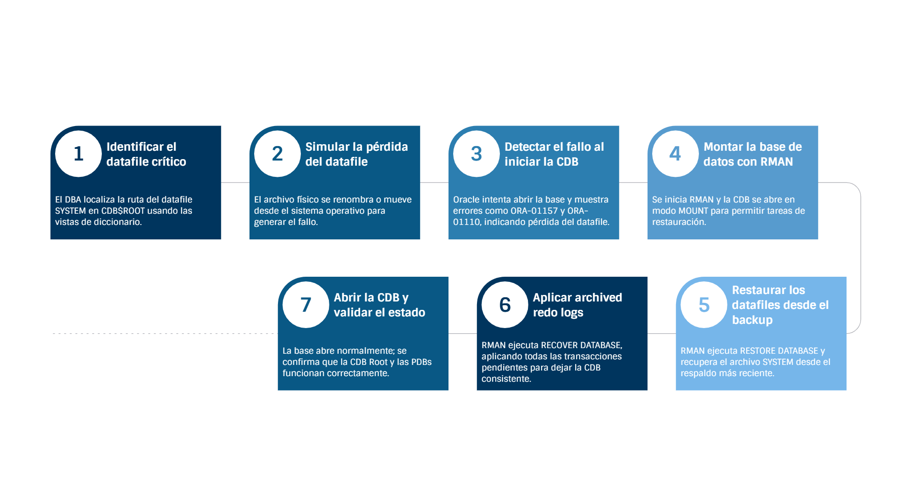

# Práctica 6.2 Restauración de la CDB Root ante la pérdida de un Datafile utilizando RMAN
<br/><br/>

## Tiempo estimado

- 60 minuntos

<br/><br/>

## Objetivos

* Simular un escenario real de pérdida de un datafile crítico de la CDB Root.
* Identificar el datafile del tablespace SYSTEM perteneciente al contenedor **CDB$ROOT**.
* Ver errores ORA-01157 y ORA-01110 derivados de la pérdida del archivo.
* Ejecutar una restauración completa utilizando **RMAN RESTORE DATABASE**.
* Aplicar una recuperación completa mediante **RMAN RECOVER DATABASE**.
* Verificar que la CDB y sus PDBs pueden abrirse correctamente tras el proceso.

<br/><br/>

## **Tabla de ayuda**

| Concepto/Comando                | Descripción                                                                                                                                                                 |
| --------------------------------- | -------------------------------------------------------------------------------------------------------------------------------------------------------------------------------- |
| **V$DATAFILE**                    | Permite identificar la ruta física de cada datafile dentro de la CDB, incluyendo por contenedor (CON_ID). Es esencial para localizar el archivo que se perderá en la simulación. |
| **CON_ID = 1**                    | Identifica al contenedor **CDB$ROOT**, lo que permite filtrar únicamente sus datafiles.                                                                                          |
| **SHUTDOWN IMMEDIATE**            | Cierra la base de datos preservando la consistencia. Es el cierre apropiado antes de simular fallos o realizar operaciones críticas.                                             |
| **mv (mover/renombrar archivo)**  | Desde el sistema operativo, se utiliza para simular la pérdida de un datafile eliminándolo de su ubicación original.                                                             |
| **Errores ORA-01157 / ORA-01110** | Indican que Oracle no puede acceder a un datafile requerido. Estos errores confirman que la simulación del fallo se realizó correctamente.                                       |
| **RMAN**                          | Herramienta oficial de Oracle para ejecutar respaldo y recuperación. Se utiliza para restaurar datafiles, aplicar redo logs y validar el estado de la base de datos.             |
| **STARTUP MOUNT**                 | Monta la base de datos (control file) sin abrirla. Es el estado necesario para ejecutar operaciones de restauración y recuperación a nivel de CDB.                               |
| **RESTORE DATABASE**              | Restaura todos los datafiles del último respaldo conocido. RMAN selecciona automáticamente qué archivos deben ser restaurados según el control file.                             |
| **RECOVER DATABASE**              | Aplica todos los **archived redo logs** necesarios para llevar la base de datos al punto más reciente posible antes de la falla.                                                 |
| **ALTER DATABASE OPEN**           | Abre la base de datos después de que todos los datafiles han sido restaurados y recuperados. Finaliza el proceso de recuperación.                                                |
| **Archived Redo Logs**            | Conjunto de redo logs archivados que contienen las transacciones necesarias para recuperar la información en caso de pérdida de datafiles.                                       |
| **Backup Full + Archivelog**      | Garantiza que RMAN pueda restaurar la base de datos completa y aplicar recuperaciones sin pérdida de datos.                                                                      |
| **Control File**                  | Archivo crítico que contiene el registro de los datafiles, SCN y estructura de la BD. En este tipo de restauración debe estar íntegro para que RMAN funcione correctamente.      |


<br/><br/>

## Objetivo visual



<br/><br/>

## Prerrequisitos

* Contar con un **backup completo y reciente de la CDB**, incluyendo:

  * **CDB Root**
  * **PDB$SEED**
  * Al menos **una PDB** utilizada en la práctica

* En caso de no disponer de un respaldo actualizado, generar uno con RMAN:

  ```bash
  $ rman target /
  RMAN> BACKUP DATABASE PLUS ARCHIVELOG;
  RMAN> QUIT;
  ```

* Tener disponibles los **archived redo logs** necesarios para el proceso de recuperación.

* Conocer la **ubicación física de un datafile perteneciente al CDB$ROOT**, por ejemplo el del tablespace **SYSTEM**.


<br/><br/>

## Instrucciones

### Tarea 1. Restaurar y Recuperar la CDB Root tras la pérdida de un Datafile SYSTEM

En esta tarea simularás la pérdida de un archivo crítico de la CDB Root y ejecutarás la restauración completa usando RMAN.


#### **Paso 1.** Conectarse a la CDB Root

```bash
# orcl
. oraenv  
```

```sql
sqlplus / as sysdba
```

#### **Paso 2.** Identificar el datafile del SYSTEM de la CDB$ROOT

```sql
SELECT NAME
FROM V$DATAFILE
WHERE CON_ID = 1
  AND NAME LIKE '%system%';
```

> Guarda la ruta obtenida, por ejemplo: `/u01/app/oracle/oradata/ORCL/system01.dbf`


#### **Paso 3.** Apagar la base de datos

```sql
SHUTDOWN IMMEDIATE;
QUIT
```


#### **Paso 4.** Simular la pérdida del datafile en el sistema operativo

En Linux:

```bash
mv /u01/app/oracle/oradata/ORCL/system01.dbf /u01/app/oracle/oradata/ORCL/system01.dbf.BAK
```


#### **Paso 5.** Intentar levantar la base de datos para observar errores

```sql
sqlplus / as sysdba
STARTUP

-- Salir de SQL*Plus
EXIT
```

> Verás errores típicos:
 * **ORA-01157:** cannot identify/lock data file
 * **ORA-01110:** data file 1: …system01.dbf


#### **Paso 6.** Iniciar RMAN y conectarse al target

```bash
rman target /
```

#### **Paso 7.** Iniciar la base de datos en modo MOUNT

```rman
STARTUP MOUNT;
```

#### **Paso 8.** Restaurar los datafiles perdidos desde el backup

```rman
RESTORE DATABASE;
```

> RMAN leerá automáticamente el respaldo anterior.


#### **Paso 9.** Recuperar la base de datos aplicando archived redo logs

```rman
RECOVER DATABASE;
```


#### **Paso 10.** Abrir la base de datos

```rman
ALTER DATABASE OPEN;
```


#### **Paso 11.** Salir de RMAN

```rman
EXIT;
```

<br/><br/>

## Resultado esperado

1. El datafile SYSTEM de la CDB Root es restaurado exitosamente desde el backup.
2. RMAN aplica todos los archived redo logs necesarios para completar la recuperación.
3. La base de datos **abre sin errores**, mostrando que se ha recuperado la CDB Root y todas las PDBs de manera consistente.

<br/><br/>

## **Notas prácticas recomendadas**

### **1. Validar que existen respaldos utilizables en RMAN**

Antes de restaurar, es buena práctica listar los backups disponibles:

```rman
LIST BACKUP;
```

Este comando permite verificar:

* Si existen backups de **DATABASE**.
* Si se respaldaron también **ARCHIVELOG**.
* Si RMAN reconoce correctamente las piezas de backup.

<br/>

### **2. Confirmar que existen archived redo logs suficientes**

Para que la recuperación sea completa, RMAN debe contar con archived logs recientes:

```rman
LIST ARCHIVELOG ALL;
```

Verifica que:

* Hay archived logs entre la fecha del backup y la fecha de la falla.
* Los logs no estén marcados como *expired*.
* Los logs estén almacenados en FRA o en la ruta configurada.

<br/>

### **3. Comprobar la ubicación de los datafiles antes del fallo**

Se recomienda verificar los datafiles del SYSTEM y SYSAUX de la CDB Root:

```sql
SELECT file#, name, status
FROM v$datafile
WHERE con_id = 1;
```

Esto permite:

* Confirmar la ruta exacta del archivo que se simulará como perdido.
* Saber si el datafile está **ONLINE** o **SYSTEM**, para identificar su criticidad.

<br/>

### **4. Validar el estado de la CDB antes de iniciar RMAN**

Revisa el estado de la base de datos:

```sql
SELECT instance_name, status FROM v$instance;
```

Y el estado de las PDB:

```sql
SHOW PDBS;
```

Esto genera una línea base para comparar después de la recuperación.

<br/>

### **5. Revisar el SCN actual antes del fallo (opcional)**

Puede ser útil para auditoría o comparación posterior:

```sql
SELECT current_scn FROM v$database;
```

<br/>

### **6. Verificar que el fallo fue correctamente simulado**

Después de mover el archivo SYSTEM, los errores esperados son:

* **ORA-01157**: cannot identify/lock data file
* **ORA-01110**: data file n: 'ruta_del_archivo'

Si no aparecen estos errores, la simulación no se realizó correctamente.

<br/>

### **7. Confirmar la apertura correcta tras la recuperación**

Después del `ALTER DATABASE OPEN;`:

```sql
SELECT name, open_mode FROM v$pdbs;
```

Debes ver:

* CDB Root → OPEN READ WRITE
* PDB$SEED → READ ONLY
* PDBs de usuario → OPEN READ WRITE (si se abren manualmente)

<br/>

### **8. Comprobar alert log para validar el flujo de recuperación**

En Linux:

```bash
tail -100f /u01/app/oracle/diag/rdbms/*/*/trace/alert_*.log
```

Busca mensajes como:

* *Media recovery complete*
* *Successfully onlined datafile*
* *Database opened*

<br/>

### **9. Confirmar integridad del backup (opcional avanzado)**

Si el instructor lo considera necesario:

```rman
VALIDATE DATABASE;
```

Esto verifica que:

* Los bloques del backup no están corruptos.
* Todas las piezas son utilizables.

 