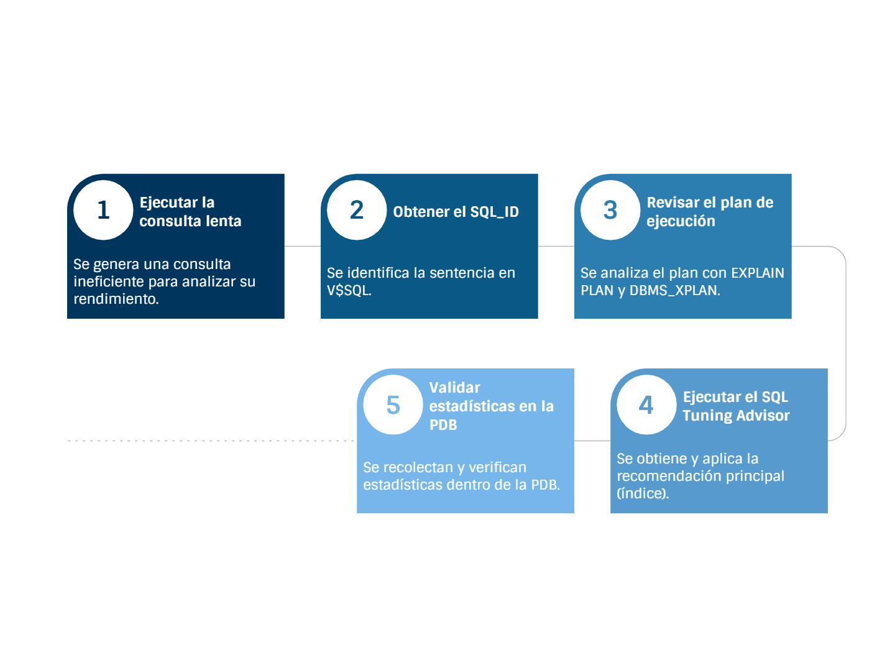
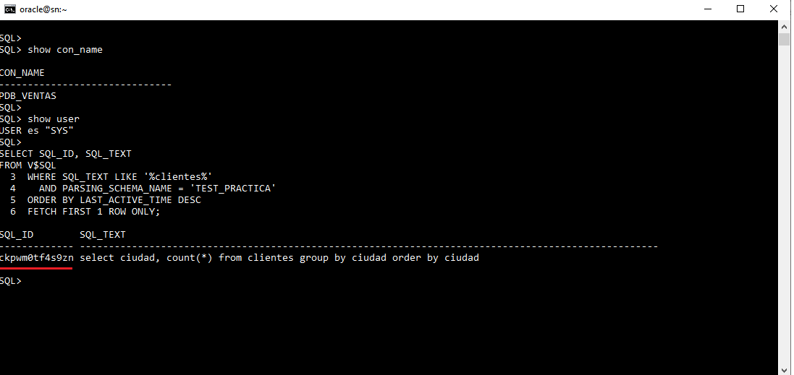
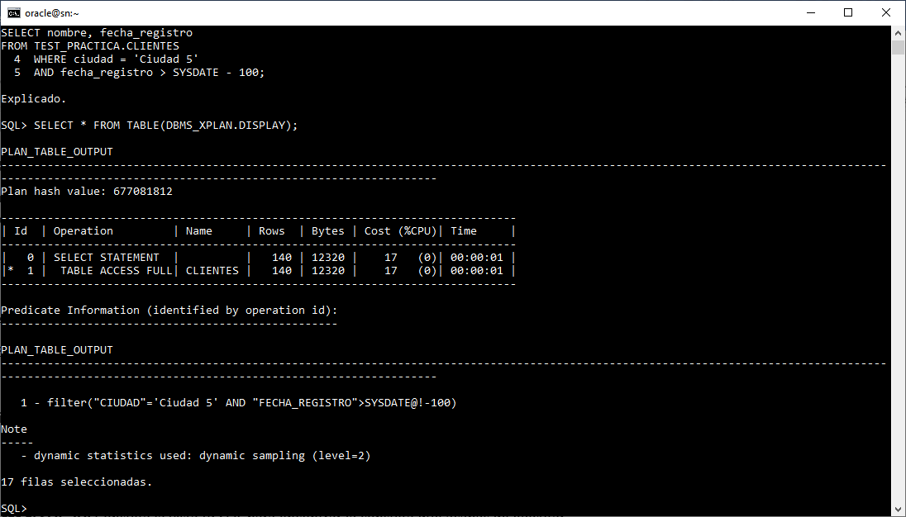
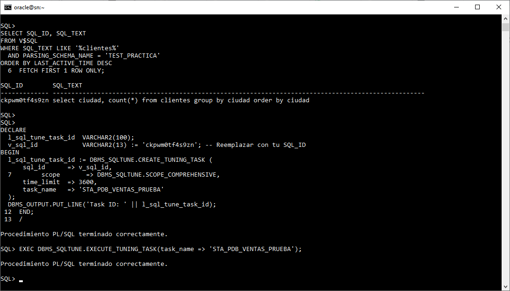
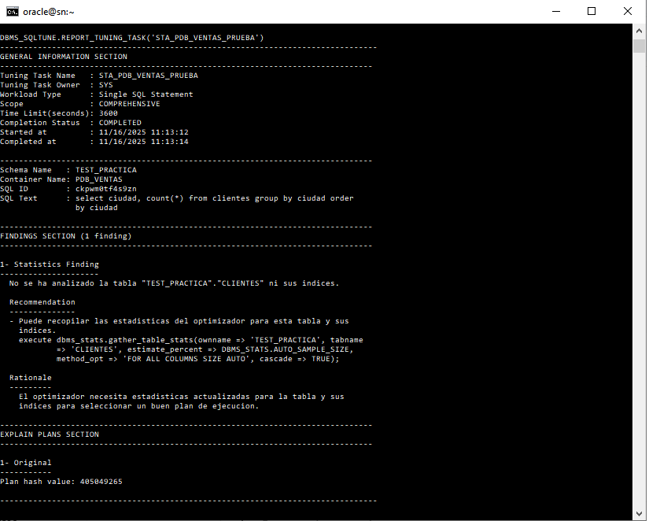
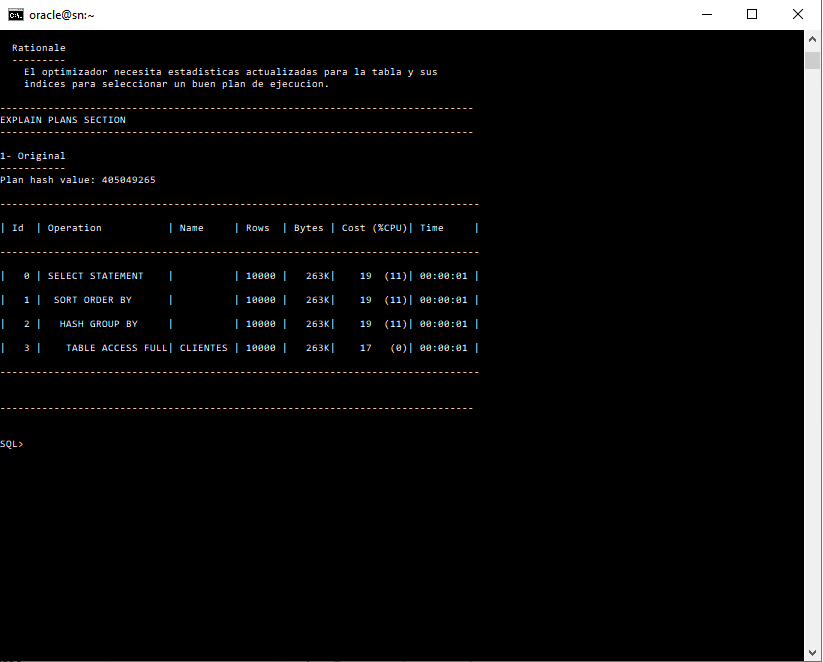
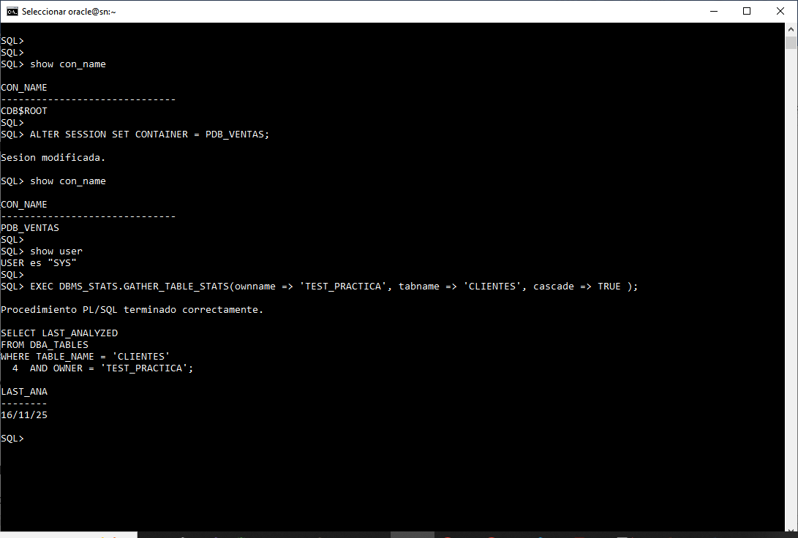

# Práctica 7.1 Ajuste de Sentencias SQL en Oracle 19c Multitenant 

<br/><br/>

## Objetivos

Al finalizar esta práctica, el participante será capaz de:

1. **Identificar y analizar una consulta SQL lenta** utilizando su SQL_ID y el plan de ejecución generado por el optimizador.
2. **Ejecutar y evaluar un SQL Tuning Advisor (STA)** para obtener recomendaciones automáticas de mejora.
3. **Aplicar acciones de optimización sugeridas**, como la creación de índices.
4. **Gestionar y validar estadísticas dentro de una PDB**, comprendiendo el aislamiento entre CDB y PDB.

<br/><br/>

## Tiempo estimado

- 80 minutos


<br/><br/>

## Tabla de ayuda


| **Comando/Vista/Concepto**      | **Descripción**                                                                     |
| ----------------------------------- | ----------------------------------------------------------------------------------- |
| `PDB_VENTAS`                        | PDB de trabajo utilizada para todo el laboratorio.                                  |
| `TEST_PRACTICA`                     | Esquema donde se crea la tabla CLIENTES y se ejecutan las consultas.                |
| `CREATE PLUGGABLE DATABASE`         | Comando para crear una nueva PDB a partir del seed.                                 |
| `ALTER PLUGGABLE DATABASE ... OPEN` | Abre la PDB en modo lectura–escritura.                                              |
| `tnsnames.ora`                      | Archivo donde se registran alias de conexión Oracle Net.                            |
| `CREATE TABLESPACE`                 | Crea un tablespace para almacenar objetos de usuario.                               |
| `CREATE USER`                       | Crea el usuario de práctica.                                                        |
| `V$SQL`                             | Vista dinámica que muestra sentencias SQL recientes y su SQL_ID.                    |
| `SQL_ID`                            | Identificador único de una sentencia SQL en el shared pool.                         |
| `EXPLAIN PLAN FOR`                  | Genera un plan de ejecución teórico para una consulta.                              |
| `DBMS_XPLAN.DISPLAY`                | Función para mostrar el plan generado por EXPLAIN PLAN.                             |
| `TABLE ACCESS FULL`                 | Operación que indica un **Full Table Scan**, generalmente costoso.                  |
| `DBMS_SQLTUNE.CREATE_TUNING_TASK`   | Crea una tarea del SQL Tuning Advisor (STA).                                        |
| `DBMS_SQLTUNE.EXECUTE_TUNING_TASK`  | Ejecuta la tarea STA.                                                               |
| `DBMS_SQLTUNE.REPORT_TUNING_TASK`   | Genera el reporte del STA con recomendaciones.                                      |
| `DBMS_STATS.GATHER_TABLE_STATS`     | Recolecta estadísticas de una tabla dentro de una PDB.                              |
| `DBMS_STATS.GATHER_SCHEMA_STATS`    | Recolecta estadísticas de un esquema (falla si no se está en la PDB correcta).      |
| `DBA_TABLES.LAST_ANALYZED`          | Indica la fecha/hora de la última recolección de estadísticas.                      |
| `CON_ID / CON_NAME / CONTAINER`     | Conceptos clave para indicar en qué contenedor (CDB/PDB) se ejecutan los comandos.  |
| `INDEX`                             | Estructura recomendada por STA para acelerar consultas.                             |
| `FULL TABLE SCAN`                   | Lectura completa de una tabla; suele indicar un problema de índices o selectividad. |


<br/><br/>

## Objetivo visual

Flujo completo de ajuste SQL: se ejecuta una consulta lenta, se identifica su SQL_ID y se analiza su plan de ejecución. Luego se ejecuta el SQL Tuning Advisor para obtener recomendaciones, se aplican los índices sugeridos y finalmente se validan las estadísticas dentro de la PDB.



<br/><br/>

## Prerrequisitos

Conéctate a la PDB de prueba y crea una tabla con datos suficientes para simular un escenario de ajuste.

### Tarea 1. Preparación del entorno

Configuras la PDB de trabajo (**PDB_VENTAS**), creas el usuario **TEST_PRACTICA**, el tablespace y la tabla **CLIENTES** con 10,000 filas para simular un escenario real de ajuste de rendimiento.


<br/>

#### **Paso 1.** Crear PDB_VENTAS (solo si no existe)

```bash
# orcl
. oraenv

sqlplus / as sysdba
```

```sql

CREATE PLUGGABLE DATABASE PDB_VENTAS 
ADMIN USER pdb_admin IDENTIFIED BY Oracle_2025 
FILE_NAME_CONVERT=('/pdbseed/','/pdb_ventas/');
```

Abrir la base de datos **pdb_ventas**:

```sql
alter pluggable database pdb_ventas open;
```

Editar el archivo **tnsnames.ora** y registrar la base de datos **PDB_VENTAS**.

<br/>

#### **Paso 2.** Conectarse a la PDB_VENTAS

```sql
CONNECT sys/oracle_4U@PDB_VENTAS AS SYSDBA;
```

O con:

```sql
ALTER SESSION SET CONTAINER = PDB_VENTAS;
```

<br/>

#### **Paso 3.** Crear TABLESPACE USERS

```sql
CREATE TABLESPACE users 
datafile '/u01/app/oracle/oradata/ORCL/pdb_ventas/users01.dbf'
size 100m autoextend on next 10m maxsize unlimited;
```

<br/>

#### **Paso 4.** Crear usuario de prueba

```sql
CREATE USER TEST_PRACTICA IDENTIFIED BY Test123;
GRANT CONNECT, RESOURCE TO TEST_PRACTICA;
ALTER USER TEST_PRACTICA QUOTA UNLIMITED ON USERS;
ALTER DATABASE DEFAULT TABLESPACE USERS;
```

<br/>

#### **Paso 5** Conectarse como TEST_PRACTICA

```sql
CONNECT TEST_PRACTICA/Test123@PDB_VENTAS;
```

<br/>

#### **Paso 6.** Crear tabla CLIENTES e insertar 10,000 filas

```sql
CREATE TABLE CLIENTES (
    cliente_id NUMBER PRIMARY KEY,
    nombre VARCHAR2(100),
    ciudad VARCHAR2(50),
    fecha_registro DATE
);
```

```sql
BEGIN
  FOR i IN 1..10000 LOOP
    INSERT INTO CLIENTES VALUES (i, 'Cliente ' || i, 'Ciudad ' || MOD(i, 20), SYSDATE - MOD(i, 365));
  END LOOP;
  COMMIT;
END;
/
```

```sql
SET PAGESIZE 100;

SELECT ciudad, COUNT(*)
FROM CLIENTES
GROUP BY ciudad;
```


<br/><br/>

### Tarea 2. Ejecutar la consulta lenta y obtener el SQL_ID

Ejecutas la consulta que provoca un **FULL TABLE SCAN** sobre CLIENTES y, desde **V$SQL**, recuperas el **SQL_ID** asociado para poder analizarla y tunearla posteriormente.


<br/>

#### **Paso 1.** Ejecutar la consulta diseñada para un FULL TABLE SCAN

```sql
-- Consulta que probablemente use un FULL TABLE SCAN
SELECT nombre, fecha_registro 
FROM CLIENTES 
WHERE ciudad = 'Ciudad 5' 
AND fecha_registro > SYSDATE - 100; 

QUIT
```

<br/>

#### **Paso 2** Consultar el SQL_ID desde V$SQL

Conectarse como SYS:

```sql
connect sys/oracle_4U@pdb_ventas as sysdba;
```

Obtener el SQL_ID:

```sql
SELECT SQL_ID, SQL_TEXT 
FROM V$SQL 
WHERE SQL_TEXT LIKE '%clientes%' 
  AND PARSING_SCHEMA_NAME = 'TEST_PRACTICA'
ORDER BY LAST_ACTIVE_TIME DESC
FETCH FIRST 1 ROW ONLY;
```

> Guarda tu SQL_ID (ejemplo: `g9235s9fgh22a`).

<br/><br/>

### Tarea 3. Analizar el Plan de Ejecución

Generas el **EXPLAIN PLAN** de la consulta y lo visualizas con `DBMS_XPLAN.DISPLAY`, verificando que la operación principal es un **TABLE ACCESS FULL** y entendiendo el costo del plan actual.

<br/>

#### **Paso 1** Generar EXPLAIN PLAN

```sql
EXPLAIN PLAN FOR
SELECT nombre, fecha_registro 
FROM TEST_PRACTICA.CLIENTES 
WHERE ciudad = 'Ciudad 5' 
AND fecha_registro > SYSDATE - 100;
```

<br/><br/>

#### **Paso 2.** Mostrar el plan

```sql
SELECT * FROM TABLE(DBMS_XPLAN.DISPLAY);
```


> **Verificación** 

Confirma en el plan de ejecución que la operación principal sea **TABLE ACCESS FULL** sobre la tabla **CLIENTES**. Esto indica que el optimizador está leyendo la tabla completa, una señal típica de ineficiencia cuando la consulta solo requiere un subconjunto pequeño de filas.


<br/><br/>

### Tarea 4. Ejecutar SQL Tuning Advisor (STA)

Creas y ejecutas una tarea del **SQL Tuning Advisor** usando el SQL_ID identificado, revisas el reporte generado y aplicas la recomendación principal, que en este caso es la creación de un índice sobre CLIENTES.

<br/>

#### **Paso 1.** Crear tarea STA

Conectarse a la PDB:

```sql
CONNECT sys/oracle_4U@PDB_VENTAS AS SYSDBA;
```

o:

```sql
ALTER SESSION SET CONTAINER = PDB_VENTAS;
```

Crear la tarea:

```sql
DECLARE
  l_sql_tune_task_id  VARCHAR2(100);
  v_sql_id            VARCHAR2(13) := 'g9235s9fgh22a'; -- Reemplazar con tu SQL_ID
BEGIN
  l_sql_tune_task_id := DBMS_SQLTUNE.CREATE_TUNING_TASK (
      sql_id      => v_sql_id,
      scope       => DBMS_SQLTUNE.SCOPE_COMPREHENSIVE,
      time_limit  => 3600,
      task_name   => 'STA_PDB_VENTAS_PRUEBA'
  );
  DBMS_OUTPUT.PUT_LINE('Task ID: ' || l_sql_tune_task_id);
END;
/
```

<br/>

#### **Paso 2.** Ejecutar la tarea

```sql
EXEC DBMS_SQLTUNE.EXECUTE_TUNING_TASK(task_name => 'STA_PDB_VENTAS_PRUEBA');
```

<br/>

#### **Paso 3.** Mostrar el reporte STA

```sql
SET LONG 100000
SET PAGESIZE 100

SELECT DBMS_SQLTUNE.REPORT_TUNING_TASK('STA_PDB_VENTAS_PRUEBA') 
FROM DUAL;
```

<br/>

#### **Paso 4.** Crear el índice recomendado

Conectarse a TEST_PRACTICA:

```sql
CONNECT TEST_PRACTICA/Test123@PDB_VENTAS;
```

```sql
CREATE INDEX idx_clientes_ciudad_fecha 
ON CLIENTES (ciudad, fecha_registro);
```

<br/><br/>

### Tarea 5. Gestión de Estadísticas (Aislamiento CDB vs PDB)

Compruebas el aislamiento entre CDB y PDB intentando recolectar estadísticas desde CDB$ROOT (fallo esperado) y luego las generas correctamente dentro de **PDB_VENTAS**, validando la actualización en `DBA_TABLES.LAST_ANALYZED`.

<br/>

#### **Paso 1.** Intentar recolectar estadísticas desde CDB ROOT (fallo esperado)

```sql
CONNECT sys/oracle_4U@PDB_VENTAS AS SYSDBA;

-- o
ALTER SESSION SET CONTAINER = CDB$ROOT;
```

```sql
EXEC DBMS_STATS.GATHER_SCHEMA_STATS(ownname => 'TEST_PRACTICA', options => 'GATHER AUTO');
```

<br/>

#### **Paso 2.** Recolectar estadísticas localmente en la PDB

```sql
CONNECT sys/oracle_4U@PDB_VENTAS AS SYSDBA;
```

o:

```sql
ALTER SESSION SET CONTAINER = PDB_VENTAS;
```

```sql
EXEC DBMS_STATS.GATHER_TABLE_STATS(ownname => 'TEST_PRACTICA', tabname => 'CLIENTES', cascade => TRUE );
```

<br/>

#### **Paso 3.** Verificar recolección

```sql
SELECT LAST_ANALYZED 
FROM DBA_TABLES 
WHERE TABLE_NAME = 'CLIENTES' 
AND OWNER = 'TEST_PRACTICA';
```

<br/><br/>

## Resultado esperado

La siguiente captura de pantalla muestra cómo, desde la PDB **PDB_VENTAS**, se consulta la vista dinámica **V$SQL** para identificar la última sentencia SQL ejecutada por el esquema **TEST_PRACTICA** que contiene la palabra *clientes*.



<br/><br/>

La captura de pantalla siguiente muestra la ejecución de una consulta sobre la tabla **TEST_PRACTICA.CLIENTES** con filtros por ciudad y fecha, seguida de la visualización del **plan de ejecución** mediante `DBMS_XPLAN.DISPLAY`.

El plan revela que Oracle ejecutó un **TABLE ACCESS FULL** sobre la tabla CLIENTES para evaluar los predicados:

* `CIUDAD = 'Ciudad 5'`
* `FECHA_REGISTRO > SYSDATE - 100`

Se observa que el optimizador estimó **140 filas** y asignó un costo de **17**, utilizando *dynamic sampling (nivel 2)* debido a la falta de estadísticas completas.





<br/><br/>

La captura muestra el **plan de ejecución original** identificado por el SQL Tuning Advisor.
El optimizador realiza un **TABLE ACCESS FULL** sobre la tabla CLIENTES, seguido de un **HASH GROUP BY** y un **SORT**, reflejando que la tabla no tiene estadísticas ni índices útiles para optimizar la consulta.




<br/><br/>


La captura siguiente muestra el reporte del **SQL Tuning Advisor** para la tarea *STA_PDB_VENTAS_PRUEBA*.
El análisis detecta que la tabla **TEST_PRACTICA.CLIENTES** no tiene estadísticas recientes y recomienda ejecutarlas con `DBMS_STATS.GATHER_TABLE_STATS`.
El asesor indica que el optimizador necesita estadísticas actualizadas para elegir un mejor plan de ejecución.






<br/><br/>

La captura siguiente muestra cómo se cambia al contenedor **PDB_VENTAS** y se ejecuta `DBMS_STATS.GATHER_TABLE_STATS` para recopilar estadísticas de la tabla **TEST_PRACTICA.CLIENTES**.
Finalmente, se verifica en `DBA_TABLES` que la columna **LAST_ANALYZED** refleja la fecha actual, confirmando que las estadísticas fueron generadas correctamente.



